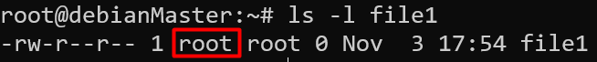
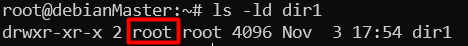
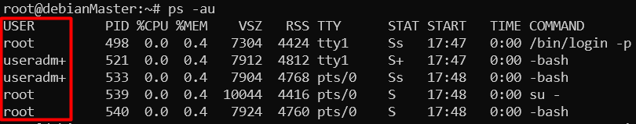
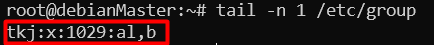
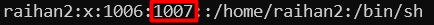
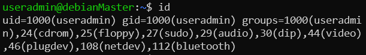

# Apa itu User dan Group?

## User

`User` memiliki peranan yang sangat penting didalam sistem operasi Linux. 
Setiap proses/program yang berjalan pada sistem operasi Linux membutuhkan User untuk menjalankannya, 
kepemilikan sebuah file dan folder pun berupa user. 
Setiap user memiliki User ID atau `UID`, 
dengan UID ini system dapat mengenali sebuah user, 
Informasi user tersimpan di `/etc/passwd`

Dalam sistem operasi Linux terdapat 3 type user:   
- Superuser(Root) ,  yang dapat melakukan apa saja terhadap sistem operasi Linux, 
ditandai dengan tanda (#) pada bash. Memiliki UID 0.  
- System User, user yang digunakan oleh service didalam sistem operasi Linux untuk menjalankan program. 
User ini tidak dapat digunakan untuk login dan berinteraksi dengan terminal.  
- Regular User, merupakan user biasa yang pada umumnya digunakan. Ditandai dengan ($) pada bash.

Kita dapat menggunakan perintah `id` melihat informasi dari user yang sedang kita gunakan
untuk login.

```
root@debianMaster:~# id
uid=0(root) gid=0(root) groups=0(root)
```

Untuk melihat informasi akun dari `user` lain, kita dapat menambahkan `argument` `username` pada perintah `id`
```
root@debianMaster:~# id user01
uid=1001(user01) gid=1001(user01) groups=1001(user01),1004(group01)
```
Untuk melihat kepemilikan / `ownership` dari sebuah `file` kita dapat menggunakan perintah **ls -l**,
sebaliknya untuk melihat `ownership` dari sebuah `direktori` kita dapat menggunakan perintah **ls -ld**. 
`username` pemilik ditunjukkan pada kolom `ketiga`.  
  
  

Untuk melihat informasi dari proses yang berjalan pada sistem operasi linux , kita dapat menggunakan perintah **ps**, tambahkan opsi **a** untuk melihat semua proses yang berjalan,
untuk melihat `user` yang menjalankan `proses` tersebut tambahkan opsi **u**. `User` yang menjalankan sebuah proses berada di kolom `pertama`.

  

Seperti yang kita ketahui , informasi `user` berada di **/etc/passwd**. Berikut contohnya :    

NamaUser:x:UID:GID::Home_Directory:Shell

## Group

Group merupakan kumpulan dari user-user yang membutuhkan hak akses yang sama.
Misal dalam
sebuah sistem operasi mempunyai user dengan nama tkj1, tkj2, tkj3, dan tkj4.
Administrator (pemegang user root) menginginkan agar keempat user tadi
memiliki hak akses yang sama. Tentunya akan sangat merepotkan jika harus
memberikan hak akses kepada masing-masing user. Oleh karena itu, kita bisa
langsung memasukkan keempat user tersebut kedalam sebuah group dengan nama
tkj, sehingga kita cukup mengatur hak akses pada group tkj saja dan keempat user
tersebut sudah memiliki hak akses sesuai dengan yang diberikan kepada group tkj  

Seperti `user` group juga memiliki Group ID atau `GID`, informasi group tersimpan **/etc/group**
Berikut contohnya:  
  
Informasi yang terkandung berupa, `nama group:x:GID:user anggota group`

Setiap `user` pasti memiliki 1 `primary group`. Informasi ini tersimpan pada `GID` yang berada  di **/etc/passwd**.
Secara default, `primary group` ini menjadi pemilik/`owner` dari `file` yang dibuat oleh `user` tersebut.
  
Pada contoh diatas user `raihan2` memiliki `primary group` dengan `GID` **1007**  

Normalnya setiap kali kita membuat `user` baru, system juga akan membuatkan sebuah `primary group` 
dengan nama yang sama. Misalnya kita membuat `user` dengan nama `tes` maka system akan membuat `group` 
dengan nama `tes` pula. Hal ini terjadi karena pada `ownership` file selalu membutuhkan `user` dan `group` sebagai pemiliknya.  
  
Pada contoh diatas `file1` merupakan kepemilikan dari `user` **root** dan `group` **root**.

Sebuah `user` dapat tergabung kedalam lebih dari 1 `group`. group diluar `primary group` disebut dengan **suplementary group**.  
  
Pada contoh diatas `useradmin` tergabung ke berbagai macam `group` diatanranya ada `sudo`,`audio` dll. 