# Deploy Simple NodeJS App

!!! tips 
    clone debian master menjadi nodejs webserver, lalu rubah hostname menjadi node-js-webserver

```py 
useradmin@debianMaster:~$ su -
Password:
root@debianMaster:~# hostnamectl set-hostname node-js-webserver

root@debianMaster:~# nano /etc/hosts
```
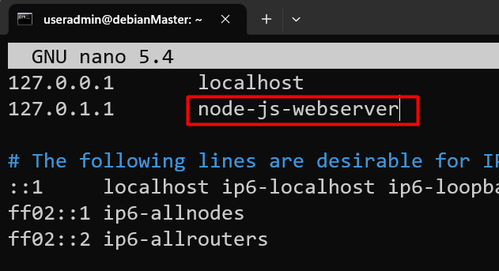

## Menginstall GIT
```
root@debianMaster:~# apt install git -y
```
## Menginstall Curl
```
root@debianMaster:~# apt install curl -y
```


## Menginstall NodeJS

```
 root@webserver-rehan:~# apt-get install -y ca-certificates curl gnupg

```
```
root@webserver-rehan:~# mkdir -p /etc/apt/keyrings
```

```
root@webserver-rehan:~# curl -fsSL https://deb.nodesource.com/gpgkey/nodesource-repo.gpg.key | gpg --dearmor -o /etc/apt/keyrings/nodesource.gpg

```
```
root@webserver-rehan:~# NODE_MAJOR=18
```

```
root@webserver-rehan:~# echo "deb [signed-by=/etc/apt/keyrings/nodesource.gpg] https://deb.nodesource.com/node_$NODE_MAJOR.x nodistro main" | tee /etc/apt/sources.list.d/nodesource.list
```
```
root@webserver-rehan:~# apt update
root@webserver-rehan:~# apt-get install nodejs -y
```

## Install Apache2
```
root@debianMaster:~# apt install apache2 -y
```

## Clone Repo dari Github

```
root@node-js-webserver:~# cd /var/www/html
```
```
root@debianMaster:/var/www/html# git clone https://github.com/fazt/crud-nodejs-mysql.git
```
## Install MySQL

```
root@debianMaster:/var/www/html# apt install mariadb-server mariadb-client
```
### Mengamankan Installasi MySQL

```
root@debianMaster:/var/www/html# mysql_secure_installation 
```

```
Enter current password for root (enter for none): (Masukkan Password Root)

Switch to unix_socket authentication [Y/n] n

Change the root password? [Y/n] n

Remove anonymous users? [Y/n] y

Disallow root login remotely? [Y/n] y

Remove test database and access to it? [Y/n] y
```

## Konfigurasi NodeJS App
```
root@node-js-webserver:/var/www/html# cd crud-nodejs-mysql/
```
```
root@debianMaster:/var/www/html/crud-nodejs-mysql#
```

### Import Database

#### Membuat User Mysql

```
root@node-js-webserver:/var/www/html/crud-nodejs-mysql# mysql -u root -p
```
```
MariaDB [(none)]> create user 'nodejs'@'%' identified by '1234';

MariaDB [(none)]> grant all privileges on *.* to 'nodejs'@'%';

MariaDB [(none)]> exit
```

```
root@debianMaster:/var/www/html/crud-nodejs-mysql# cd database
```
```
root@node-js-webserver:/var/www/html/crud-nodejs-mysql/database# mysql -u nodejs -p < db.sql
```

#### Edit Koneksi Mysql di db.js

```
root@debianMaster:/var/www/html/crud-nodejs-mysql/database# cd ..
```
```
root@node-js-webserver:/var/www/html/crud-nodejs-mysql# nano src/db.js
```
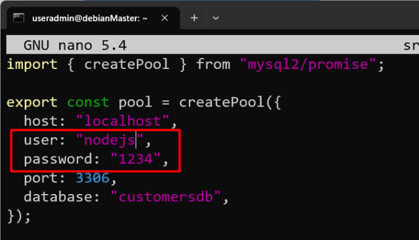
### Menginstall Dependencies App NodeJS

```
root@node-js-webserver:/var/www/html/crud-nodejs-mysql# npm install
```

### Jalankan Aplikasi

```
root@node-js-webserver:/var/www/html/crud-nodejs-mysql# npm start
```
### Tes Akses Via Web Browser
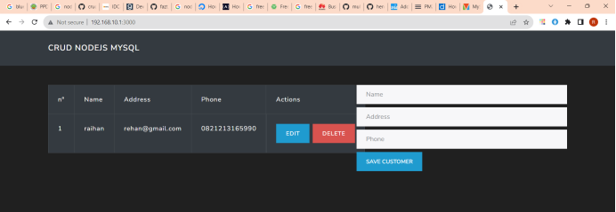

## Menjalankan Aplikasi di Background

### Menginstall PM2

```
root@node-js-webserver:/var/www/html/crud-nodejs-mysql# npm install -g pm2
```

### Konfigurasi PM2 pada Package Json

```
root@node-js-webserver:/var/www/html/crud-nodejs-mysql# nano package.json
```
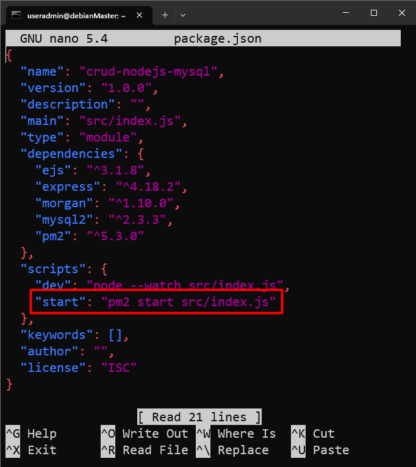

### Menjalankan Kembali Aplikasi

```
root@node-js-webserver:/var/www/html/crud-nodejs-mysql# npm start
```
### Melihat list PM2

```
root@node-js-webserver:/var/www/html/crud-nodejs-mysql# pm2 list
```
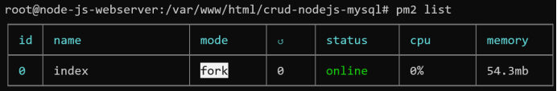

### Tes Akses Aplikasi pada Web Browser
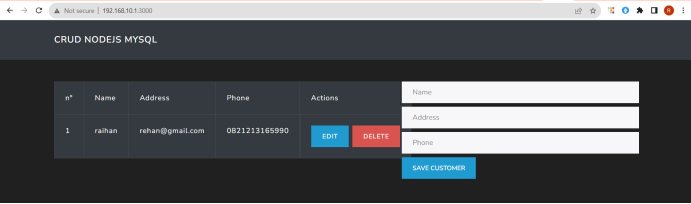

## Setting DNS Server

``` 
root@node-js-webserver:~# cd ~

root@node-js-webserver:~# apt install bind9

root@node-js-webserver:~# cd /etc/bind

root@node-js-webserver:/etc/bind# nano named.conf.local
```
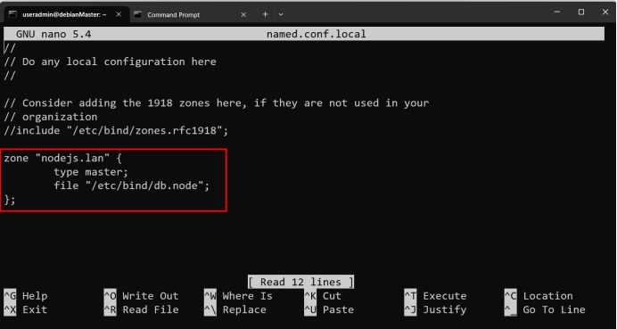

```
root@node-js-webserver:/etc/bind# cp db.local db.node  

root@node-js-webserver:/etc/bind# nano db.node
```
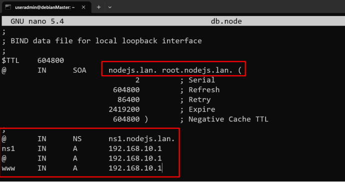

```
root@node-js-webserver:/etc/bind# service bind9 restart
```
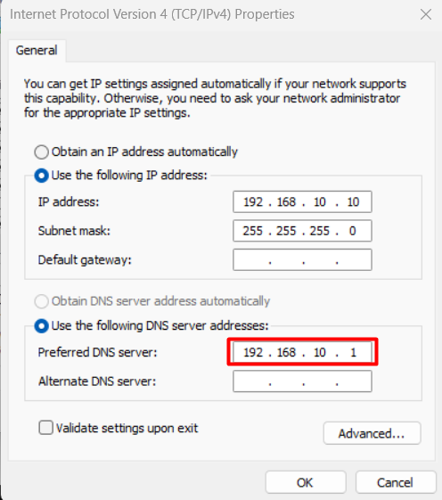
### Tes Akses APlikasi pada W3b Browser

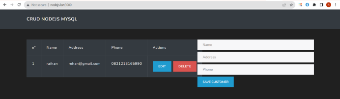

## Reverse Proxy

```
root@node-js-webserver:/etc/bind# cd /etc/apache2/sites-available/

root@node-js-webserver:/etc/apache2/sites-available# cp 000-default.conf node.conf

root@node-js-webserver:/etc/apache2/sites-available# a2enmod proxy rewrite

root@node-js-webserver:/etc/apache2/sites-available# nano node.conf

root@node-js-webserver:/etc/apache2/sites-available# a2ensite node.conf
```
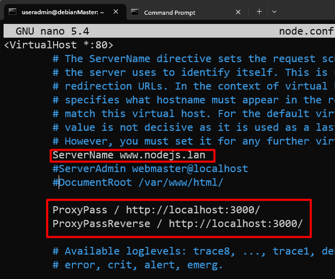

```
root@node-js-webserver:/etc/apache2/sites-available# a2dissite 000-default.conf

root@node-js-webserver:/etc/apache2/sites-available# service apache2 restart
```

### Tes Akses Kembali di Browser

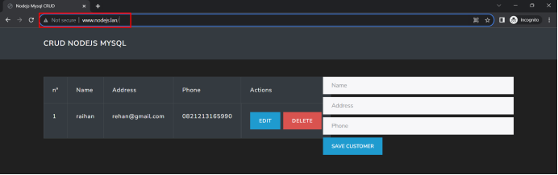

!!! quote
    Tugas Praktikum Mandiri!!!

    1. Deploy Aplikasi NodeJS dari github berikut https://github.com/hendisantika/nodejs-mysql-crud
    2. Setting DNS server dengan domain nodejs2.lan  
    3. Jalankan app di port 3030  
    4. Setting Apache Reverse Proxy agar dapat diakses tanpa menggunakan Port

