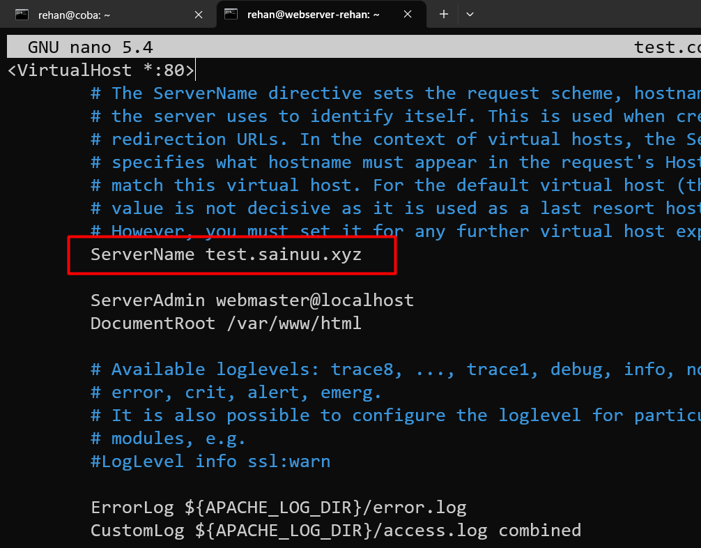
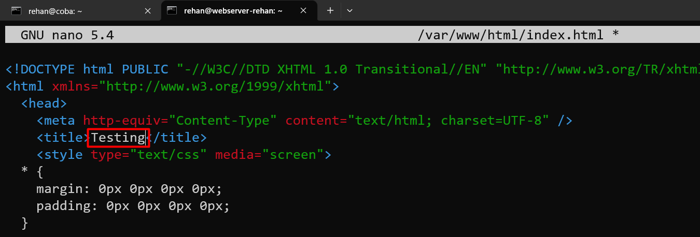
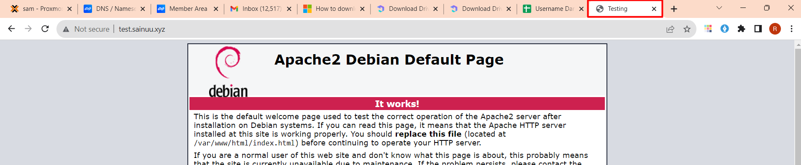

# Konfigurasi Domain Public

!!! Note
    Gunakan Domain di link berikut https://docs.google.com/spreadsheets/d/1mRJvJxXy28GBG6489mGHnWq_Ok2t8VZsn5lz0UeaZfs/edit#gid=0 ,
    SSH ke Server VPS.


## Konfigurasi Virtual Host

```py
root@webserver-rehan:~# cd /etc/apache2/sites-available/
```
```py
root@webserver-rehan:/etc/apache2/sites-available# cp 000-default.conf test.conf
```

!!! warning
    untuk `test.conf` sesuaikan dengan nama domain kalian. Dan untuk domainnya juga sesuaikan dengan yang ada di Excel.  

```py
root@webserver-rehan:/etc/apache2/sites-available# nano test.conf
```



```py
root@webserver-rehan:/etc/apache2/sites-available# a2ensite test.conf
```

```py
root@webserver-rehan:/etc/apache2/sites-available# service apache2 restart
```

### Testing

```py
root@webserver-rehan:/etc/apache2/sites-available# nano /var/www/html/index.html
```


Browse di Browser




