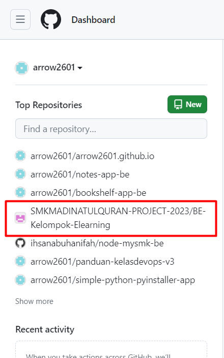
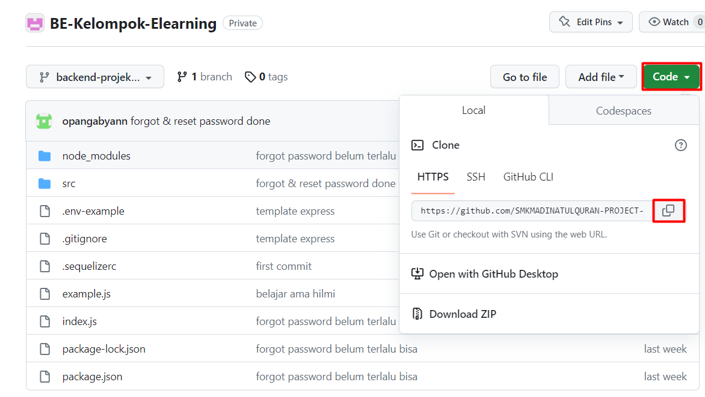
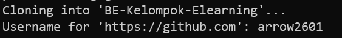
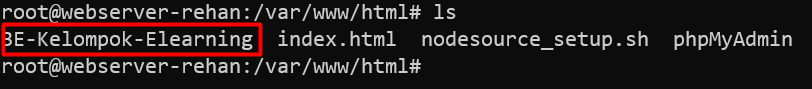
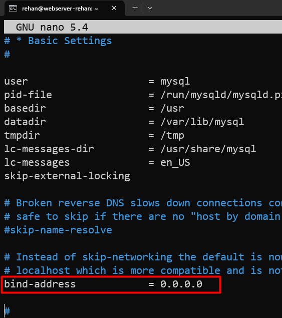
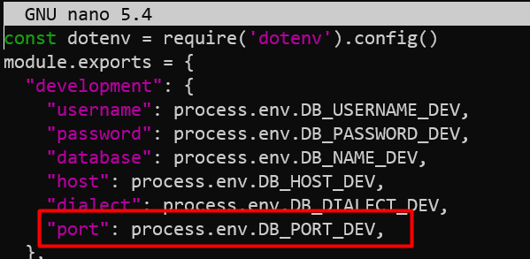
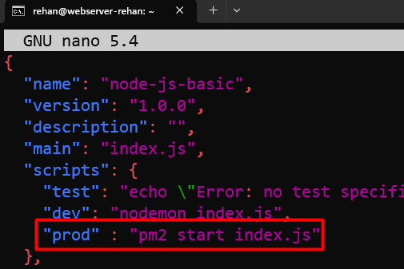
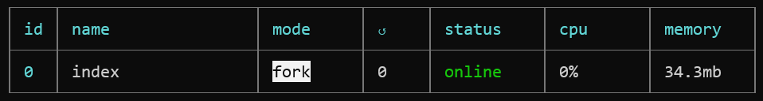
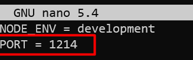
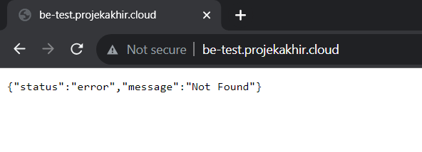

# Deploy-BE

## Cloning Repo

Masuk kedalam `/var/www/html`

```py
root@webserver-rehan:~# cd /var/www/html
```

Masuk kembali ke akun github kalian, kemudian copy kan `repo` `BE` dari kelompok kalian

  

  

lalu `clone` repo tersebut pada server

```py
root@webserver-rehan:/var/www/html# git clone https://github.com/SMKMADINATULQURAN-PROJECT-2023/BE-Kelompok-Elearning.git
```
Masukkan username dari akun github kalian

  

Masukkan `token` yang sudah kalian simpan pada notepad. copy kemudian pastekan, perlu diingat bahwa ketika mengisi `token` tidak akan muncul tulisan apapun.


repo diatas hanya contoh saja gunakan repo be dari kelompok masing masing.

cek apakah cloning berhasil

```py
root@webserver-rehan:/var/www/html# ls
```



## Menginstall dependencies 
Masuk kedalam folder yang telah di clone tadi

```py
root@webserver-rehan:/var/www/html# cd BE-Kelompok-Elearning/
```

```py

root@webserver-rehan:/var/www/html/BE-Kelompok-Elearning# npm install
```
```py
root@webserver-rehan:/var/www/html/BE-Kelompok-Elearning# npm install sequelize-cli
```
```py
root@webserver-rehan:/var/www/html/BE-Kelompok-Elearning# npm install --save mariadb
```
```py
root@webserver-rehan:/var/www/html/BE-Kelompok-Elearning# npm install nodemon
```

## Konfigurasi database 

### Mengubah bind address mysql

Secara default mysql hanya dapat diakses melalui localhost, sehingga perlu kita ubah agar dapat diakses secara remote

```py
 root@webserver-rehan:/var/www/html/BE-Kelompok-Elearning# cd /etc/mysql/
 root@webserver-rehan:/etc/mysql# cd mariadb.conf.d/
 root@webserver-rehan:/etc/mysql/mariadb.conf.d# nano 50-server.cnf
```

ubah bind address menjadi `0.0.0.0`

  

### Membuat file env

```py
root@webserver-rehan:/etc/mysql/mariadb.conf.d# cd /var/www/html
root@webserver-rehan:/var/www/html# cd BE-Kelompok-Elearning/
```
copykan dibawah ini
```py
NODE_ENV = development
PORT = 1214

DB_USERNAME_DEV = userdb
DB_PASSWORD_DEV = '1234'
DB_NAME_DEV = smkm1712_flearning_DB
DB_HOST_DEV = db-test.sainuu.xyz
DB_DIALECT_DEV = mysql
DB_PORT_DEV = 3307

DB_USERNAME_TEST = smkm1712_flearning
DB_PASSWORD_TEST = ']cQbwX~mr?;F'
DB_NAME_TEST = smkm1712_flearning_DB
DB_HOST_TEST = 127.0.0.1
DB_DIALECT_TEST = mysql

DB_USERNAME_PROD = smkm1712_flearning
DB_PASSWORD_PROD = ']cQbwX~mr?;F'
DB_NAME_PROD = smkm1712_flearning_DB
DB_HOST_PROD = 127.0.0.1
DB_DIALECT_PROD = mysql
```
    Sesuaikan db_name, db_host, dan juga db_port sesuai dengan kelompok kalian.  
kirimkan setingan file .env kalian ke tim RPL agar mereka bisa menyesuaikan .  

### Konfigurasi database.js

```py
root@webserver-rehan:/var/www/html/BE-Kelompok-Elearning# cd src
root@webserver-rehan:/var/www/html/BE-Kelompok-Elearning/src# cd config/
root@webserver-rehan:/var/www/html/BE-Kelompok-Elearning/src/config# nano database.js
```
tambahkan konfigurasi port seperti pada gambar
  

Kembali himbau kepada tim RPL agar mengubah settingan database.js nya sesuai dengan apa yang kita rubah, agar kedepannya ketika ada pull request tidak terjadi konflik.

### membuat database dengan sequilize

```py
root@webserver-rehan:/var/www/html/BE-Kelompok-Elearning# npx sequelize-cli db:create
root@webserver-rehan:/var/www/html/BE-Kelompok-Elearning# npx sequelize-cli db:migrate
```

### Menginstall PM2 dan menjalankan aplikasi di background

```py
root@webserver-rehan:/var/www/html/BE-Kelompok-Elearning# npm install -g pm2
```

#### Konfigurasi package.json
```py
root@webserver-rehan:/var/www/html/BE-Kelompok-Elearning# nano package.json
```
Tambahkan konfigurasi berikut. agar aplikasi dijalankan via pm2


himbau tim RPL untuk mengubah file package.json sesuai dengan konfigurasi diatas.  

## Menjalankan Aplikasi

```py
root@webserver-rehan:/var/www/html/BE-Kelompok-Elearning# npm run prod
```


untuk cek bisa menggunakan command
```py
root@webserver-rehan:/var/www/html/BE-Kelompok-Elearning# pm2 list
```

Aplikasi sudah berjalan diserver namun belum bisa diakses melalui domain, kita harus menggunakan ` Reverse Proxy` agar dari domain diarahkan ke port NodeJS nya.

## Reverse Proxy

### cek Port yang digunakan

```py
root@webserver-rehan:/var/www/html/BE-Kelompok-Elearning# nano .env
```



bisa kita lihat bahwa PORT yang digunakan NODE JS adalah 1214.

### KOnfigurasi Reverse Proxy Apache2

```py
root@webserver-rehan:/var/www/html/BE-Kelompok-Elearning# cd /etc/apache2/sites-available/
```
copy kan file konfigurasi default menjadi nama projek be kalian.

```py
root@webserver-rehan:/etc/apache2/sites-available# cp 000-default.conf be-test.conf
```

```py
root@webserver-rehan:/etc/apache2/sites-available# nano be-test.conf
```

konfigurasikan seperti dibawah ini namun ingat sesuaikan dengan konfigurasi project kalian.

```py
<VirtualHost *:80>
        ServerName be-test.projekakhir.cloud

        ServerAdmin webmaster@localhost
        DocumentRoot /var/www/html/phpMyAdmin


        ErrorLog ${APACHE_LOG_DIR}/error.log
        CustomLog ${APACHE_LOG_DIR}/access.log combined

ProxyPass / http://localhost:1214/ nocanon
ProxyPassReverse / http://localhost:1214/
ProxyRequests Off


</VirtualHost>
```
```py
root@webserver-rehan:/etc/apache2/sites-available# a2ensite be-test.conf
```
```py
root@webserver-rehan:/etc/apache2/sites-available# service apache2 restart
```

## Testing

Akses dibrowser menggunakan domain

