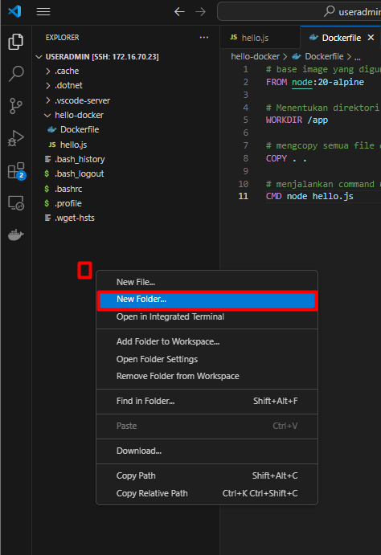
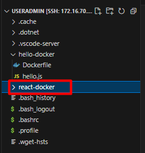
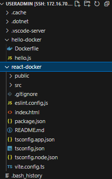
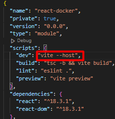
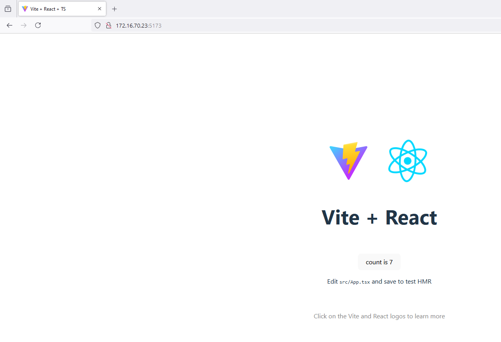

# React App

Pada praktikum kali ini kita akan `dockerize` `React App` 

1. Membuat folder baru pada `homefolder` user yang digunakan untuk SSH. klik kanan ditempat kosong kemudian `New Folder`. Buat folder dengan nama `react-docker`.  

  
2. Membuat project baru `React JS`. Karena di server kita belum diinstall `NodeJS` maka untuk membuat project `React` kita bisa memanfaatkan container / image `hello-docker` yang didalamnya terdapat `NodeJS`. Kita juga akan memanfaatkan `volume` sehingga hasil pembuatan projectnya akan kita arahkan ke folder `react-folder` yang telah kita buat sebelumnya.
```
root@debianMaster:/home/useradmin# docker run -it -v /home/useradmin/react-docker:/app/react-docker hello-docker npm create vite@latest react-docker
```
Dengan command ini otomatis akan menjalankan `npm create ...` didalam container yang kita jalankan.
kemudian nanti akan ada muncul pilihan sesuaikan seperti dibawah ini  
  
Untuk `framework` pilih `react` dan untuk `variant` pilih `TypeScript`. Tunggu hingga prosesnya selesai.
3. Cek apakah `react-docker` sudah terbuat didalam `host volume` kita  
  
Terlihat folder `react-docker` kita telah terisi dengan project `react` yang tadi telah kita buat.
4. Membuat `Dockerfile` didalam folder `react-docker`
```
# set the base image to create the image for react app
FROM node:20-alpine

# create a user with permissions to run the app
# -S -> create a system user
# -G -> add the user to a group
# This is done to avoid running the app as root
# If the app is run as root, any vulnerability in the app can be exploited to gain access to the host system
# It's a good practice to run the app as a non-root user
RUN addgroup app && adduser -S -G app app

# set the user to run the app
USER app

# set the working directory to /app
WORKDIR /app

# copy package.json and package-lock.json to the working directory
# This is done before copying the rest of the files to take advantage of Docker’s cache
# If the package.json and package-lock.json files haven’t changed, Docker will use the cached dependencies
COPY package*.json ./

# sometimes the ownership of the files in the working directory is changed to root
# and thus the app can't access the files and throws an error -> EACCES: permission denied
# to avoid this, change the ownership of the files to the root user
USER root

# change the ownership of the /app directory to the app user
# chown -R <user>:<group> <directory>
# chown command changes the user and/or group ownership of for given file.
RUN chown -R app:app .

# change the user back to the app user
USER app

# install dependencies
RUN npm install

# copy the rest of the files to the working directory
COPY . .

# expose port 5173 to tell Docker that the container listens on the specified network ports at runtime
EXPOSE 5173

# command to run the app
CMD npm run dev
```
5. Membuat file `.dockerignore` didalam folder `react-docker`. File ini berguna untuk tidak menghiraukan sebuah `file` atau `folder` agar tidak tersimpan kedalam `docker image`, sehingga size dari `docker image` tersebut tidak terlalu besar.
```
node_modules/
```
6. Edit file `package.json`. Konfigurasi ini dilakukan agar `app` nya bisa diakses dari luar container.  


7. Build image `react-docker` menggunakan `dockerfile` yang telah kita buat sebelumnya. Kerjakan di `terminal` vscode  
```
root@debianMaster:/home/useradmin# cd /home/useradmin/react-docker
root@debianMaster:/home/useradmin/react-docker# docker build -t react-docker .
```
Sesuaikan folder `react-docker` kalian yang ada diserver.
8. Verifikasi apakah `image` berhasil dibuild
```
docker images
```


9. Jalankan `docker container` dengan menggunakan `image` yang telah kita buat sebelumnya
```
root@debianMaster:/home/useradmin# docker run -d -p 5173:5173 react-docker
```
10. akses ipaddres_server:5173 di browser
 

