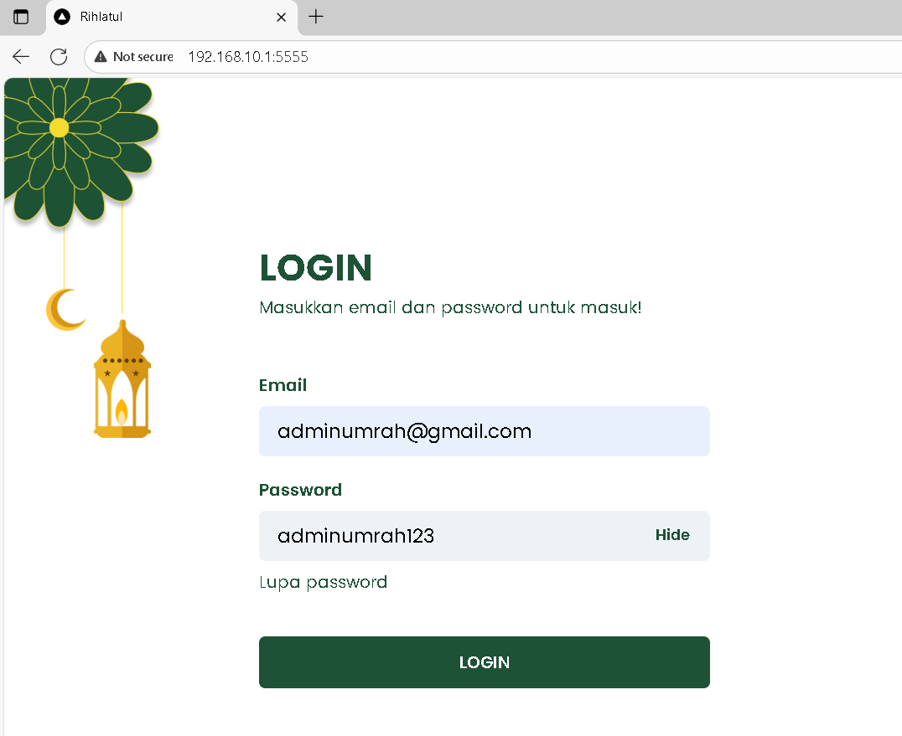
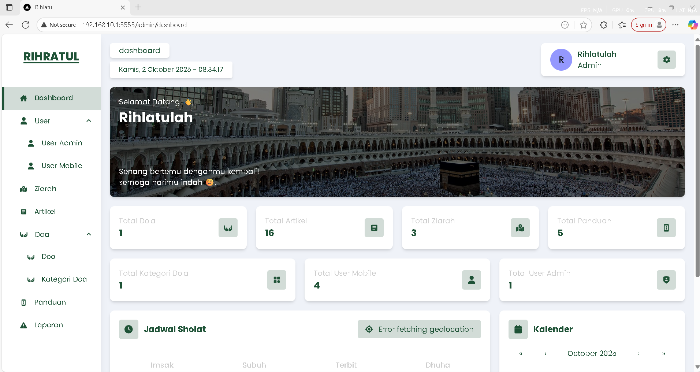

# Umrah App 
 

## Clone repo
```
root@debianMaster:~# mkdir rihlatul-app
root@debianMaster:~# cd rihlatul-app
root@debianMaster:~/rihlatul-app# git clone https://github.com/SMKMADINATULQURAN-PROJECT-2023/FE-Kelompok-Umroh.git
root@debianMaster:~/rihlatul-app# git clone https://github.com/SMKMADINATULQURAN-PROJECT-2023/BE-Kelompok-Umroh.git
```

## Membuat file .envproduction untuk FE
```
root@debianMaster:~/rihlatul-app# nano FE-Kelompok-Umroh/.env.production
```
# SECRET KEY
NEXTAUTH_SECRET=dofbhkgjnosjgdklnsmgojdfkhglnsgnvfvsdkn

# REDIRECT URL (WEB'S URL)
NEXTAUTH_URL=http://192.168.10.1:5555

# URL API
```

```
## Membuat file .envBE untuk BE
```
root@debianMaster:~/rihlatul-app# nano .envBE
```
```
NODE_ENV = development
PORT = 3306
PORT_API = 5002
BASE_CLIENT_URL = http://192.168.10.1:5555

DB_USERNAME_DEV = 'umroh48'
DB_PASSWORD_DEV = '1234'
DB_NAME_DEV = 'smkm1712_umroh_DB'
DB_HOST_DEV = '202.83.120.91'
DB_DIALECT_DEV = mysql

DB_USERNAME = 'root'
DB_PASSWORD = ''
DB_NAME = 'umrah'
DB_HOST = '127.0.0.1'
DB_DIALECT = mysql

DB_USERNAME_TEST = 'root'
DB_PASSWORD_TEST = 'secret'
DB_NAME_TEST = 'u8767111_rihlatul'
DB_HOST_TEST = '192.168.10.1'
DB_DIALECT_TEST = mysql

MAIL_HOST = mail.smkmadinatulquran.sch.id
MAIL_PORT = 465
MAIL_USERNAME = latihan-email@smkmadinatulquran.sch.id
MAIL_PASSWORD = IHSAN$%09
MAIL_CLIENT_URL = http://localhost:1214/

JWT_SECRET = ghfjdkjnojsighijknlzsofjihgudhkggnsghsjmjfshogdfgn
ACCESS_TOKEN_SECRET = 5Np9LmQaJxTb2rY3sC8K6z7W1GvF0U4IhDqXoAeP
REFRESH_TOKEN_SECRET = 4Fh9YkTl8QjR2sA6gP5nDm7WqV1zX3cB0
JWT_EXPIRED = 3600

CLOUD_NAME = "dllw0z7bh"
API_KEY = "576412332728459"
API_SECRET = "IAuPjdvPxCFUcjmDjOZ4yd29leU"
```

## Membuat Dockerfile dan .dockerignore di FE
```
root@debianMaster:~/rihlatul-app# nano FE-Kelompok-Umroh/Dockerfile
```
```
FROM node:18

WORKDIR /app

COPY package*.json ./
RUN npm install

COPY . .

RUN npm run build

CMD npm run start
```
```
root@debianMaster:~/rihlatul-app# nano FE-Kelompok-Umroh/.dockerignore
```
```
Dockerfile
.dockerignore
node_modules
npm-debug.log
dist
```
## Membuat Dockerfile dan .dockerignore di BE
```
root@debianMaster:~/rihlatul-app# nano BE-Kelompok-Umroh/Dockerfile
```
```
FROM node:18

WORKDIR /app

COPY package*.json ./
RUN npm install

COPY . .

RUN npm run build

CMD node dist/main --host
```
```
root@debianMaster:~/rihlatul-app# nano BE-Kelompok-Umroh/.dockerignore
```
```
Dockerfile
.dockerignore
node_modules
npm-debug.log
dist
```

## Membuat file dump untuk BE
arena BE butuh database dengan nama `u87....` sebagaimana yang ada di file env, maka ketika kita membuat docker mysql, otomatis akan membuatkan database tersebut. Oleh karena itu, kita harus membuat dahulu file sql, yang akan dijalankan oleh docker mysql ketika running diawal.
 - Membuat folder dump didalam rihlatul-app/umrohDB
 - Membuat file u8767111_rihlatul.sql didalam folder dump

```
root@debianMaster:~/rihlatul-app# mkdir -p umrohDB/dump
root@debianMaster:~/rihlatul-app# nano umrohDB/dump/u8767111_rihlatul.sql
```
isi file dump ada di discord

## Membuat compose.yaml 
```
root@debianMaster:~/rihlatul-app# nano compose.yaml
```
```
services:
  db:
    image: mysql:latest
    container_name: db
    ports:
      - 3306:3306
    volumes:
      - ./umrohDB/dump:/docker-entrypoint-initdb.d
      - ./umrohDB/dbdata:/var/lib/mysql
    environment:
      MYSQL_ROOT_PASSWORD: secret
  phpmyadmin:
    image: phpmyadmin/phpmyadmin
    container_name: pma
    links:
      - db
    environment:
      PMA_HOST: db
      PMA_PORT: 3306
      PMA_ARBITRARY: 1
    restart: always
    ports:
      - 8081:80

  be:
    build:
      context: BE-Kelompok-Umroh/
      dockerfile: Dockerfile
    env_file:
      - .envBE
    container_name: nest-docker-mysql
    ports:
      - '5002:5002'
    depends_on:
      - db
    volumes:
      - ./BE-Kelompok-Umroh/src:/app/src

  fe:
    build:
      context: FE-Kelompok-Umroh/
      dockerfile: Dockerfile
    env_file:
      - ./FE-Kelompok-Umroh/.envproduction
    container_name: umrah-fe
    ports:
      - '5555:5555'
    links:
      - be
    volumes:
      - /app/node_module
```
## Menjalankan docker compose
```
 docker compose up -d --build
```

## Tes di Browser

  



 

