# Installasi dan setup awal Ngrok

## Sign up Ngrok

  
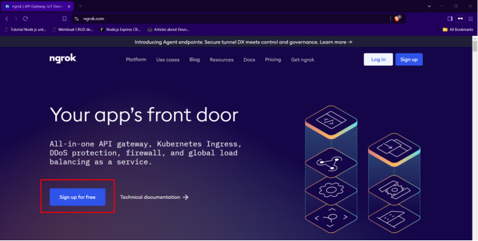  
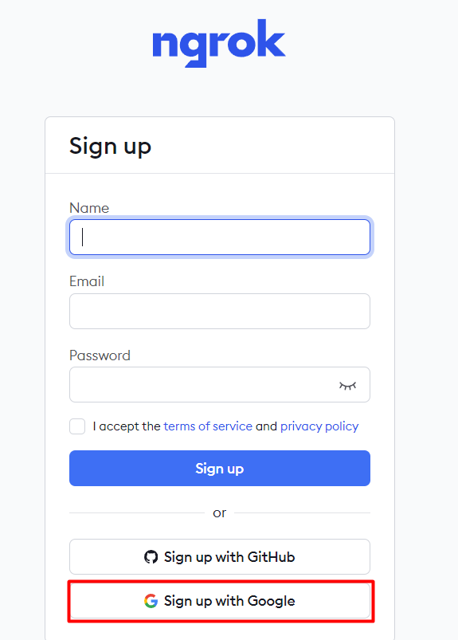  
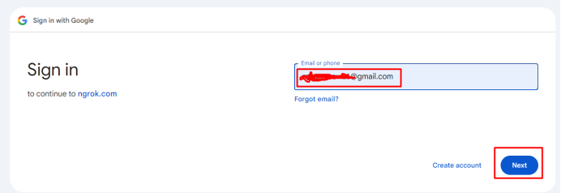  
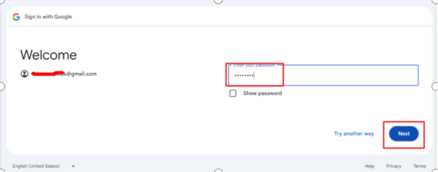  
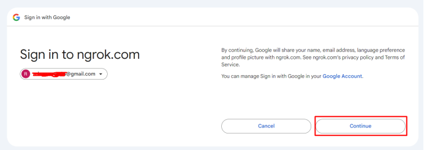  
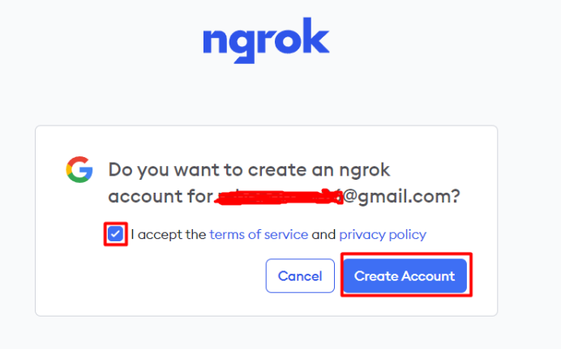  
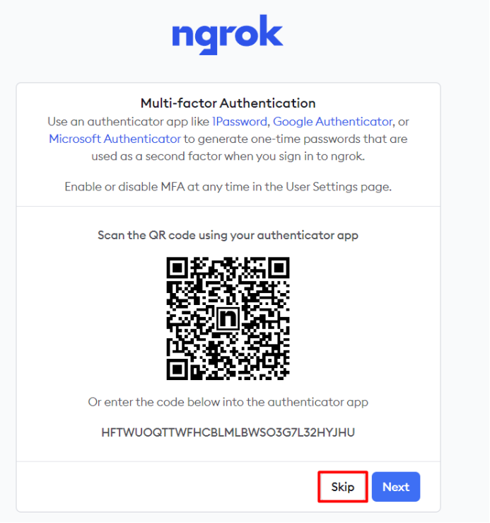  
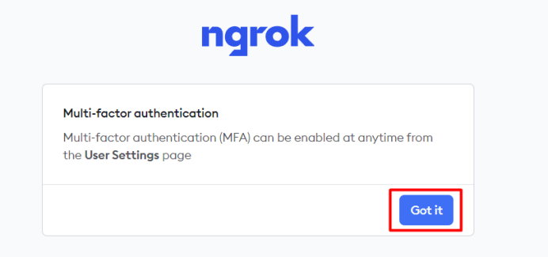  
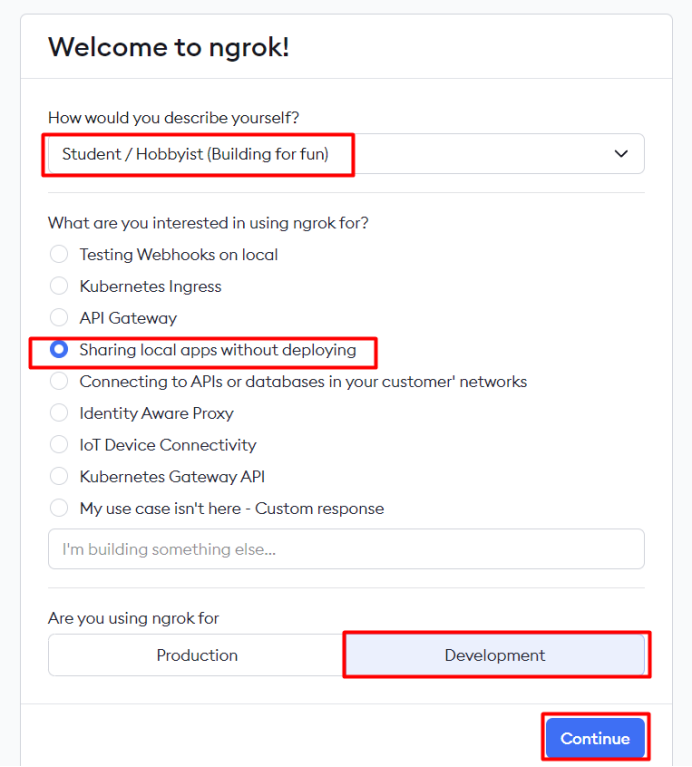  

## Copy Personal Token untuk Autentikasi  

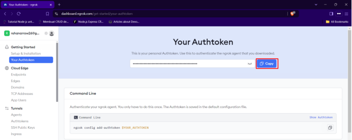  
Copy dan simpan ditempat yang aman

## Installasi Ngrok di debian
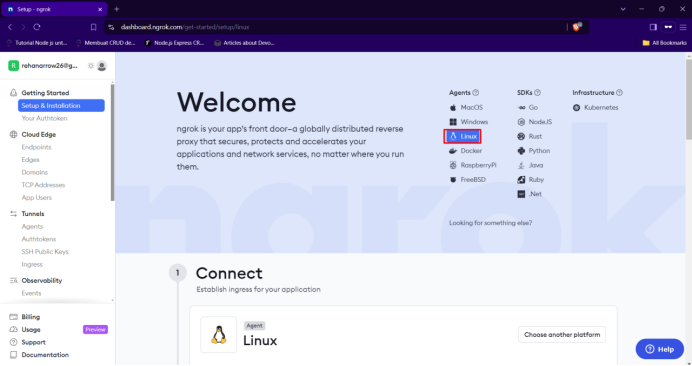  

```
useradmin@debianMaster:~$ su -
```
```
root@debianMaster:~# curl -sSL https://ngrok-agent.s3.amazonaws.com/ngrok.asc \
        | tee /etc/apt/trusted.gpg.d/ngrok.asc >/dev/null \
        && echo "deb https://ngrok-agent.s3.amazonaws.com bullseye main" \
        | tee /etc/apt/sources.list.d/ngrok.list \
        && apt update \
        && apt install ngrok

```
!!! Warning
    Sesuaikan `deb https://ngrok-agent.s3.amazonaws.com bullseye main` sesuaikan dengan code versi debian kalian.

Memasukkan personal token yang tadi telah kalian copy.

```
root@debianMaster:~# ngrok config add-authtoken <personal_token>
Authtoken saved to configuration file: /root/.config/ngrok/ngrok.yml
```

Membuat Jenkins menjadi Online. Masukkan port dimana jenkins kalian berjalan.

```


