# Jenkins Gaming

## installasi Jenkins

### Membuat bridge network

```
docker network create jenkins
```

### Membuat file penyimpanan file Jenkins Docker
```
mkdir jenkins
cd jenkins
```

### Membuat dockerfile untuk Jenkins Docker

```
nano Dockerfile
```
```
FROM jenkins/jenkins:lts-jdk21

USER root
RUN apt-get update && apt-get install -y \
    ca-certificates curl gnupg lsb-release \
    && mkdir -p /etc/apt/keyrings \
    && curl -fsSL https://download.docker.com/linux/debian/gpg -o /etc/apt/keyrings/docker.asc \
    && echo "deb [arch=$(dpkg --print-architecture) signed-by=/etc/apt/keyrings/docker.asc] \
       https://download.docker.com/linux/debian $(lsb_release -cs) stable" \
       > /etc/apt/sources.list.d/docker.list \
    && apt-get update && apt-get install -y docker-ce-cli \
    && apt-get clean && rm -rf /var/lib/apt/lists/*

USER jenkins
RUN jenkins-plugin-cli --plugins "blueocean docker-workflow"

```

### buat docker compose
``` 
nano compose.yaml
```

```
version: '3.9'

services:
  jenkins:
    build: .
    container_name: jenkins
    restart: unless-stopped
    ports:
      - "8080:8080"
      - "50000:50000"
    volumes:
      - jenkins_home:/var/jenkins_home
      - /var/run/docker.sock:/var/run/docker.sock
    environment:
      - JAVA_OPTS=-Djava.awt.headless=true

volumes:
  jenkins_home:
```

### Jalankan docker compose
```
docker compose up -d --build
```

### Jalankan jenkins di browser
```
http://your-server-ip:8080
```
### Masukkan administrator password

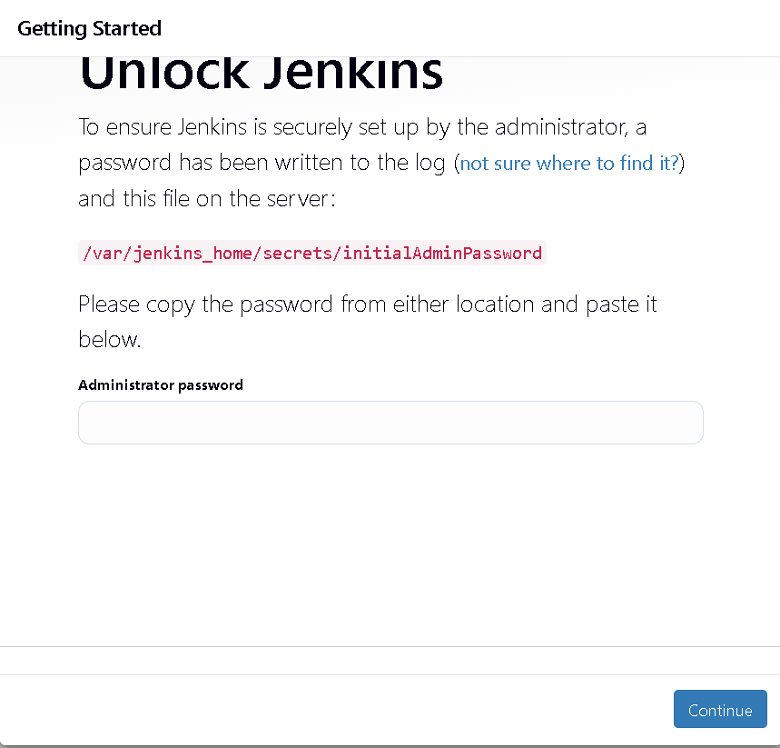  

copy dari server

```
docker exec -it jenkins cat /var/jenkins_home/secrets/initialAdminPassword
```

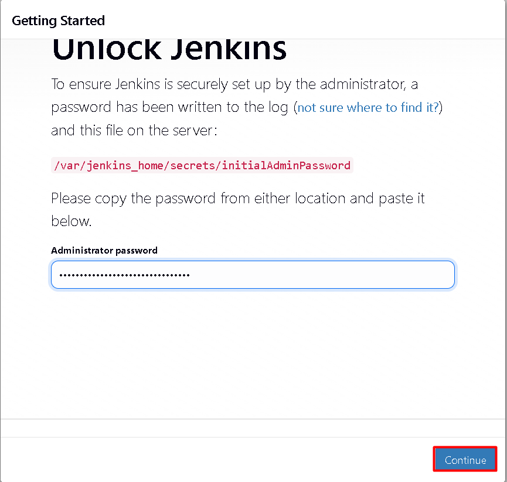  

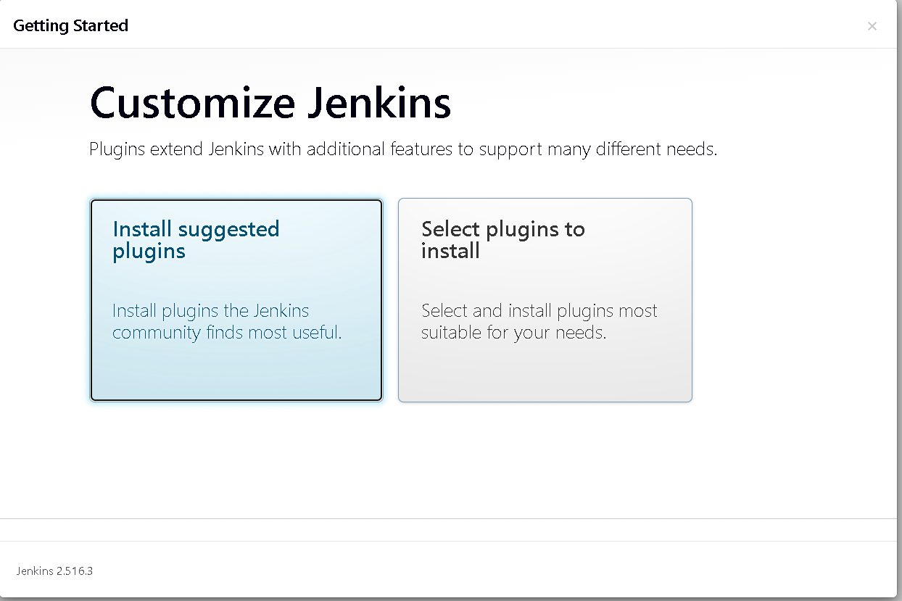  

## Fork Repo

```
https://github.com/ihsanabuhanifah/tka_fe
https://github.com/ihsanabuhanifah/tka_be
```

## git clone di folder tka


## Membuat Registry Docker Image Local

```
docker run -d \
  -p 5500:5500 \
  --name registry \
  --restart=always \
  registry:2
```

## membuat docker file di masing masing service

```
cd ~/rihlatul-app
nano FE-Kelompok-Umroh/Dockerfile
```
```
FROM node:18
WORKDIR /app
COPY package*.json ./
RUN npm install
COPY . .
RUN npm run build
CMD ["npm", "run", "start"]
```
```
nano BE-Kelompok-Umroh/Dockerfile
```

```
FROM node:18

WORKDIR /app

COPY package*.json ./
RUN npm install

COPY . .

RUN npm run build

CMD node dist/main --host
```

## Membuat file Pipeline Jenkins
```
nano FE-Kelompok-Umroh/Jenkinsfile
```
```
pipeline {
    agent any

    environment {
        IMAGE_NAME = "192.168.10.26:5000/rihlatul-fe"
    }

    stages {
        stage('Checkout') {
            steps {
                git branch: 'main', url: 'https://github.com/SMKMADINATULQURAN-PROJECT-2023/FE-Kelompok>            }
        }

        stage('Build Docker Image') {
            steps {
                sh 'docker build -t $IMAGE_NAME:latest .'
            }
        }

        stage('Push to Local Registry') {
            steps {
                sh 'docker push $IMAGE_NAME:latest'
            }
        }
    }
}
```
```
nano BE-Kelompok-Umroh/Jenkinsfile
```
```
pipeline {
    agent any

    environment {
        IMAGE_NAME = "registry.local:5000/rihlatul-be"
    }

    stages {
        stage('Checkout') {
            steps {
                git branch: 'main', url: 'https://github.com/SMKMADINATULQURAN-PROJECT-2023/BE-Kelompok>            }
        }

        stage('Build Docker Image') {
            steps {
                sh 'docker build -t $IMAGE_NAME:latest .'
            }
        }

        stage('Push to Local Registry') {
            steps {
                sh 'docker push $IMAGE_NAME:latest'
            }
        }
    }
}
```

## commit perubahan dan push ke github

```
cd FE-Kelompok-Umroh/
git add .
git commit -m "jenkinsfile and dockerfile added"
git push
Username for 'https://github.com': arrow2601
Password for 'https://arrow2601@github.com':
```
```
cd ../BE-Kelompok-Umroh/
git add .
git commit -m "jenkinsfile and dockerfile added"
git push
Username for 'https://github.com': arrow2601
Password for 'https://arrow2601@github.com':
```

## Membuat pipeline baru di Jenkins untuk rihlatul app FE

akses jenkins via webrowser

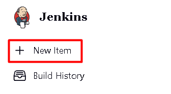  

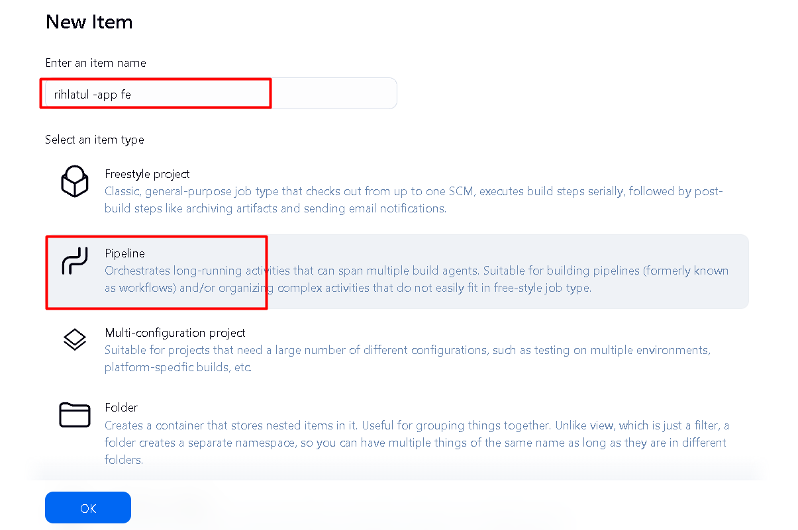  

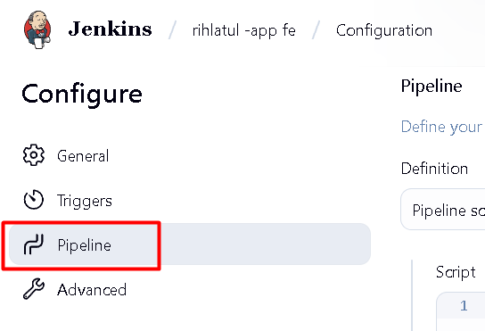   

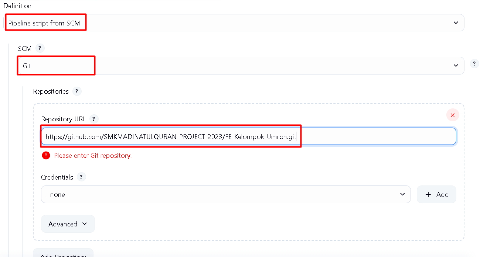  

## Membuat pipeline baru di Jenkins untuk rihlatul app BE
 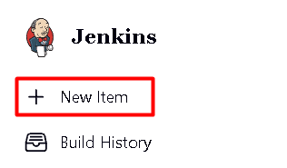  

 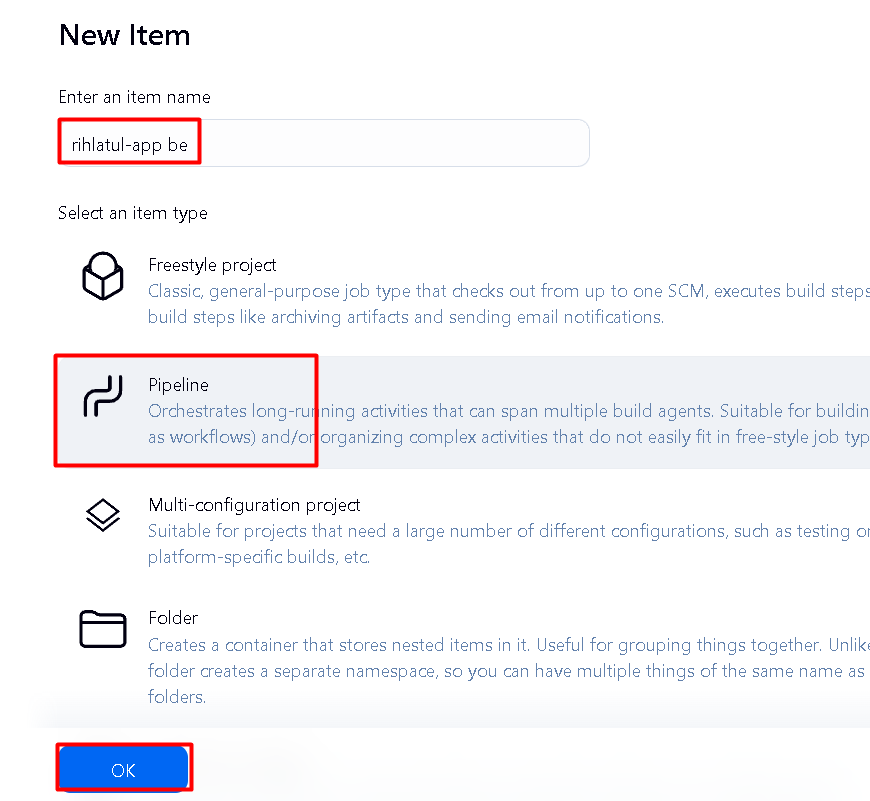  

 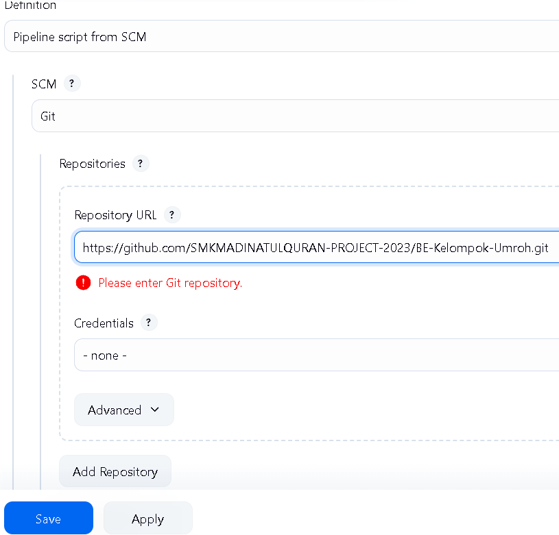  

 ## UJi Coba pipeline

 masuk ke dashboard Jenkins


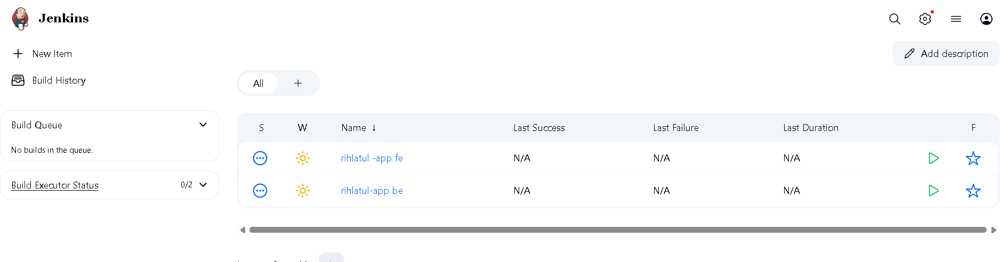  

Coba masuk ek rihlatul-app fe
kemudian open blue ocean

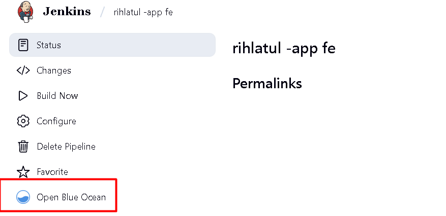  

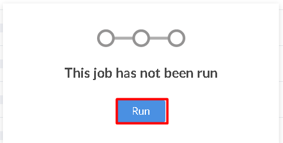  


