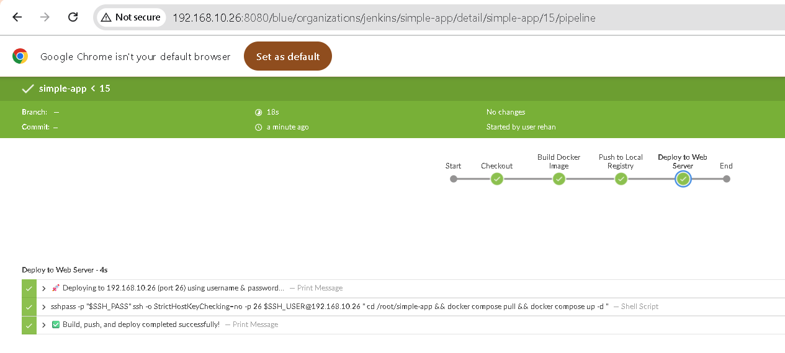
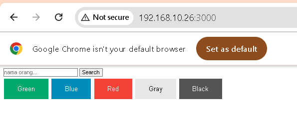
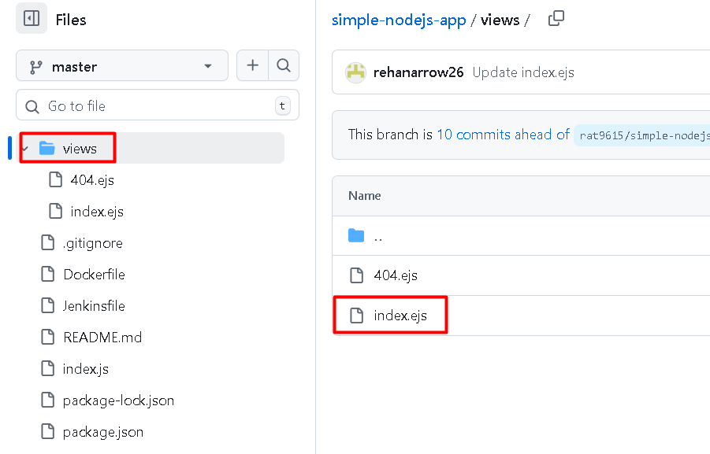

# Jenkins Gaming

## installasi Jenkins

### Membuat bridge network

```
docker network create jenkins
```

### Membuat file penyimpanan file Jenkins Docker
```
mkdir jenkins
cd jenkins
```

### Membuat dockerfile untuk Jenkins Docker

```
nano Dockerfile
```
```
FROM jenkins/jenkins:lts-jdk21

USER root
RUN apt-get update && apt-get install -y \
    ca-certificates curl gnupg lsb-release \
    && mkdir -p /etc/apt/keyrings \
    && curl -fsSL https://download.docker.com/linux/debian/gpg -o /etc/apt/keyrings/docker.asc \
    && echo "deb [arch=$(dpkg --print-architecture) signed-by=/etc/apt/keyrings/docker.asc] \
       https://download.docker.com/linux/debian $(lsb_release -cs) stable" \
       > /etc/apt/sources.list.d/docker.list \
    && apt-get update && apt-get install -y docker-ce-cli \
    && apt-get clean && rm -rf /var/lib/apt/lists/*

USER jenkins
RUN jenkins-plugin-cli --plugins "blueocean docker-workflow"

```

### buat docker compose
``` 
nano compose.yaml
```

```
version: '3.9'

services:
  jenkins:
    build: .
    container_name: jenkins
    restart: unless-stopped
    ports:
      - "8080:8080"
      - "50000:50000"
    volumes:
      - jenkins_home:/var/jenkins_home
      - /var/run/docker.sock:/var/run/docker.sock
    environment:
      - JAVA_OPTS=-Djava.awt.headless=true

volumes:
  jenkins_home:
```

### Jalankan docker compose
```
docker compose up -d --build
```

### Jalankan jenkins di browser
```
http://your-server-ip:8080
```
### Masukkan administrator password

  

copy dari server

```
docker exec -it jenkins cat /var/jenkins_home/secrets/initialAdminPassword
```

  

  

## Fork Repo

```
https://github.com/rat9615/simple-nodejs-app
```

## Membuat Folder baru kemudian clone didalam folder tersebut
```
mkdir simple-app
cd simple-app
git clone repo-anda-yang-sudah-hasil-fork.git
```


## Membuat Registry Docker Image Local

```
docker run -d \
  -p 5000:5000 \
  --name registry \
  --restart=always \
  registry:2
```

## Mendaftarkan ip address registry local agar jenkins dapat mengaksesnya
```
nano /etc/docker/daemon.json
```
```
{
  "insecure-registries": ["192.168.10.26:5000"]
}
```
```
 systemctl daemon-reload
 systemctl restart docker
```

## membuat docker file di masing masing service

```
cd ~/simple-app
nano simple-nodejs-app/Dockerfile
```

```
FROM node:22

WORKDIR /app

COPY package*.json ./
RUN npm install

COPY . .

EXPOSE 3000

CMD ["npm", "start"]
```

## Membuat file Pipeline Jenkins
```
nano simple-nodejs-app/Jenkinsfile
```
```
pipeline {
    agent any

    environment {
        REGISTRY = "192.168.10.26:5000"
        IMAGE_NAME = "simple-app"
        VERSION = "v01"
    }

    stages {

        stage('Checkout') {
            steps {
                echo "📦 Cloning repository..."
                git branch: 'master', url: 'https://github.com/rehanarrow26/simple-nodejs-app.git'
            }
        }

        stage('Build Docker Image') {
            steps {
                script {
                    echo "🏗️ Building Docker image..."
                    sh """
                        docker build -t ${REGISTRY}/${IMAGE_NAME}:${VERSION} \
                                     -t ${REGISTRY}/${IMAGE_NAME}:latest .
                    """
                }
            }
        }

        stage('Push to Local Registry') {
            steps {
                script {
                    echo "🚢 Pushing image to local registry..."
                    sh """
                        docker push ${REGISTRY}/${IMAGE_NAME}:${VERSION}
                        docker push ${REGISTRY}/${IMAGE_NAME}:latest
                    """
                }
            }
        }

        stage('Deploy to Web Server') {
    steps {
        echo "🚀 Deploying to 192.168.10.26 (port 26) using username & password..."
        withCredentials([usernamePassword(credentialsId: 'ssh_ke_web', usernameVariable: 'SSH_USER', passwordVariable: 'SSH_PASS')]) {
            sh '''
                sshpass -p "$SSH_PASS" ssh -o StrictHostKeyChecking=no -p 26 $SSH_USER@192.168.10.26 "
                    cd /root/simple-app && \
                    docker compose pull && \
                    docker compose up -d
                "
            '''
        }
    }
}
    }

    post {
        success {
            echo "✅ Build, push, and deploy completed successfully!"
        }
        failure {
            echo "❌ Build, push, or deploy failed. Please check logs."
        }
    }
}
```


## commit perubahan dan push ke github

```
 cd simple-nodejs-app/
git add .
git commit -m "jenkinsfile and dockerfile added"
git push
Username for 'https://github.com': arrow2601
Password for 'https://arrow2601@github.com':
```

## Membuat Docker Compose untuk menjalankan app
```
cd ~/simple-app
nano docker-compose.yml
```
```
version: "3.9"

services:
  app:
    image: localhost:5000/simple-app:latest
    pull_policy: always
    container_name: node_app
    ports:
      - "3000:3000"
    restart: unless-stopped
    environment:
      - NODE_ENV=production
```
## setting SSH agar Jenkins bisa SSH ke server production menggunakan user root
```
nano /etc/ssh/sshd_config
```
cari `Permitlogin`
ubah jadi `Permitlogin Yes`

```
service sshd restart
```

## Membuat pipeline baru di Jenkins 

akses jenkins via webrowser

  


arahkan jenkins ke github yang telah kita fork


Pada bagian `Triggers` centang `Github Hook`
  


## Tambahkan credential agar Jenkins bisa ssh ke server kita

Dibawah pilihan repo klik `+ Add` pada kolom credential  
  

Masukkan username dan password Root server production  
  

Setelah itu pada credential pilih `root/*******`


## Tes Running Pipeline
  


  

## Tes App di Browser
  

## Install Ngrok

Login kemudian  
  

copy dan paste ke server production  
  

tapi edit portnya ke port Jenkins
```
docker run --net=host -it -e NGROK_AUTHTOKEN=2nrboyVCMRdveLk5W2EhFYgYaqI_5yj7T3Q46JKCQpvEmoR9s ngrok/ngrok:latest http --url=vocal-mainly-halibut.ngrok-free.app 8080
```

  

## Memasukkan url ngrok ke Webhook Github

Masuk ke setting dari repo kemudian add webhook  
  

Masukkan url dari ngrok
  


## Testing Github Trigger

### Edit file di repo views/index.ejs
  


  

Jika github webhook berjalan seharusnya di Jenkins akan menjalankan Job dengan nama commit message yang kita buat tadi


  

Terlihat ketika code di Github berubah, Jenkins otomatis menjalankan JOb, dan melakukan deploy secara otomatis ke server production.
