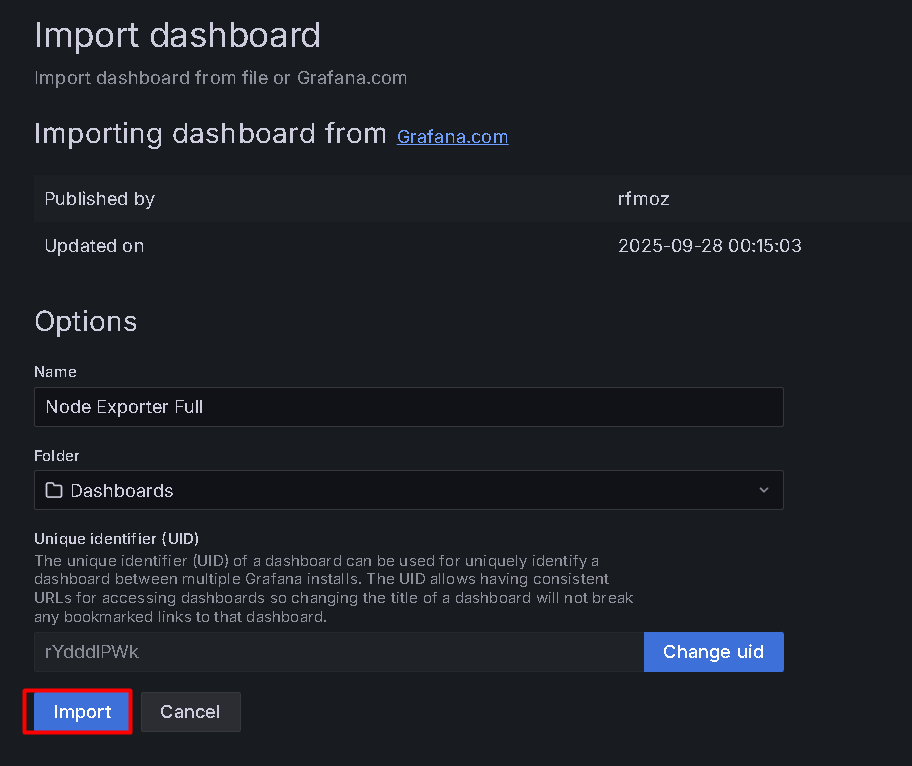

# Monitoring Promeotheus & Grafana

## Pasang Node Exporter (di server yang mau dimonitor)  

Node Exporter harus dijalankan di setiap host yang ingin dimonitor.  

1. Download binary terbaru (contoh cara manual — ganti versi bila perlu):

```py
cd /tmp
VERSION=1.8.2
wget https://github.com/prometheus/node_exporter/releases/download/v${VERSION}/node_exporter-${VERSION}.linux-amd64.tar.gz
tar xzf node_exporter-${VERSION}.linux-amd64.tar.gz
sudo mv node_exporter-${VERSION}.linux-amd64/node_exporter /usr/local/bin/
```
2. Buat user sistem dan service systemd:  

```
useradd -rs /bin/false node_exporter
```
```
tee /etc/systemd/system/node_exporter.service > /dev/null <<'EOF'
[Unit]
Description=Prometheus Node Exporter
After=network.target

[Service]
User=node_exporter
Group=node_exporter
Type=simple
ExecStart=/usr/local/bin/node_exporter

[Install]
WantedBy=multi-user.target
EOF
```  
3. Mulai dan aktifkan:  

```py
systemctl daemon-reload
systemctl enable --now node_exporter  
sudo systemctl status node_exporter --no-pager  
```

4. Tes dari localhost / remote:  

```py
curl -s http://127.0.0.1:9100/metrics | head  
```

## Pasang Prometheus (bisa di server monitoring terpisah atau sama)  

1. Download Prometheus:  

```py
cd /tmp
PROM_VER=2.47.0   # contoh; sesuaikan bila perlu
wget https://github.com/prometheus/prometheus/releases/download/v${PROM_VER}/prometheus-${PROM_VER}.linux-amd64.tar.gz
tar xzf prometheus-${PROM_VER}.linux-amd64.tar.gz
cp -r prometheus-${PROM_VER}.linux-amd64/* /opt/prometheus
```

2. Struktur file dan user:  

```py
useradd -rs /bin/false prometheus
sudo mkdir -p /etc/prometheus /var/lib/prometheus
sudo mv /opt/prometheus/prometheus /opt/prometheus/promtool /usr/local/bin/
rm -rf /etc/prometheus/consoles /etc/prometheus/console_libraries
sudo mv /opt/prometheus/consoles /opt/prometheus/console_libraries /etc/prometheus/
sudo chown -R prometheus:prometheus /etc/prometheus /var/lib/prometheus
sudo chown prometheus:prometheus /usr/local/bin/prometheus /usr/local/bin/promtool
```  

3. Buat prometheus.yml minimal di /etc/prometheus/prometheus.yml:  

```py
nano /etc/prometheus/prometheus.yml
```
```py
global:
  scrape_interval: 15s

scrape_configs:
  - job_name: 'prometheus'
    static_configs:
      - targets: ['localhost:9090']

  - job_name: 'node_exporter'
    static_configs:
      - targets: ['127.0.0.1:9100']   # ganti dengan IP host jika node_exporter di host lain
```
4. Systemd service:

```py
sudo tee /etc/systemd/system/prometheus.service > /dev/null <<'EOF'
[Unit]
Description=Prometheus
Wants=network-online.target
After=network-online.target

[Service]
User=prometheus
Group=prometheus
Type=simple
ExecStart=/usr/local/bin/prometheus \
  --config.file=/etc/prometheus/prometheus.yml \
  --storage.tsdb.path=/var/lib/prometheus \
  --web.listen-address=0.0.0.0:9090

[Install]
WantedBy=multi-user.target
EOF
```

5. Mulai Prometheus:

```py
systemctl daemon-reload
systemctl enable --now prometheus  
systemctl status prometheus --no-pager  
```

6. Buka web UI Prometheus (di browser): http://<PROM_SERVER_IP>:9090/targets — di sini kamu harus melihat node_exporter sebagai UP.

Jika node_exporter di host lain, tambahkan IP host pada targets (contoh 192.168.1.10:9100).
  

## Pasang Grafana
```py
apt update
apt install -y apt-transport-https software-properties-common wget
wget -q -O - https://packages.grafana.com/gpg.key | sudo apt-key add -
add-apt-repository "deb https://packages.grafana.com/oss/deb stable main"  
apt update 
apt install -y grafana
```
  
Aktifkan dan jalankan:
```py 
systemctl enable --now grafana-server
systemctl status grafana-server --no-pager
```  

Akses Grafana di browser: http://<GRAFANA_IP>:3000
Default login: admin / admin → kamu akan diminta mengganti password.  
 
   

 ## Hubungkan Grafana ke Prometheus

 1. Login Grafana -> connections - Add data sources  
   

   
   
  Save and test (paling bawah)

## Membuat Dashboard

  

  

cari template dashboard di 

https://grafana.com/grafana/dashboards/ 


  

ke bawah copy ID nya 

  

Masukkan ID nya kemudian Load  

  

  

  


   