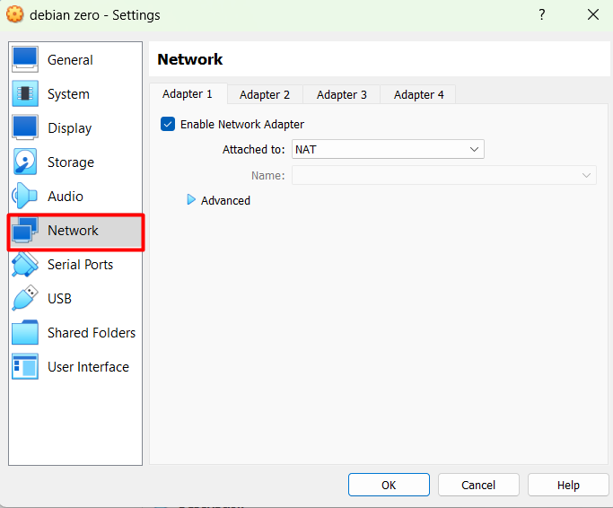
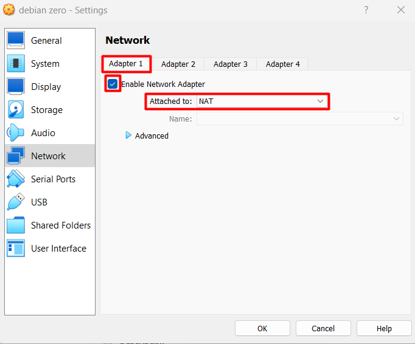
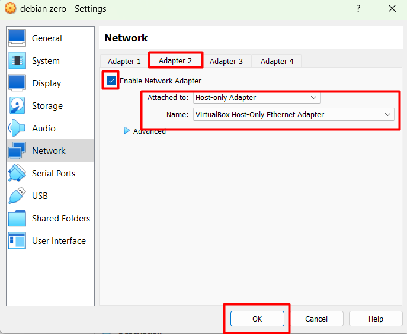
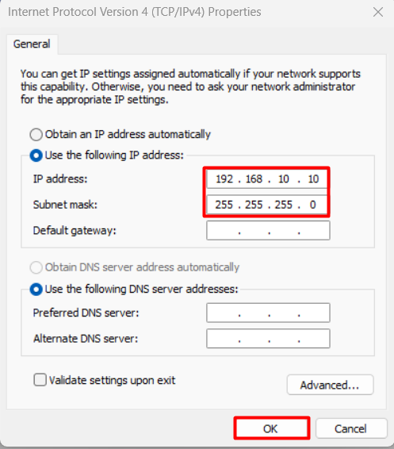
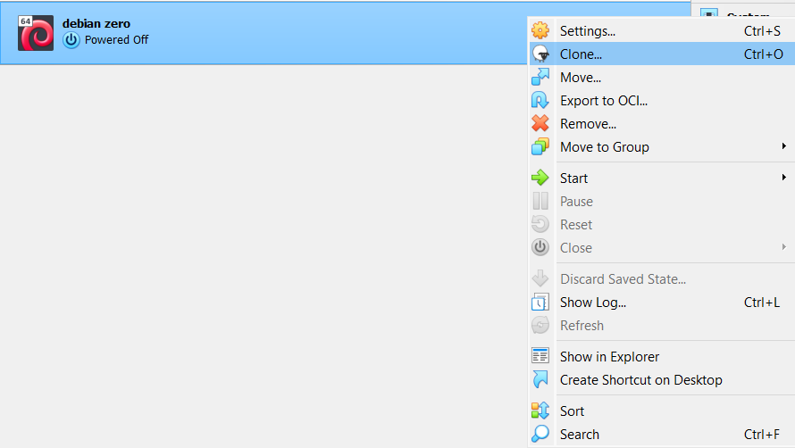
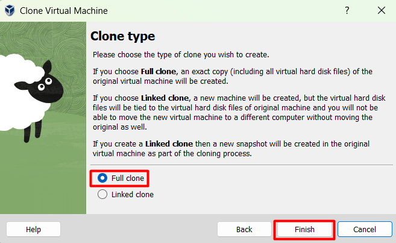
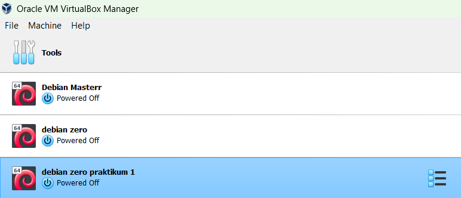

# Initial Setup
Didalam initial setup kita akan mengkonfigurasikan `Network Virtual Box` , `ip address` , `repository`, `Hostname`, `Message Of The Day`, menginstall `sudo`

## Network VirtualBox

Pada pembelajaran ini kita menggunakan `Virtual Box` sebagai media virtualisasi. Berikut sedikit penjelasan singkat terkait `Virtual Box`. Komputer yang kita gunakan untuk menginstall `Virtual Box` disebut dengan `Host` , sebaliknya Virtual Machine yang kita buat di dalam `Virtual Box` disebut dengan `Guest` kedepannya kedua istilah ini akan terus digunakan pada pembelajaran ini. Agar `Host` dan `Guest` dapat berkomunikasi kita membutuhkan sebuah `Network Adapter`. Ada beberapa `Network Adapter` yang disediakan oleh `Virtual Box` diantaranya:  

1. NAT (Network Address Translation)  
   Dengan `NAT` komputer `Guest` dapat terkoneksi dengan Internet. 

2. Virtual Host Only  
`Virtual Host Only` bekerja seperti sebuah switch, artinya lebih dari 1 komputer `Guest` bisa terkoneksi ke `Network Adapter` ini, namun tetap harus disetting `IP Address` nya.  

3. Bridged Adapter  
`Bridget Adapter` menggunakan `Network Adapter` dari komputer `Host` sehingga misalkan komputer `Host` terkoneksi dengan jaringan wifi maka komputer `Guest` pun terkoneksi di jaringan yang sama.  

4. Internal Network
`Internal Network` ialah `Network Adapter` yang bersifat custom, kita dapat membuat beberapa `Internal Network`. `Internal Network` hanya dapat digunakan untuk mengoneksikan antar komputer `Guest`.  

### Menambahkan Network Adapter

Untuk menambahkan `Network Adapter` Klik pada `Guest` yang dituju lalu klik `Setting` -> `Network Adapter`.  

  
  
    

Pada pembelajaran ini kita hanya butuh 2 buah `Network Adapter` yaitu `Nat` dan `Host Only Adapter`. Cukup klik `Enable Network Adapter` dan memilih `Network Adapter` nya, lakukan ini pada `Adapter 1` dan `Adapter 2`.  
  
    
    

    


## Mengganti IP Address
Didalam ip address biasanya terdapat 2 macam ip address yaitu `dynamic` dan ` static`. Sesuai dengan namanya `dynamic` artinya `ip address` yang didapatkan secara dinamis sehingga selalu berubah ubah tergantung dari si pemberi ` ip address`. Sedang `static` berarti `ip address` tersebut ialah tetap sehingga kita perlu memasukkan `ip address` nya.

### IP Adrress Dynamic

``` py title="nano /etc/network/interfaces"
# The primary network interface
auto enp0s3
iface enp0s3 inet dhcp
```
``` py
root@debian:~# service networking restart
```
!!! Note
    `enp0s3` ialah nama dari `Network Adapter` yang ingin dirubah ipnya. Untuk mengeceknya bisa menggunakan perintah `ip a`. lalu `service networking restart` ialah agar system mengenali perubahan `IP Address` yang telah kita buat. Nantinya setiap service yang kita konfigurasi harus direstart terlebih dahulu.

### IP Address Static

``` py title="nano /etc/network/interfaces"
auto enp0s8
iface enp0s8 inet static
address 192.168.10.1
netmask 255.255.255.0
```
``` py
root@debian:~# service networking restart
```  
  
!!! Note
    Selain `address` dan juga `netmask` kita juga dapat mengkonfigurasi `gateway` dan `dns-nameservers`. `dns-nameservers` digunakan untuk mengarahkan dns server yang ingin digunakan.

### Setting IP Address Komputer Host

Masuk ke `Control Panel` -> `Network and Internet` -> `Network and Sharing Center` -> `Change adapter settings` cari `VirtualBox Host-Only ......`.  

  

Klik 2 kali lalu pilih `Properties` cari pengaturan `Internet Protocol version 4` lalu klik `Properties`, kemudian ubah seperti dibawah ini.  

  

### Tes Koneksi

Buka `CMD` Kemudian ping ke `Ip Address` dari `Guest Server`  

``` py title="CMD"
Microsoft Windows [Version 10.0.22621.1848]
(c) Microsoft Corporation. All rights reserved.

C:\Users\Monk>ping 192.168.10.1

Pinging 192.168.10.1 with 32 bytes of data:
Reply from 192.168.10.1: bytes=32 time<1ms TTL=64
Reply from 192.168.10.1: bytes=32 time<1ms TTL=64
Reply from 192.168.10.1: bytes=32 time<1ms TTL=64
Reply from 192.168.10.1: bytes=32 time<1ms TTL=64

Ping statistics for 192.168.10.1:
    Packets: Sent = 4, Received = 4, Lost = 0 (0% loss),
Approximate round trip times in milli-seconds:
    Minimum = 0ms, Maximum = 0ms, Average = 0ms
```  

Pastikan kalian berhasil ping ke `Guest Server`.

## Hostname

`Hostname` merupakan sebuah nama komputer atau label unik yang diterapkan untuk perangkat atau host pada jaringan. nah dengan `hostname` kita dapat membedakan antara satu perangkat dengan perangkat lainnya.  

### Melihat Hostname

Untuk melihat `Hostname` kita dapat menggunakan perintah `Hostnamectl`  

```py title="Hostnamectl"
root@debianMaster:~# hostnamectl
   Static hostname: debianMaster
         Icon name: computer-vm
           Chassis: vm
        Machine ID: 09c3103389ac419883e8fa3afa594b43
           Boot ID: e8c4fba2ed25414aa237e7c858f5a2c5
    Virtualization: oracle
  Operating System: Debian GNU/Linux 11 (bullseye)
            Kernel: Linux 5.10.0-18-amd64
      Architecture: x86-64
```  
Bisa kita lihat pada bagian `Static hostname`, `hostname`  dari `guest` server kita adalah `debianMaster`. `Hostname` sendiri sebenarnya tersematkan setelah nama `user` yang dipisahkan dengan tanda `@`.  

  

### Mengganti Hostname

```py title="Syntax"
root@debianMaster:~# hostnamectl set-hostname [nama hostname anda]

```

```py title="Example"
root@debianMaster:~# hostnamectl set-hostname debianMaster2
```  

Untuk melihat perubahan dari `Hostname` yang telah diganti kita harus `logout` terlebih dahulu, kemudian `login` kembali.

```py
root@debianMaster:~# exit
logout
useradmin@debianMaster:~$ su -
Password:
root@debianMaster2:~#

```  

Terlihat `Hostname` telah berubah menjadi `debianMaster2`.  

## Message Of The Day

Setiap kita melakukan `SSH` system akan memberikan pesan seperti dibawah ini.

```py
C:\Users\Monk>ssh useradmin@192.168.10.1
useradmin@192.168.10.1's password:
Linux debianMaster2 5.10.0-18-amd64 #1 SMP Debian 5.10.140-1 (2022-09-02) x86_64

The programs included with the Debian GNU/Linux system are free software;
the exact distribution terms for each program are described in the
individual files in /usr/share/doc/*/copyright.

Debian GNU/Linux comes with ABSOLUTELY NO WARRANTY, to the extent
permitted by applicable law.
Last login: Wed Jul 26 14:48:58 2023 from 192.168.10.10
useradmin@debianMaster2:~$
```
Nah pesan ini bisa kita konfigurasi sesuai keinginan.

```py
useradmin@debianMaster2:~$ su -
Password:
root@debianMaster2:~# nano /etc/motd
```  

Silahkan hapus isinya, kemudian tuliskan sesuai dengan keinginan.

```py title="nano /etc/motd"
_________________________S3L4M4T D4T4NG!!!___________________________

_________________________________W3LC0M3________________________________
```  

Untuk melihat hasilnya, `logout` terlebih dahulu lalu `SSH` kembali

```py
root@debianMaster2:~# exit
logout
useradmin@debianMaster2:~$ exit
logout
Connection to 192.168.10.1 closed.

C:\Users\Monk>ssh useradmin@192.168.10.1
useradmin@192.168.10.1's password:
Linux debianMaster2 5.10.0-18-amd64 #1 SMP Debian 5.10.140-1 (2022-09-02) x86_64
_________________________S3L4M4T D4T4NG!!!___________________________

_________________________________W3LC0M3________________________________
Last login: Wed Jul 26 21:04:32 2023 from 192.168.10.10
useradmin@debianMaster2:~$
```

## Tugas Praktikum !!!

### Preparation

Sebelum memulai praktikum silahkan `clone` terlebih dahulu VM `debian Zero` menjadi `debian zero praktikum 1`. **Klik Kanan** -> **Clone**  

  

  



  

Nantinya VM baru ini yang digunakan untuk mengerjakan tugas.

### Task

Buatlah dokumentasi untuk pemecahan permasalahan dibawah ini : 

1. Menambahkan network adapter 3 dan 4 pada VirtualBox. Kedua Adapter tersebut menggunakan `Host Only Adapter`

2. Melakukan konfigurasi `IP Address` pada `Guest Server` dengan ketentuan sebagai berikut:  
Adapter 3 : Dynamic
Adapter 4 : 192.168.1.[tanggal lahir anda]/24

3. Pastikan `Host` bisa melakukan ping ke `Guest` menggunakan `IP` dari `Adapter 4`.

4. `SSH` ke `Guest` menggunakan `IP` dari Adapter 4.

5. Merubah `Hostname` dari `Guest` menjadi **Praktikum 1**

6. Merubah `Welcome Message` dari `Guest` menjadi **Selamat Datang di Praktikum 1**

Kirimkan ke discord dalam bentuk pdf dengan format judul Praktikum_InitialSetup_[nama antum].pdf
  


