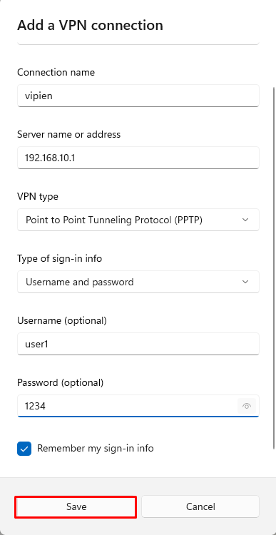
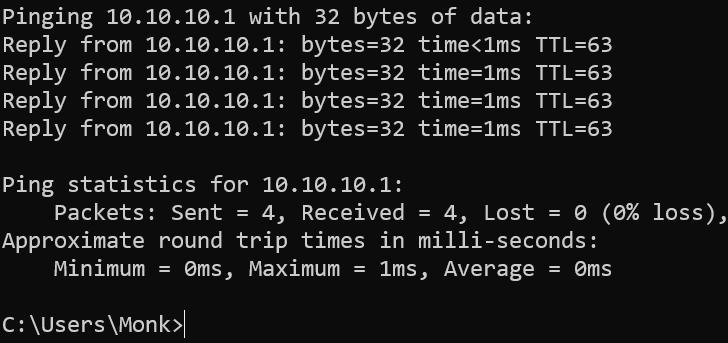
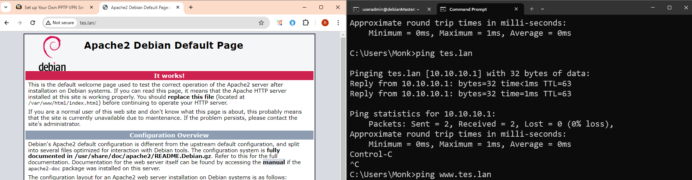

# VPN PPTP (Point to Point)

!!! Requirement
    Disini kita akan membutuhkan 2 buah server, `web+dns server` dan `VPN PPTP Server`. Khusus `VPN PPTP Server` kita menggunakan 3 Network Adapter. 

## Apa itu VPN Server

VPN atau Virtual Private Network, merupakan teknologi yang menghubungkan antara jaringan private dengan jaringan Public. Seperti yang kita ketahui bersama jaringan private tidak dapat diakses melalui internet karena tidak terekspos secara publik, dengan menggunakan VPN Server kita dapat mengakses jaringan private melalui jaringan publik/internet. VPN juga berfungsi untuk menyembunyikan jaringan , sehingga client yang terhubung ketika melakukan akses internet, tidak terekpos di jaringan publik.  
VPN server sendiri ada 2 tipe yang pertama adalah `PPTP` `(Point to Point)` tipe ini kita akan konek ke VPN server menggunakan Username dan Password. Dikatakan bahwa sejak tahun 2017 tipe ini sudah jarang digunakan karena memiliki celah keamanan, yang kedua adalah `OpenVPN` tipe ini lebih aman karena menggunakan pasangan `certificate` dan `key`.  

Untuk pembelajaran kali ini kita akan menggunakan PPTP.


## Setting web+dns Server

### Setting ip dan Hostname

```py
root@debianMaster:~# hostnamectl set-hostname webdns
root@debianMaster:~# exit
logout
useradmin@debianMaster:~$ su -
Password:
root@webdns:~#
```

```py
root@webdns:~# nano /etc/network/interface
```
```py
# This file describes the network interfaces available on your system
# and how to activate them. For more information, see interfaces(5).

source /etc/network/interfaces.d/*

# The loopback network interface
auto lo
iface lo inet loopback

auto enp0s3
iface enp0s3 inet dhcp

auto enp0s8
iface enp0s8 inet static
address 10.10.10.1
netmask 255.255.255.0
```
```py
root@webdns:~# service networking restart
```


#### Installasi Apache2

```py
root@webdns:~# apt install apache2 -y
```

#### Setting DNS
```py
root@webdns:~# apt install bind9 -y
root@webdns:~# cd /etc/bind
root@webdns:/etc/bind# nano named.conf.local
```
```py
zone "tes.lan" {
        type master;
        file "/etc/bind/db.tes";
};
```
```py
root@webdns:/etc/bind# cp db.local db.tes
root@webdns:/etc/bind# nano db.tes
```
```py
;
; BIND data file for local loopback interface
;
$TTL    604800
@       IN      SOA     tes.lan. root.tes.lan. (
                              2         ; Serial
                         604800         ; Refresh
                          86400         ; Retry
                        2419200         ; Expire
                         604800 )       ; Negative Cache TTL
;
@       IN      NS      tes.lan.
@       IN      A       10.10.10.1
www     IN      A       10.10.10.1
```
```py
root@webdns:/etc/bind# service bind9 restart
root@webdns:/etc/bind# nano /etc/resolv.conf
```
```py
nameserver 10.10.10.1
nameserver 8.8.8.8
```
## Setting VPN Server

### Setting IP dan Hostname
```py
root@debianMaster:~# hostnamectl set-hostname vpn
root@debianMaster:~# exit
logout
useradmin@debianMaster:~$ su -
Password:
root@vpn:~#
```
```py
# This file describes the network interfaces available on your system
# and how to activate them. For more information, see interfaces(5).

source /etc/network/interfaces.d/*

# The loopback network interface
auto lo
iface lo inet loopback

auto enp0s3
iface enp0s3 inet dhcp

auto enp0s8
iface enp0s8 inet static
address 192.168.10.1
netmask 255.255.255.0

auto enp0s9
iface enp0s9 inet static
address 10.10.10.2
netmask 255.255.255.0
```
```py
root@vpn:~# service networking restart
```
!!! Explaination
    `enp0s8` konek ke client sedangkan `enp0s9` konek ke server `webdns`

### Adding DNS Server
```py
root@vpn:~# nano -c /etc/ppp/pptpd-options
##cari baris 58-59 uncomment dan rubah seperti dibawah ini
ms-dns 10.10.10.1
ms-dns 8.8.8.8
```
!!! Explaination
    Jadi `ms-dns` adalah DNS Server yang akan digunakan oleh `client` dari VPN server kita, sehingga `client` menggunakan `dns server` kita dan juga `google`.

### Adding VPN User Accounts
```py
root@vpn:~# nano /etc/ppp/chap-secrets
```
```py
# Secrets for authentication using CHAP
# client        server  secret                  IP addresses
user1   pptpd   1234    *
user2   pptpd   1234    10.10.10.26
```
!!! EXP
    Pada file ini kita bisa menentukan `username`,`password` dan juga `IP` yang akan didapatkan oleh `client`. Untuk tanda `*` maka client akan mendapatkan random `IP` dari pool `remote IP`, adapun setting `remote IP` setelah langkah ini.

### Allocating Private IP for VPN Server and Clients
```py
root@vpn:~# nano /etc/pptpd.conf
##Ke baris paling bawah kemudian ketikkan seperti dibawah ini
localip 10.10.10.2
remoteip 10.10.10.3-100
```
!!! EXP
    `localip` adalah ip dari vpn server, sedangkan `remoteip` adalah ip yang akan didapatkan oleh `client`. `client` akan mendapatkan ip dari 10.10.10.3 - 10.10.10.100.

### Enable IP Forwarding
```py
root@vpn:~# nano -c /etc/sysctl.conf
```
```py 
##uncomment baris 28
net.ipv4.ip_forward=1
```
!!! Explaination
    Karena `subnet` dari client dan `webdns` berbeda maka kita butuh `ip forward` , sehingga tetap terhubung meskipun beda `subnet`.

```py
root@vpn:~# service pptpd restart
```

## Membuat koneksi vpn di client
  
  
  
  


## Pengujian
Tes Ping 10.10.10.1 (webdns) di cmd  

Tes akses tes.lan di browser  



