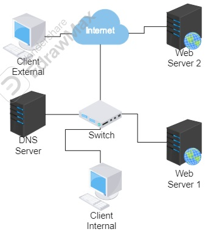
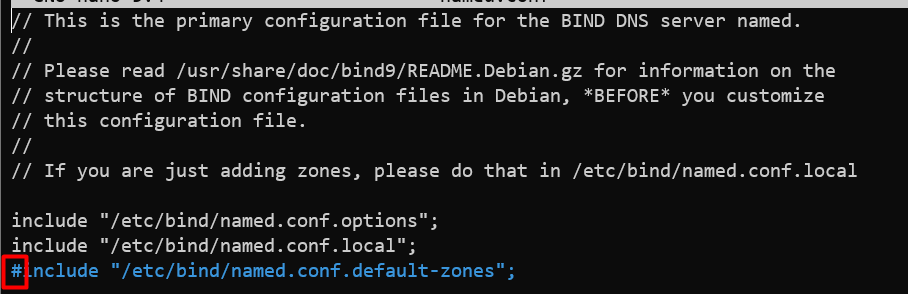
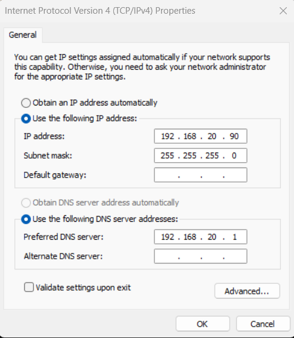
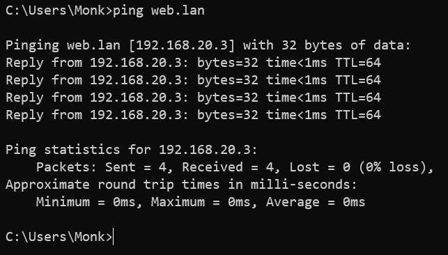
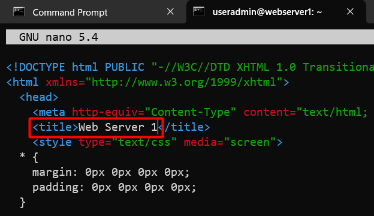
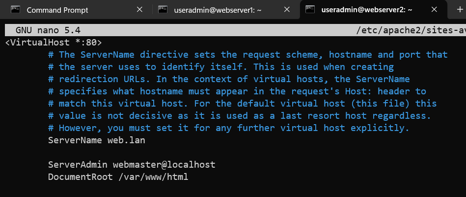
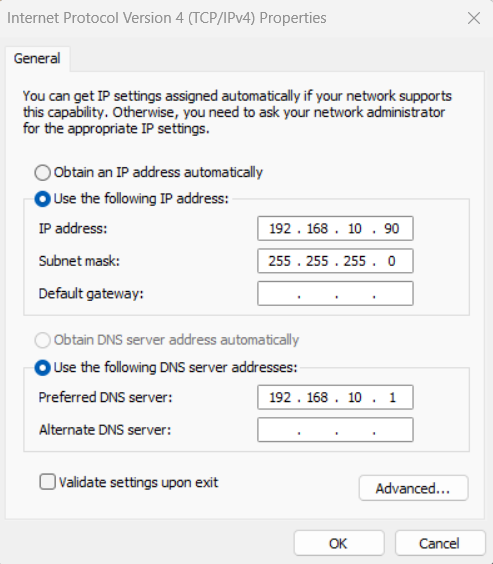
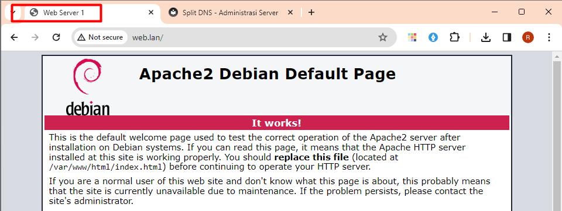
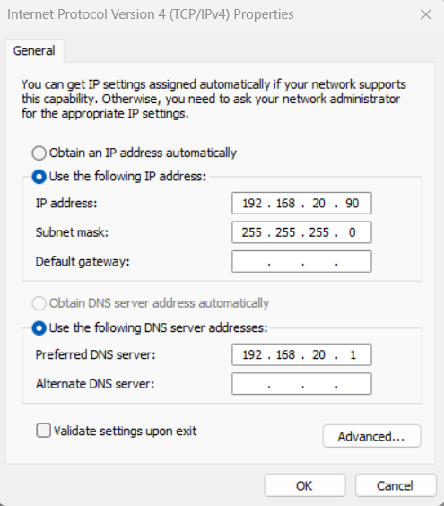
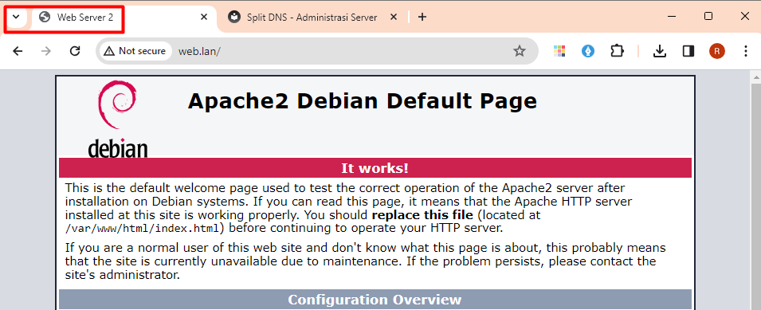

# Split DNS

## Apa itu Split DNS

Split DNS (Domain Name System) adalah metode konfigurasi di mana server DNS memecahkan nama domain yang sama menjadi alamat IP yang berbeda berdasarkan sumber permintaan DNS Pada dasarnya, ini melibatkan dua set server DNS: satu set untuk penggunaan jaringan internal dan satu set lagi untuk penggunaan jaringan eksternal.

Dalam pengaturan split DNS, ketika sebuah permintaan DNS berasal dari dalam jaringan internal organisasi, itu akan dipecahkan oleh server DNS internal, yang mungkin mengembalikan alamat IP internal untuk sumber daya seperti server, printer, atau perangkat lain dalam jaringan organisasi. Namun, ketika nama domain yang sama diambil dari luar jaringan internal organisasi, server DNS eksternal akan memberikan balasan dengan alamat IP publik yang dapat diakses dari internet.

Konfigurasi ini sering digunakan untuk tujuan keamanan dan efisiensi. Ini memungkinkan organisasi untuk memberikan tanggapan yang berbeda kepada pengguna internal dan eksternal, memungkinkan mereka mengontrol akses ke sumber daya internal dan mungkin mengoptimalkan lalu lintas jaringan dengan mengarahkan pengguna internal ke sumber daya yang berada dalam jaringan yang sama daripada melewatkan lalu lintas melalui jaringan eksternal.

Split DNS juga dapat digunakan untuk memungkinkan akses yang lancar ke beberapa layanan atau sumber daya bagi pengguna internal sambil tetap menjaga langkah-langkah keamanan yang membatasi akses eksternal ke sumber daya yang sama. Ini sangat berguna untuk organisasi yang meng-host layanan mereka sendiri atau memiliki infrastruktur jaringan yang kompleks dengan komponen yang menghadap ke dalam dan ke luar.
## Implementasi Split DNS



!!! Requirement
    DNS Server :  
    - enp0s8 192.168.10.1   
    - enp0s9 192.168.20.1   
    - hostname split-dns-server  

    web server 1 :   
    - enp0s8 192.168.10.2   
    - enp0s9 192.168.20.2   
    - hostname web-server-1  

    web server 2 :  
     enp0s8 192.168.10.3  
      enp0s9 192.168.20.3   
      hostname web-server-2

### Konfigurasi Split DNS Server

#### installasi DNS Server

```py
root@split-dns-server:~# apt install bind9 -y
```

#### Membuat Zone

```py
root@split-dns-server:~# cd /etc/bind/
root@split-dns-server:/etc/bind# nano named.conf.local
```
```py
view "internal" {               // Nama Split dan Pembuka
        match-clients {         // Daftar IP client yang bisa akses split tsb
        192.168.10.0/24;
};

        zone "web.lan" {        // zone yang berada didalam sebuah split
        type master;
        file "/etc/bind/db.int";
        };

        include "/etc/bind/named.conf.default-zones"; // dibutuhkan dalam penggunaan split dns

}; // Penutup Split


view "external" {
        match-clients {
        any;                    // semua ip address bisa melakukan akses
};

        zone "web.lan" {
        type master;
        file "/etc/bind/db.ext";
};
        include "/etc/bind/named.conf.default-zones";

};

```
#### Konfigurasi file forward internal

```py
root@split-dns-server:/etc/bind# cp db.local db.int
root@split-dns-server:/etc/bind# nano db.int
```
```py
;
; BIND data file for local loopback interface
;
$TTL    604800
@       IN      SOA     web.lan. root.web.lan. (
                              2         ; Serial
                         604800         ; Refresh
                          86400         ; Retry
                        2419200         ; Expire
                         604800 )       ; Negative Cache TTL
;
@       IN      NS      ns1.web.lan.
@       IN      A       192.168.10.2
ns1     IN      A       192.168.10.1
www     IN      A       192.168.10.2
```

#### Konfigurasi file forward external

```py
root@split-dns-server:/etc/bind# cp db.int db.ext
root@split-dns-server:/etc/bind# nano db.ext
```

```py
;
; BIND data file for local loopback interface
;
$TTL    604800
@       IN      SOA     web.lan. root.web.lan. (
                              2         ; Serial
                         604800         ; Refresh
                          86400         ; Retry
                        2419200         ; Expire
                         604800 )       ; Negative Cache TTL
;
@       IN      NS      ns1.web.lan.
@       IN      A       192.168.20.3
ns1     IN      A       192.168.20.1
www     IN      A       192.168.20.3
```
#### edit named.conf

```py
root@split-dns-server:/etc/bind# nano named.conf
```


!!! Warning
    Agar tidak terjadi conflict pada DNS server, kita perlu comment named.conf.default-zones. Karena sudah kita include pada masing masing split.

```py
root@split-dns-server:/etc/bind# service bind9 restart
root@split-dns-server:/etc/bind# service bind9 status
```

#### Resolve Conf

```py
root@split-dns-server:/etc/bind# nano /etc/resolv.conf
```

```py
nameserver 192.168.10.1
nameserver 192.168.20.1
nameserver 8.8.8.8
nameserver 8.8.4.4
```

#### Testing Konfigurasi

ubah dahulu Ip Address dari client menjadi 192.168.10.90 dan dns server ke 192.168.10.1 kemudian ping ke web.lan


Jika konfigurasi sudah benar seharusnya web.lan diarahkan ke ip 192.168.10.2


Ubah kembali IP Address dari client menjadi 192.168.20.90 dan dns server ke 192.168.20.1 kemudian ping kembali web.lan



Jika konfigurasi sudah benar seharusnya web.lan diarahkan ke ip 192.168.20.3



### Konfigurasi Web Server

### Konfigurasi Web Server 1

#### Installasi Apache2

```py
root@webserver1:~# apt install apache2 -y
```

#### Konfigurasi V-Host
```py
root@webserver1:~# nano /etc/apache2/sites-available/000-default.conf
```


```py
root@webserver1:~# service apache2 restart
```

#### Edit Html File

```py
root@webserver1:~# nano /var/www/html/index.html
```



### Konfigurasi Web Server 2

#### Installasi Apache2

```py
root@webserver2:~# apt install apache2 -y
```

#### Konfigurasi V-Host
```py
root@webserver2:~# nano /etc/apache2/sites-available/000-default.conf
```


```py
root@webserver2:~# service apache2 restart
```

#### Edit Html File

```py
root@webserver2:~# nano /var/www/html/index.html
```


### Testing
Sama seperti sebelumnya kita perlu mengubah IP Client menjadi 192.168.10.90 dan dns server menjadi 192.168.10.1 lalu akses web.lan lewat browser



Jika konfigurasi benar maka web page yang akan muncul adalah web server 1 yang ceritanya berada di lokal



ubah kembali IP Client menjadi 192.168.20.90 dan dns server menjadi 192.168.20.1 lalu akses web.lan lewat browser



Jika konfigurasi benar maka web page yang akan muncul adalah web server 1 yang ceritanya berada di internet



#EZ