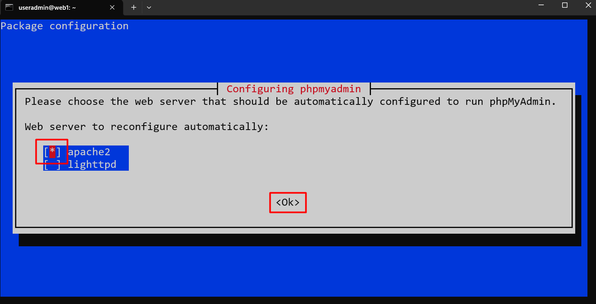
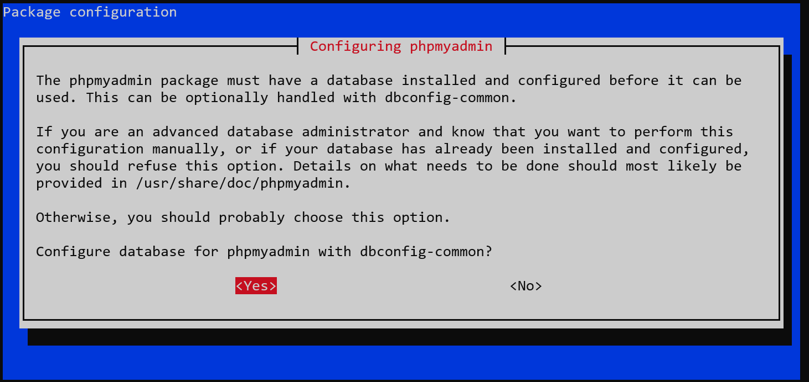
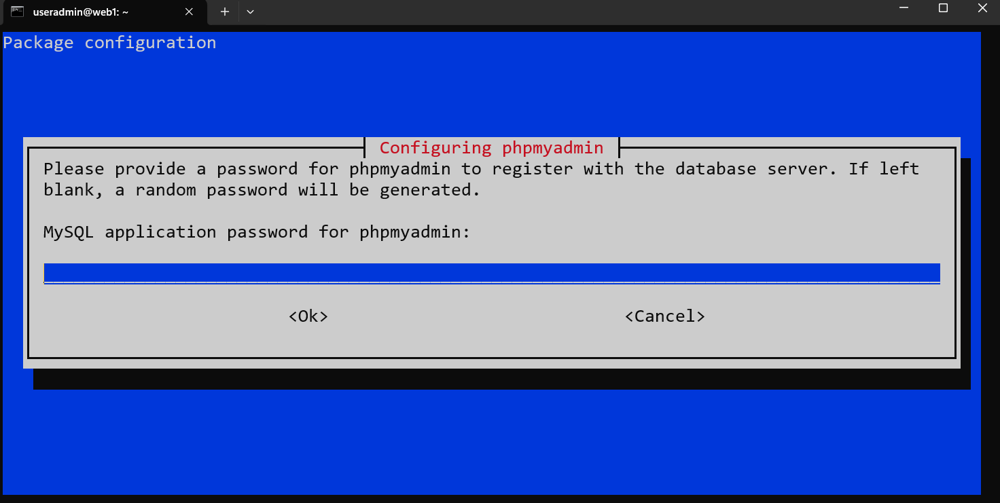
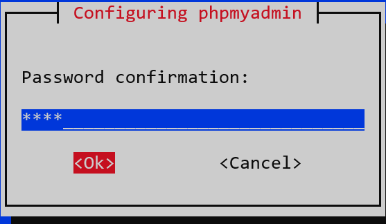
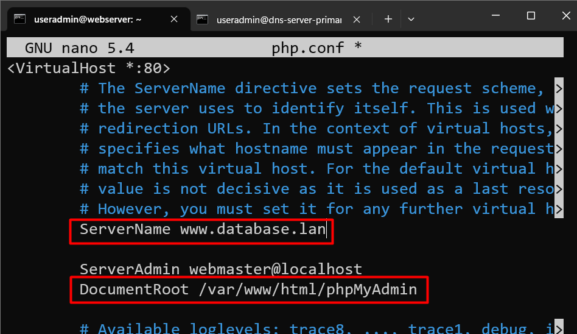
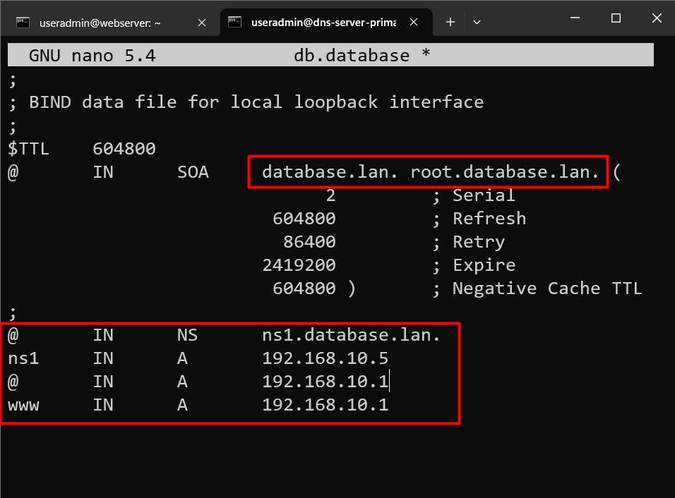
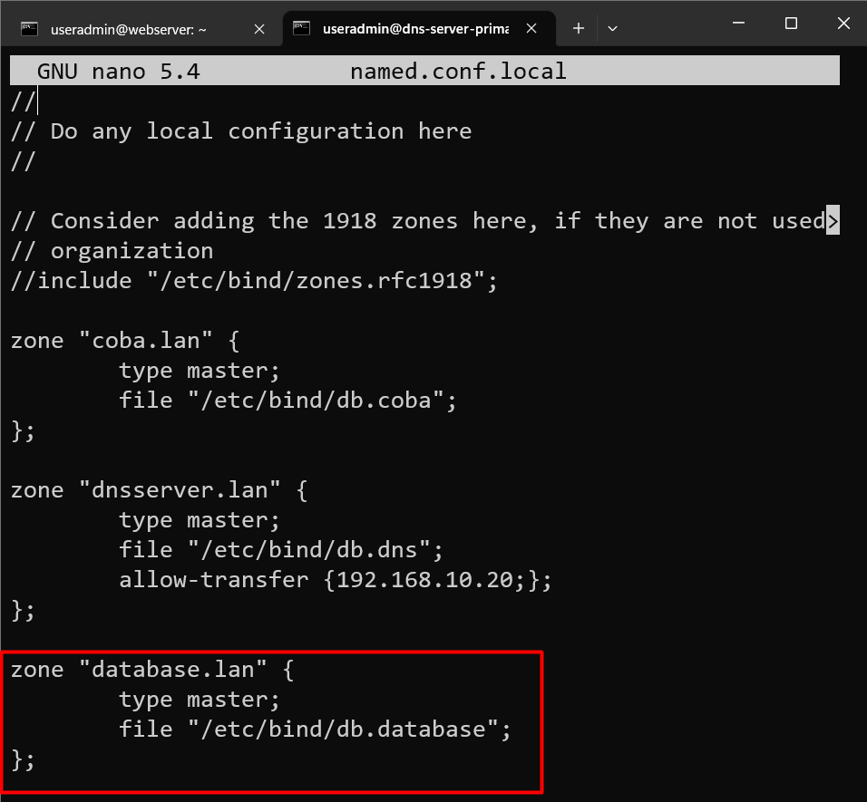
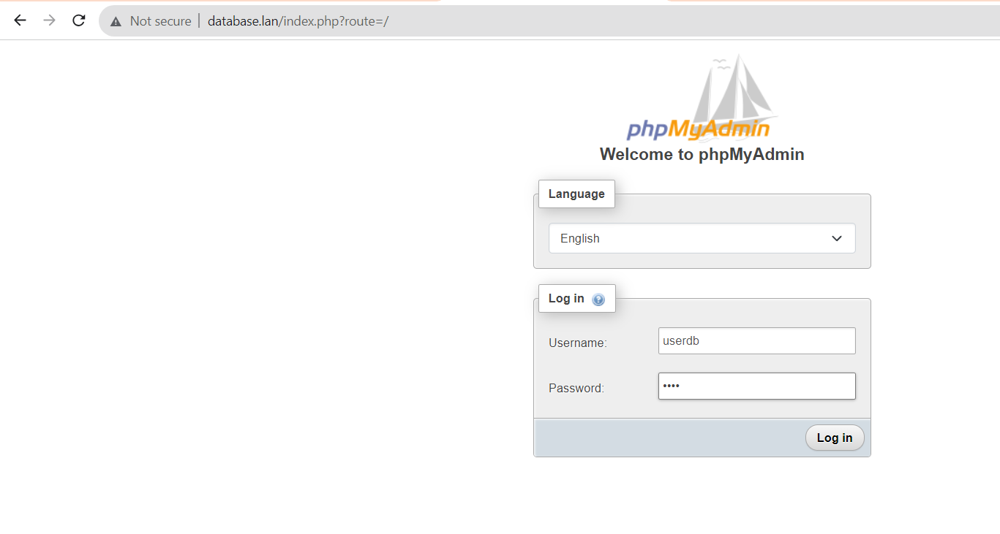

# Konfigurasi Mysql dan PHPMyAdmin

## Installasi Mariadb

### Setting Repository

```py
root@webserver-rehan:/etc/apache2/sites-available# nano /etc/apt/sources.list
```
hapus semua kemudian isikan seperti dibawah ini

```py
deb http://deb.debian.org/debian bookworm main
deb-src http://deb.debian.org/debian bookworm main

deb http://security.debian.org/debian-security bookworm-security main
deb-src http://security.debian.org/debian-security bookworm-security main

deb http://deb.debian.org/debian bookworm-updates main
deb-src http://deb.debian.org/debian bookworm-updates main

deb http://deb.debian.org/debian bookworm-backports main
deb-src http://deb.debian.org/debian bookworm-backports main

```
```py
root@webserver-rehan:/etc/apache2/sites-available# apt update
```
### install mariadb

```py
root@webserver-rehan:/etc/apache2/sites-available# apt install mariadb-server mariadb-client -y
```

```py
root@webserver-rehan:/etc/apache2/sites-available# mysql_secure_installation
```
```py
Enter current password for root (enter for none):  
Switch to unix_socket authentication [Y/n] n  
Change the root password? [Y/n] n  
Remove anonymous users? [Y/n] y
Disallow root login remotely? [Y/n] y  
Remove test database and access to it? [Y/n] y  
Reload privilege tables now? [Y/n] y  
```
## Membuat user Mysql Baru

```py
root@webserver-rehan:/etc/apache2/sites-available# mysql -u root -p
```

```py
MariaDB [(none)]> create user 'userdb'@'%' identified by '1234';
MariaDB [(none)]> grant all privileges on *.* to 'userdb'@'%';
MariaDB [(none)]> exit
```

## Installasi phpMyAdmin

```py
root@webserver-rehan:/etc/apache2/sites-available# cd /root
```
### Install kebutuhan PHP

```py
root@webserver-rehan:~# apt -y install php php-cgi php-mysqli php-pear php-mbstring libapache2-mod-php php-common php-phpseclib php-mysql
```
### Installasi PhpMyAdmin

```py
apt-get install phpmyadmin
```  
- Tandai `apache` dengan menekan tombol `space` kemudian tekan `tab` sampai `ok` berwarna merah lalu tekan `enter`  
  
- Pilih `Yes` agar system melakukan konfigurasi database yang diperlukan secara otomatis  
  
- Masukkan password untuk database MySql yang akan dibuatkan oleh system, masukan `1234` saja untuk saat ini, kemudian `ok`. 
  
- Masukkan kembali password `1234`  



```py
root@webserver-rehan:~# apt install -y wget
```
```py
root@webserver-rehan:~# wget -P Downloads https://www.phpmyadmin.net/downloads/phpMyAdmin-latest-all-languages.tar.gz
```
```py
root@webserver-rehan:~# wget -P Downloads https://files.phpmyadmin.net/phpmyadmin.keyring
```
```py
root@webserver-rehan:~# cd Downloads/
```
```py
root@webserver-rehan:~/Downloads# apt install gnupg -y
```
```py
root@webserver-rehan:~/Downloads# gpg --import phpmyadmin.keyring
```

```py
root@webserver-rehan:~/Downloads# wget https://www.phpmyadmin.net/downloads/phpMyAdmin-latest-all-languages.tar.gz.asc
```

```py
root@webserver-rehan:~/Downloads# gpg --verify phpMyAdmin-latest-all-languages.tar.gz.asc
```

### Extract PhpMyAdmin

```py
root@webserver-rehan:~/Downloads# mkdir /var/www/html/phpMyAdmin
```
```py
root@webserver-rehan:~/Downloads# tar xvf phpMyAdmin-latest-all-languages.tar.gz --strip-components=1 -C /var/www/html/phpMyAdmin
```
### KOnfigurasi Apache phpmyadmin

```py
root@webserver-rehan:~/Downloads# chown -R www-data:www-data /var/www/html/phpMyAdmin
```
```py
root@webserver-rehan:/var/www/html/phpMyAdmin# cd /etc/apache2/sites-available/
root@webserver-rehan:/etc/apache2/sites-available# cp 000-default.conf php.conf
root@webserver-rehan:/etc/apache2/sites-available# nano php.conf
```  

```py
root@webserver-rehan:/etc/apache2/sites-available# a2dissite 000-default.conf
```
```py
root@webserver-rehan:/etc/apache2/sites-available# a2ensite php.conf
```
```py
root@webserver-rehan:/etc/apache2/sites-available# service apache2 restart
```

### Setting DNS

#### Membuat Zone Baru

```py
root@dns-server-primary:/etc/bind# cd /etc/bind
```
```py
root@dns-server-primary:/etc/bind# nano named.conf.local
```
```py
root@dns-server-primary:/etc/bind# cp db.local db.database
```
```py
root@dns-server-primary:/etc/bind# nano db.database
```


```py
root@dns-server-primary:/etc/bind# service bind9 restart
```


### Testing 

Akses phpmyadmin via broser



