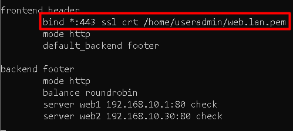
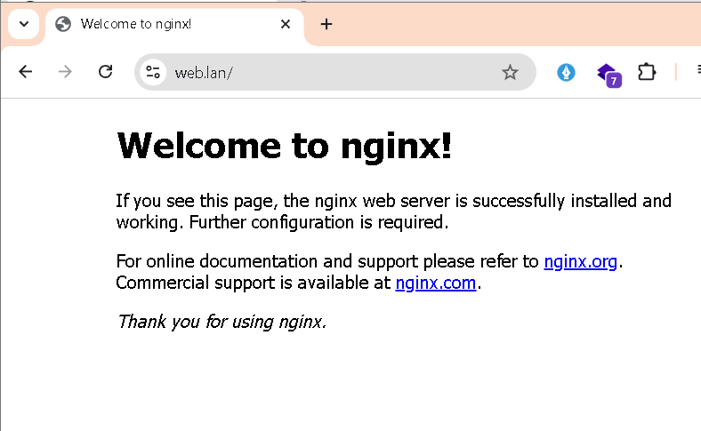

# Haproxy SSL/TLS (HTTPS)

!!! Note
    Untuk praktikum kali ini kita akan menggunakan 3 buah server.  
    1. haproxy-server : Gunakan server haproxy pada praktikum sebelumnya  
    2. CA Server dan Web Server 1 : Gunakan vm `ftp server`  
    3. DNS Server dan Web Server 2 : GUnakan vm `nginx` pada praktikum sebelumnya.

    Ha-proxy server dapat diakses dengan domain `www.web.lan` 

## Pembuatan file crt dan key untuk web.lan
!!! note
    Pembuatan akan menggunakan vm `ftp-server` , jangan lupa **GUNAKAN USER BIASA** 

### Membuat file konfigurasi untuk client haproxy
```py
useradmin@ftp-server:~$ cd ca
useradmin@ftp-server:~/ca$ nano web.lan.ext
```
```py
authorityKeyIdentifier=keyid,issuer
basicConstraints=CA:FALSE
keyUsage = digitalSignature, nonRepudiation, keyEncipherment, dataEncipherment
subjectAltName = @alt_names

[alt_names]
DNS.1 = web.lan
DNS.2 = www.web.lan
```

### Membuat private key untuk client
```py
useradmin@ftp-server:~/ca$ openssl genrsa -out web.lan.key 2048
```

### Membuat CSR file untuk client
```py
useradmin@ftp-server:~/ca$ openssl req -new -key web.lan.key -out web.lan.csr
```
```py
You are about to be asked to enter information that will be incorporated
into your certificate request.
What you are about to enter is what is called a Distinguished Name or a DN.
There are quite a few fields but you can leave some blank
For some fields there will be a default value,
If you enter '.', the field will be left blank.

Country Name (2 letter code) [AU]:ID
State or Province Name (full name) [Some-State]:Jabar
Locality Name (eg, city) []:Jonggol
Organization Name (eg, company) [Internet Widgits Pty Ltd]:Load Balancer
Organizational Unit Name (eg, section) []:Haproxy
Common Name (e.g. server FQDN or YOUR name) []:www.web.lan
Email Address []:ggwp@gg.wp

Please enter the following 'extra' attributes
to be sent with your certificate request
A challenge password []: enter aja 
An optional company name []: enter aja
```

### Menandatangani (Sign) file csr
```py
useradmin@ftp-server:~/ca$ openssl x509 -req -in web.lan.csr -CA rootCA.crt -CAkey rootCA.key -CAcreateserial -out web.lan.crt -days 365 -sha256 -extfile web.lan.ext
```

### Mengirimkan file crt dan key client ke server client
```py
useradmin@ftp-server:~/ca$ scp web.lan.key useradmin@192.168.10.10:~
useradmin@ftp-server:~/ca$ scp web.lan.crt useradmin@192.168.10.10:~
```

## Setting DNS Server
Kita akan melakukan konfigurasi domain `web.lan` yang akan kita arahkan ke VM `haproxy` pada `dns server` atau pada VM `nginx`

### Buat Zone Baru
```py
root@nginx:~# cd /etc/bind
root@nginx:/etc/bind# nano named.conf.local
```
tambahkan seperti dibawah ini
```py
zone "web.lan" {
type master;
file "/etc/bind/db.web";
};
```

### Konfigurasi File DB
```py 
root@nginx:/etc/bind# cp db.local db.web
root@nginx:/etc/bind# nano db.web
```
edit sehingga tampak seperti dibwah ini
```py
; BIND data file for local loopback interface
;
$TTL    604800
@       IN      SOA     ns1.web.lan. root.web.lan (
                              2         ; Serial
                         604800         ; Refresh
                          86400         ; Retry
                        2419200         ; Expire
                         604800 )       ; Negative Cache TTL
;
@       IN      NS      ns1.web.lan.
@       IN      A       192.168.10.10
ns1     IN      A       192.168.10.10
www     IN      A       192.168.10.10
```

```py
root@nginx:/etc/bind# service bind9 restart
```

## Konfigurasi Haproxy
Haproxy harus dikomnfigurasi sedemikian rupa agar dapat diakses menggunakan `https`. Konfigurasi ini dilakukan pada vm **LOAD BALANCER**

### Menggabungkan file crt dan key kedalam file pem
Haproxy tidak mengenali pasangan file `crt` dan `key`, haproxy hanya mengenali file `pem` yang merupakan gabungan dari isi file `crt` dan `key`, Sehingga kita perlu untuk menggabung file `crt` dan `key` yang telah dibuat di `ca server`.  

#### Masuk sebagai user biasa
```py
root@haproxy:~# su - useradmin
```

#### Menggabungkan file crt dan key
```py
useradmin@haproxy:~$ cat web.lan.crt web.lan.key > web.lan.pem
```

### edit file haproxy.cfg
```py
useradmin@haproxy:~$ su -
root@haproxy:~# nano /etc/haproxy/haproxy.cfg
```
ganti `bind*:80` menjadi seperti pada gambar  
 

### Pengujian 
akses https://www.web.lan di browser  
  
  

