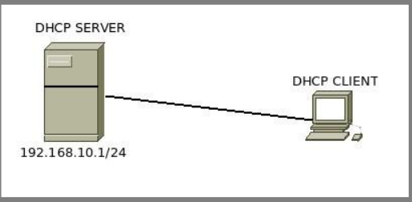
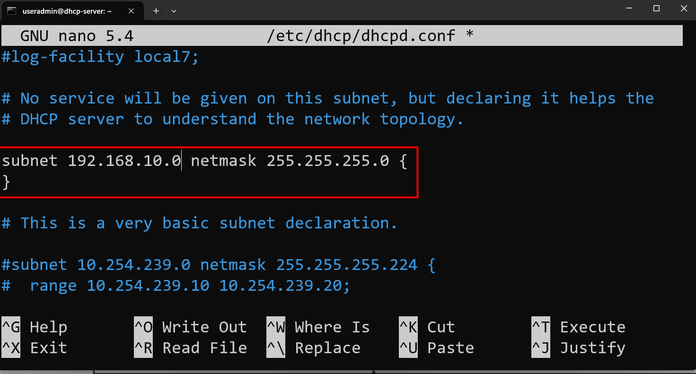
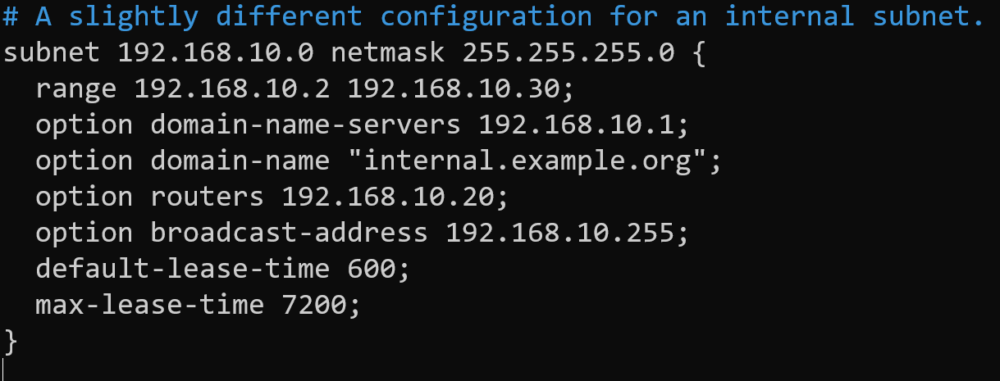
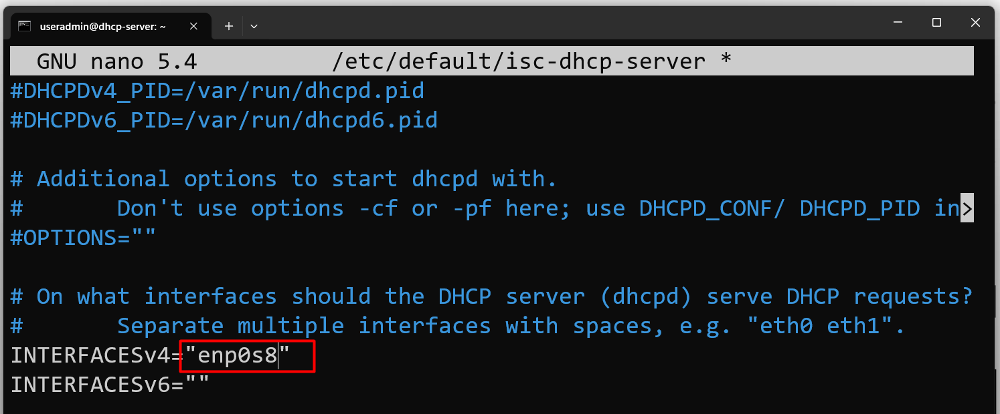
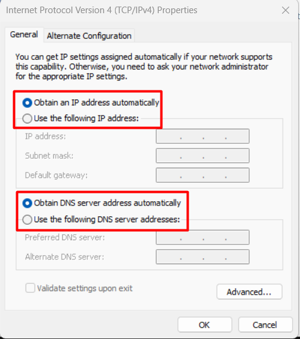
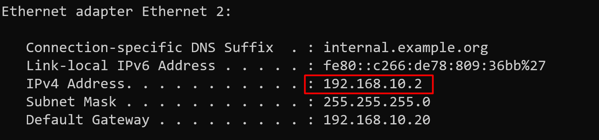

# DHCP Server

## Konsep DHCP Server

Dynamic Host Configuration Protocol (DHCP) adalah sebuah protocol yang berfungsi untuk memberikan ip address secara dynamic (otomatis) kepada client Sehingga client yang terkoneksi ke server nantinya tidak perlu mensetting ip address secara manual, karena client akan otomatis mendapat ip address dari
server. DHCP Server tidak hanya memberikan ip address, namun juga subnetmask, gateway, dns resolver, dan beberapa paramter lainnya.

!!! J4NG4N_LUP4
    clone debian master menjadi dhcp-server, lalu rubah hostname menjadi dhcp-server, dan sesuaikan IP Address sesuai topologi.


Berikut adalah Topologi pada praktikum kali ini.  


### Installasi DHCP Server

```py
root@dhcp-server:~# apt update
root@dhcp-server:~# apt install isc-dhcp-server -y
```

### Konfigurasi DHCP Server

```py
root@dhcp-server:~# nano /etc/dhcp/dhcpd.conf
```
lakukan konfigurasi seperti dibawah ini





```py
root@dhcp-server:~# nano /etc/default/isc-dhcp-server
```


```py
root@dhcp-server:~# service isc-dhcp-server restart
```

!!! Warning
    Klo error terus
    ```py
    root@dhcp-server:~# rm /var/run/dhcpd.pid
    ```

### Setting Client

Obtain Ip address client



### Testing

```py
C:\Users\Monk>ipconfig
```



!!! Tugas_Praktikum_Mandiri
    Konfigurasikan DHCP Server Seperti dibawah ini:  
    1. Tambahkan Network Adapter 3 (enp0s9) pada VM  
    2. Setting Ip Address enp0s8 pada server dengan IP 192.168.20.1  
    3. Setting DHCP server agar request DHCP di serve menggunakan enp0s9  
    4. Setting dhcpd.conf seperti dibawah ini:  
        - range ip dari 192.168.20.26 - 192.168.20.50
        - ip option domain-name dan option routers menggunakan ip address enp0s9  
        - untuk default lease timenya 12 menit dan max lease timenya 30 menit

    Selamat Mengerjakan !!! Salam Just Talk