# DHCP Relay

DHCP Relay adalah sebuah aplikasi yang digunakan untuk menghubungkan DHCP Client dan DHCP Server apabila berada pada network yang berbeda, dengan syarat kedua network sudah saling terkoneksi. DHCP Relay ini menggunakan protocol UDP nomer port 67. 

Pada pembelajaran kali ini kita akan menggunakan Topologi Berikut :  

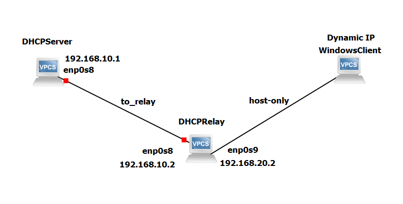

## Konfigurasi Network Manager Virtual Box
agar tidak terjadi konflik, kita akan menghapus Host Only yang sudah ada dan membuat yang baru.

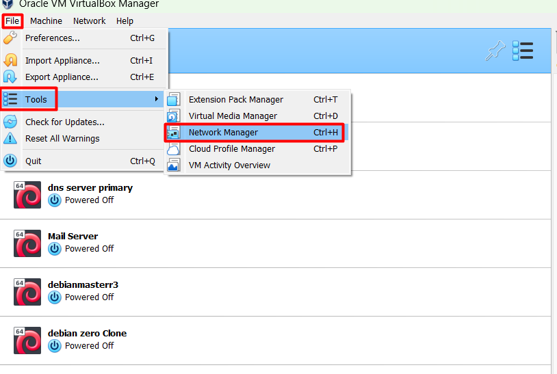

kita hapus yang sudah ada
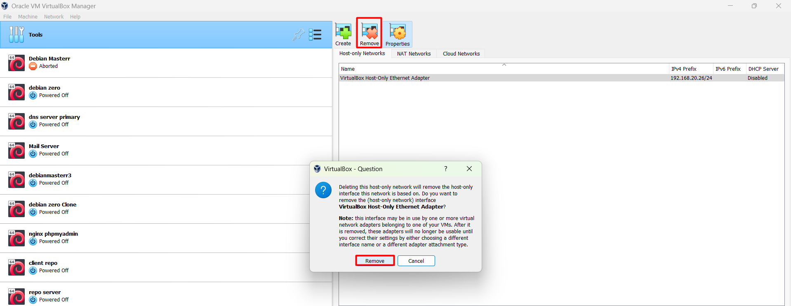

kemudian bikin yang baru
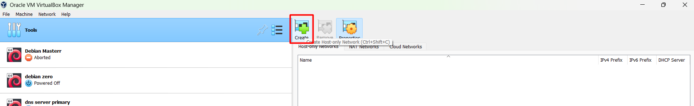

## Konfigurasi DHCP-Server

!!! Warning
    Gunakan vm `dhcp server` pada pertemuan sebelumnya

### Konfigurasi Network Adapter

Konfigurasikan Network Adapter seperti gambar dibawah ini  
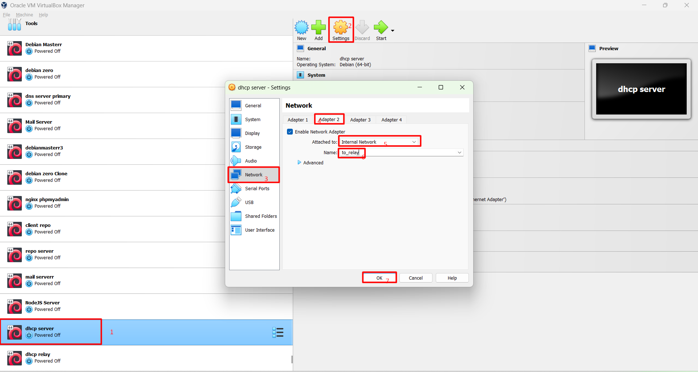

### Konfigurasi IP Address

Kali ini kita membutuhkan Gateway dalam konfigurasi ip address

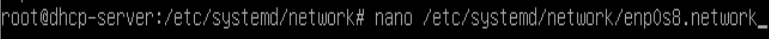

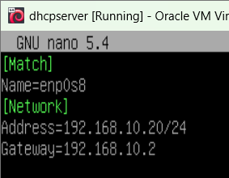

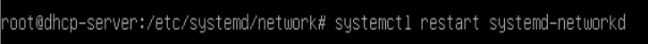

!!! Warning
    Jangan lupa hapus konfigurasi enp0s8 di `/etc/network/interfaces`

### Setting dhcpd.conf

tampilkan informasi baris pada `dhcpd.conf` dengan menambahkan option `-c` pada perintah `nano`

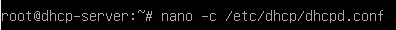

cari `line` atau `baris` 30 dan 31 lalu hilangkan tanda `#` seperti pada gambar , disini kita menentukan subnet dari DHCP server, sebab subnet dhcp server dan subnet dari IP Address yang akan kita berikan ke client berbeda oleh sebab itu kita harus mendeklarasikan subnet dari dhcp server.

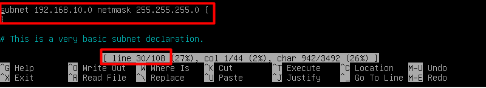

cari `line 50` lalu sesuaikan seperti dibawah ini  

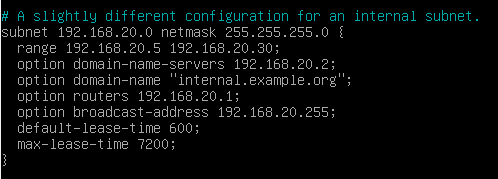

Pastikan interface mengarah ke `enp0s8`

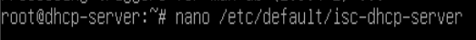

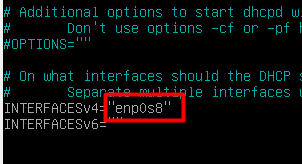

restart service

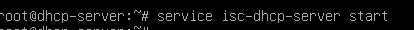

## Konfigurasi DHCP-Relay-Server

!!! Caution
    Clone dari vm debianmaster menjadi dhcp-relay-server , seperti biasa ubah hostname menjadi `relay server`  

### Konfigurasi Network Adapter

Konfigurasikan Network Adapter 2 dan 3

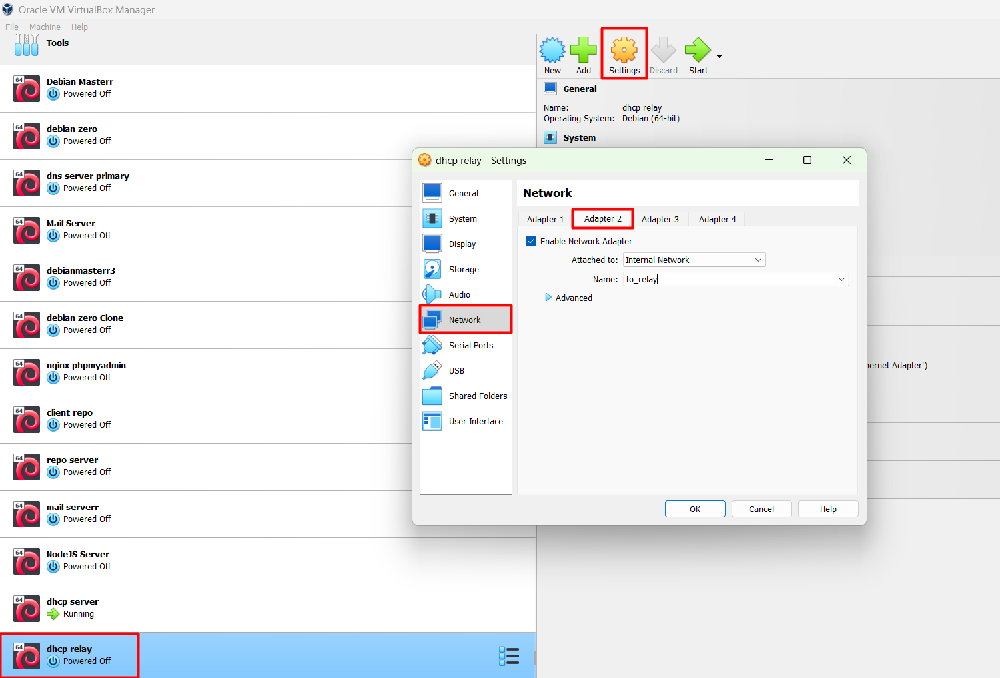  

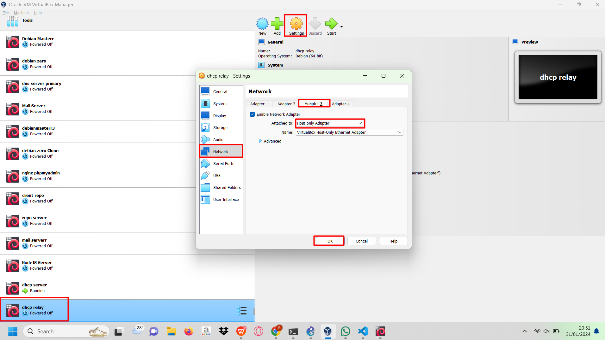

### Konfigurasi IP Address

Konfigurasikan IP Address sesuai Topologi

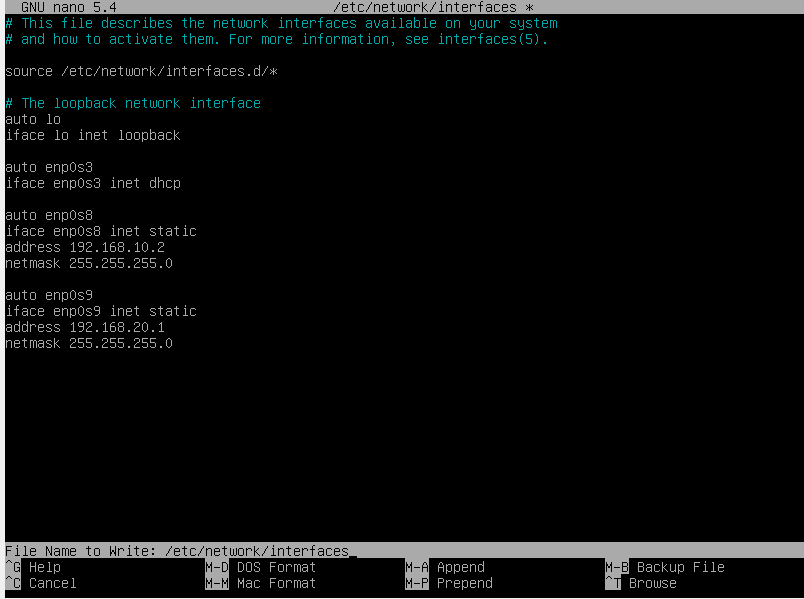

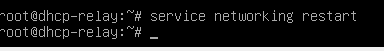

### Mengaktifkan Fitur Ip Forward

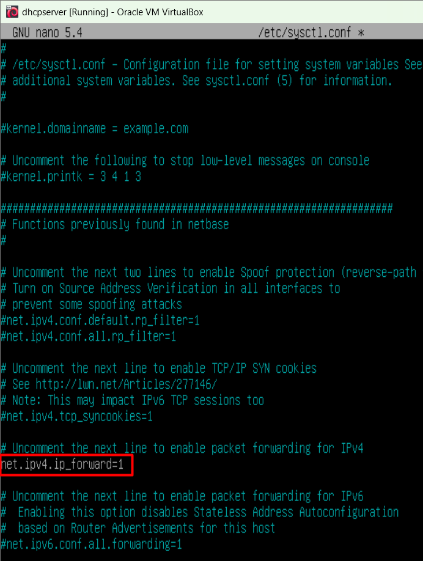

### Installasi dhcp-relay

Masukkan IP Address dari `DHCP Server`

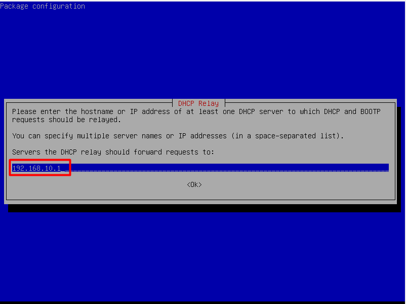

Kosongkan Interface

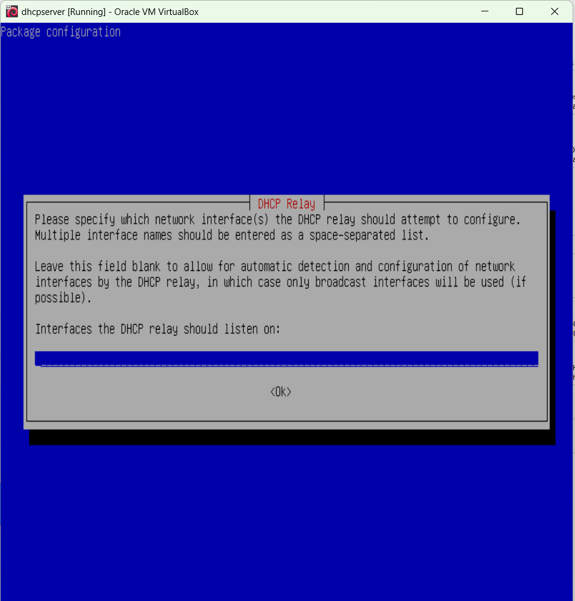

Kosongkan saja
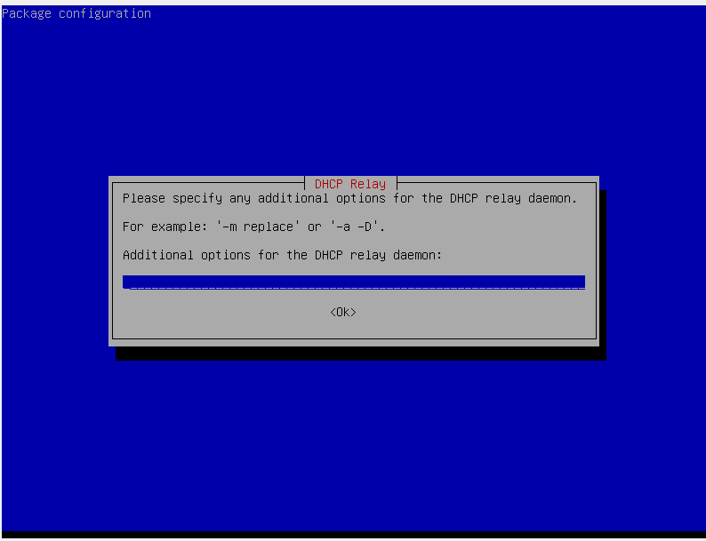

Cek statusnya

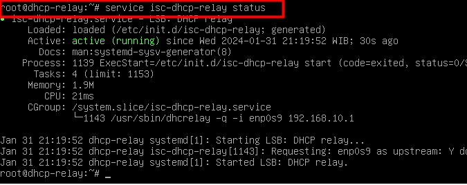

### Setting IP Client

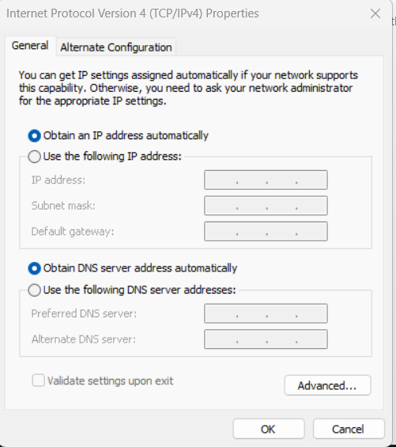

### Testing

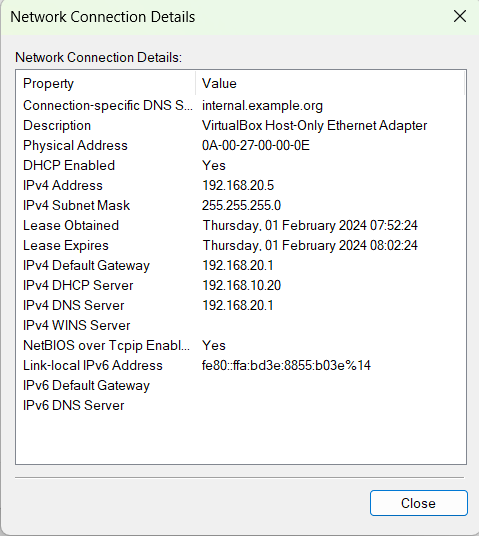

terlihat client sudah mendapat IP dari server

!!! Tugas_Praktikum_Mandiri
    1. Buatlah kelompok yang tediri dari 2 orang.
    2. Praktikkan dhcp-relay sesuai dengan topologi pada praktikum ini, namun dhcp server berada di laptop si A dan dhcp-relay beserta client berada di laptop B.

