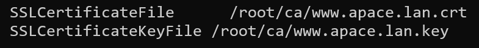
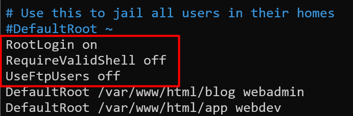
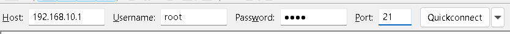
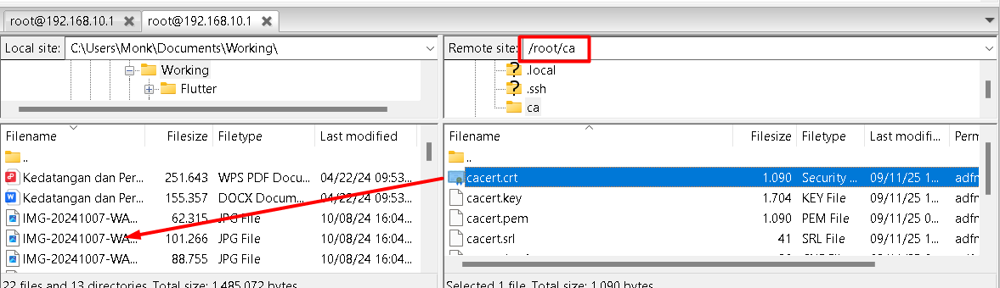
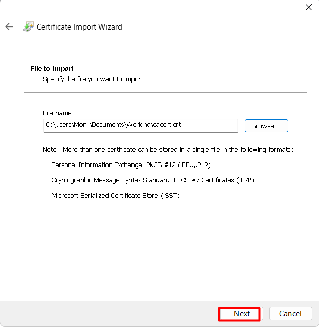
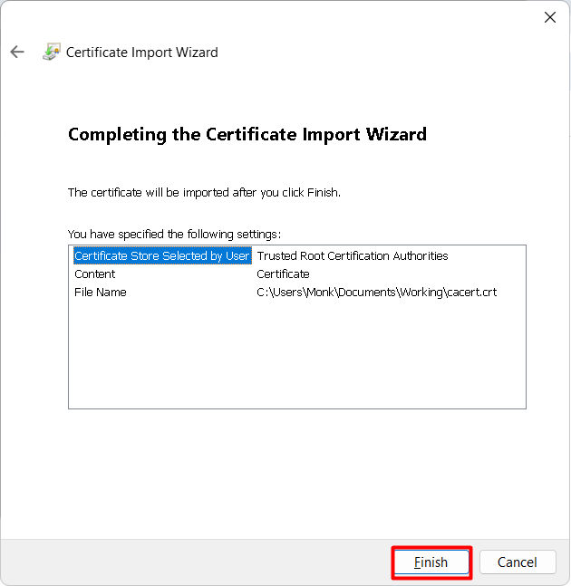

# Apache2 TLS/SSL (HTTPS) dan Apache2 Authentication

Ada dua alasan utama mengapa perlu melakukan Apache2 TLS/SSL (HTTPS) dan Apache2 Authentication: untuk mengamankan data yang dikirim dan untuk mengontrol siapa yang bisa mengakses sumber daya tertentu.  
  
## Apache2 TLS/SSL (HTTPS)
TLS/SSL (Transport Layer Security/Secure Sockets Layer) adalah protokol yang mengenkripsi data yang dikirimkan antara server (Apache2) dan klien (web browser). 🔐 Ini mengubah koneksi dari HTTP (Hypertext Transfer Protocol) menjadi HTTPS (HTTP Secure).

### Mengapa Ini Penting?
`Enkripsi Data`: Mencegah pihak ketiga, seperti peretas, untuk mencegat dan membaca informasi sensitif yang ditransfer, seperti kredensial login, nomor kartu kredit, atau data pribadi lainnya. Tanpa enkripsi, data ini dikirim dalam bentuk teks biasa, membuatnya sangat rentan.

`Integritas Data`: Memastikan data yang diterima oleh klien sama persis dengan yang dikirim oleh server, tanpa adanya modifikasi di tengah jalan.

`Otentikasi Server`: Memverifikasi bahwa server yang dihubungi oleh klien adalah server yang sebenarnya, bukan server palsu yang mencoba meniru situs aslinya. Ini mencegah serangan phishing dan man-in-the-middle.

Intinya, HTTPS adalah standar keamanan di internet saat ini. Mayoritas browser modern akan menampilkan peringatan keamanan jika sebuah situs tidak menggunakan HTTPS, dan bahkan dapat memblokir akses ke situs tersebut.

## Apache2 Authentication
`Apache2 Authentication` adalah proses untuk membatasi akses ke bagian tertentu dari situs web atau direktori. Ini memastikan hanya pengguna yang berwenang yang bisa melihat, mengunduh, atau memodifikasi file tertentu.

### Mengapa Ini Penting?
`Kontrol Akses`: Memungkinkan administrator untuk menentukan siapa yang dapat mengakses sumber daya tertentu. Ini sangat penting untuk area yang berisi informasi sensitif, seperti panel admin, data pelanggan, atau konten eksklusif.

`Keamanan Tambahan`: Mencegah akses tidak sah oleh bot atau individu jahat yang mencoba menjelajahi direktori yang seharusnya tidak dapat diakses publik.

`Pembatasan Pengguna`: Digunakan untuk berbagai skenario, seperti area anggota berbayar, halaman admin internal, atau direktori khusus untuk tim pengembangan.

Secara umum, Apache2 Authentication sering kali dikombinasikan dengan HTTPS. Ini berarti tidak hanya data yang dilindungi saat dikirim (HTTPS), tetapi juga akses ke data itu sendiri dibatasi hanya untuk pengguna yang telah terverifikasi (Authentication). Keduanya bekerja bersama untuk menciptakan lapisan keamanan yang kuat.

## Certificate Authority (CA)   
`Certificate Authority` adalah sebuah entitas tepercaya yang bertanggung jawab untuk mengeluarkan, mengelola, dan menandatangani sertifikat digital. 📄 Sertifikat ini berfungsi untuk memverifikasi identitas suatu entitas, seperti website, dan merupakan fondasi dari keamanan internet modern, terutama dalam protokol TLS/SSL (HTTPS). CA bertindak sebagai pihak ketiga yang netral, menjembatani kepercayaan antara server (website) dan klien (browser).

### Cara Kerja CA
Proses kerja CA melibatkan beberapa langkah utama, yang sering disebut sebagai bagian dari Public Key Infrastructure (PKI):

`Pembuatan Pasangan Kunci`: Pemilik website membuat sepasang kunci kriptografi: kunci publik dan kunci privat. Kunci privat dijaga kerahasiaannya di server, sementara kunci publik akan disertakan dalam sertifikat digital.

`Permintaan Sertifikat`: Pemilik website mengirimkan Certificate Signing Request (CSR) kepada CA. CSR ini berisi informasi identitas (nama domain, organisasi) dan kunci publik.

`Verifikasi Identitas`: CA memverifikasi identitas pemohon. Tingkat verifikasi ini berbeda-beda tergantung jenis sertifikat yang diminta (misalnya, Domain Validation, Organization Validation, atau Extended Validation). Proses ini memastikan bahwa pemohon benar-benar pemilik domain yang diklaim.

`Penerbitan Sertifikat`: Setelah verifikasi berhasil, CA akan menandatangani CSR menggunakan kunci privatnya sendiri. Tanda tangan ini menciptakan sertifikat digital yang secara efektif mengikat kunci publik dengan identitas website. Tanda tangan CA adalah hal yang membuat sertifikat dapat dipercaya.

`Instalasi Sertifikat`: Pemilik website menginstal sertifikat yang telah ditandatangani oleh CA di server mereka.

`Verifikasi oleh Browser`: Ketika pengguna mengunjungi website tersebut, browser akan menerima salinan sertifikat dari server. Browser kemudian akan melakukan verifikasi dengan memeriksa tanda tangan CA. Karena browser memiliki daftar CA tepercaya yang sudah terpasang secara bawaan (disebut trust store), ia dapat memvalidasi bahwa tanda tangan itu asli.

`Koneksi Aman`: Jika verifikasi berhasil, browser akan menampilkan simbol gembok 🔒, dan koneksi antara browser dan server dienkripsi menggunakan kunci publik yang ada di sertifikat. Jika verifikasi gagal (misalnya, sertifikat sudah kedaluwarsa atau ditandatangani oleh CA yang tidak dikenal), browser akan menampilkan peringatan keamanan.

Dengan cara ini, CA memastikan bahwa ketika Anda mengunjungi sebuah website dengan HTTPS, Anda terhubung ke server yang benar-benar asli dan komunikasi Anda aman.

## Langkah - Langkah Praktikum

!!! Warning
    Gunakan VM FTP-Web Server sebelumnya.  

### Konfigurasi CA Root
Untuk membuat sertifikat ssl kita butuh yang namanya `CA Root` , `CA Root` akan melakukan penandatangan (sign) `csr`(sertificate request)  

#### Membuat direktori penyimpanan CA Root
``` py
mkdir /root/ca
cd /root/ca
```

#### Membuat file Konfigurasi OpenSSL
```py
nano openssl.cnf 
```
```
# OpenSSL CA configuration file
[ ca ]
default_ca = CA_default

[ CA_default ]
default_days = 365
database = index.txt
serial = serial.txt
default_md = sha256
copy_extensions = copy
unique_subject = no

# Used to create the CA certificate.
[ req ]
prompt=no
distinguished_name = distinguished_name
x509_extensions = extensions

[ distinguished_name ]
organizationName = MySMK
commonName = ca-server

[ extensions ]
keyUsage = critical,digitalSignature,nonRepudiation,keyEncipherment,keyCertSign
basicConstraints = critical,CA:true,pathlen:1

# Common policy for nodes and users.
[ signing_policy ]
organizationName = supplied
commonName = optional

# Used to sign node certificates.
[ signing_node_req ]
keyUsage = critical,digitalSignature,keyEncipherment
extendedKeyUsage = serverAuth,clientAuth

# Used to sign client certificates.
[ signing_client_req ]
keyUsage = critical,digitalSignature,keyEncipherment
extendedKeyUsage = clientAuth
```

#### Membuat Private Key CA
```
openssl genrsa -out cacert.key 2048
```

#### Membuat certificate untuk CA Root
``` py
openssl req -new -x509 -config openssl.cnf -key cacert.key -out cacert.crt -days 365 -batch
```
#### Membuat index.txt dan serial.txt
```
touch index.txt
echo '01' > serial.txt
```
### Membut file configurasi untuk client
```py
nano web.cnf
```
```
# OpenSSL node configuration file
[ req ]
prompt=no
distinguished_name = distinguished_name
req_extensions = extensions

[ distinguished_name ]
organizationName = Web SMK MQ

[ extensions ]
subjectAltName = critical,DNS:ftp-server,DNS:www.apace.lan,IP:192.168.10.1
```
### Membuat private key untuk client
```
openssl genrsa -out www.apace.lan.key 2048
chmod 400 www.apace.lan.key
```

### Membuat file CSR untuk Web Server
```py
openssl ca -config openssl.cnf -keyfile cacert.key -cert cacert.crt -policy signing_policy -extensions signing_node_req -out www.apace.lan.crt -outdir /root/ca -in www.apace.lan.csr -batch
```

### Menandatangani (Sign) file csr 
```py
openssl x509 -req -in www.apace.lan.csr -CA cacert.crt -CAkey cacert.key -CAcreateserial -out www.apace.lan.crt -days 365
``` 

### Setting DNS Server
Sertifikat digital selalu terikat dengan domain, sehingga kita butuh DNS server untuk domain `www.apace.lan`

```py
apt-get update
apt-get install bind9
```
```py
cd /etc/bind
nano named.conf
```
  
```py
cp db.local db.apace  
nano db.apace
```
  

### Konfigurasi Virtual Host HTTPS

```py
nano -c /etc/apache2/sites-available/default-ssl.conf
```
tambahkan `ServerName` www.apace.lan  
  

arahkan certificate file ke tempat kita menyimpan certificate  
  

#### Aktifkan module ssl

```
a2enmod ssl
```

#### Mengaktifkan Virtual host
```
a2ensite default-ssl.conf
```
#### Restart Service apache2 
```
service apache2 restart
```

### Mengimport Certificate CA Root ke Web Browser
Karena CA kita belum masuk ke `Trust Store` maka kita harus mengimport CA kita agar certificate kita dikenali oleh browser.

### Konfigurasi FTP agar bisa Login menggunakan user Root
Karena file disimpan di folder /root kita butuh user root untuk melakukan ftp menggunakan filezilla
#### edit file config proftpd server
```py
nano /etc/proftpd/proftpd.conf
```
tambahkan konfigurasi berikut  

!!! Warning
    KOnfigurasi ini hanya untuk pembelajaran, karena memiliki celah keamanan.

#### restart service proftpd
```
service proftpd restart
```

#### Mengambil file cacert.pem dari server menggunakan filezilla  
  


#### Memasukkan file cacert.pem ke browser

Buka Chrome -> Setting -> Privacy and Security Manage certificates  
    
    
   
    
    

  
  

### Pengujian di client

#### setting ip address dns server client


