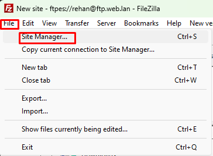
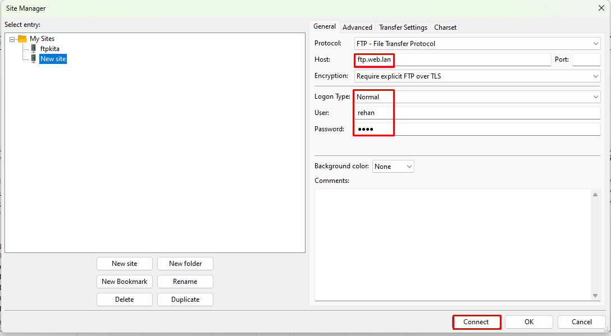
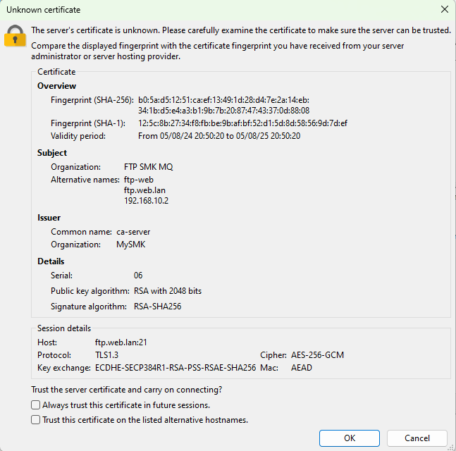
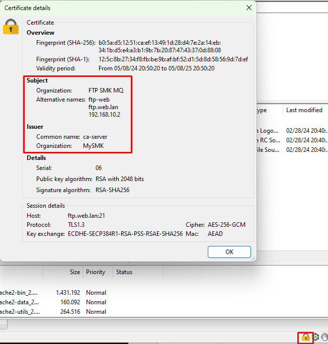

# FTP Over SSL/TLS (FTPS)

!!! Note
Cukup gunakan vm `FTP-web server` yang sudah ada, setting ip addrress nya secara static menjadi `192.168.10.2`

## Setting SSH
Setting agar dapat melakukan ssh menggunakan user root. Karena nantinya kita perlu mengirim file dari `ca-server` ke server kita via ssh.

```py
root@ftp-web:~# nano -c /etc/ssh/sshd_config
```
```py
##Cari Baris 34 Uncomment lalu ubah seperti dibawah ini
PermitRootLogin yes
```
```py
root@ftp-web:~# service sshd restart
```

## Duplikat Sertifikat dan private key dari CA-SERVER ke FTP Server
*Untuk Command ini dieksekusi di CA-SERVER*

```py
root@ca-server:/certs# scp web.key web.crt ftp.key ftp.crt root@192.168.10.2:/etc/ssl/
root@192.168.10.2's password:
```

## Konfigurasi SSL/TLS FTP

1. edit file proftpd.conf
```py
root@ftp-web:~# nano -c /etc/proftpd/proftpd.conf
```
```py
### cari baris 143 uncomment agar file tersebut membaca file tls.conf
Include /etc/proftpd/tls.conf
```
2. edit file tls.conf
```py
root@ftp-web:~# nano -c /etc/proftpd/tls.conf
```
```py
### cari baris 10,11,12 uncomment ketiga baris tersebut
TLSEngine                               on
TLSLog                                  /var/log/proftpd/tls.log
TLSProtocol                             SSLv23
### Pada baris 27,28 uncomment lalu sesuaikan path certificate dan private key kita.
TLSRSACertificateFile                   /etc/ssl/ftp.crt
TLSRSACertificateKeyFile                /etc/ssl/ftp.key
### uncomment pada baris 35
TLSOptions                              AllowClientRenegotiations
```
3. Mengaktifkan Module TLS
```py
root@ftp-web:~# nano -c /etc/proftpd/modules.conf
```
```py
### Uncomment baris 21
LoadModule mod_tls.c
```
4. Restart Layanan Proftpd
root@ftp-web:~# service proftpd restart

## Pengujian SSL

  

  

  


