# Web Server Over SSL/TLS (HTTPS)

!!! Note
    Masih menggunakan vm `FTP-web Server`. Untuk langkah `Duplikat certificate dari ca-server` dan `Setting SSH` bisa kita skip karena masih menggunakan server yang sama.

## Konfigurasi Web Server HTTPS

1. Konfigurasi file Virtual Host Https
```py
root@ftp-web:~# nano -c /etc/apache2/sites-available/default-ssl.conf
```
```py
### edit konfigurasi seperti dibawah ini
ServerName www.web.lan
DocumentRoot /var/www/html
### Cari baris 32,33 edit seperti dibawah ini
SSLCertificateFile      /etc/ssl/web.crt                               
SSLCertificateKeyFile /etc/ssl/web.key
```
2. Mengaktifkan module ssl
```py
root@ftp-web:~# a2enmod ssl
```
3. Mengaktifkan virtual host ssl
```py
root@ftp-web:~# a2ensite default-ssl.conf
```
4. Service layanan apache2
```py
root@ftp-web:~# service apache2 restart
```

## Mengimport Certificate CA ke Web Browser

1. Mengambil ca.crt dari ca-server via sftp
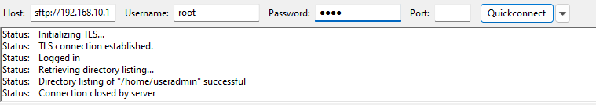  
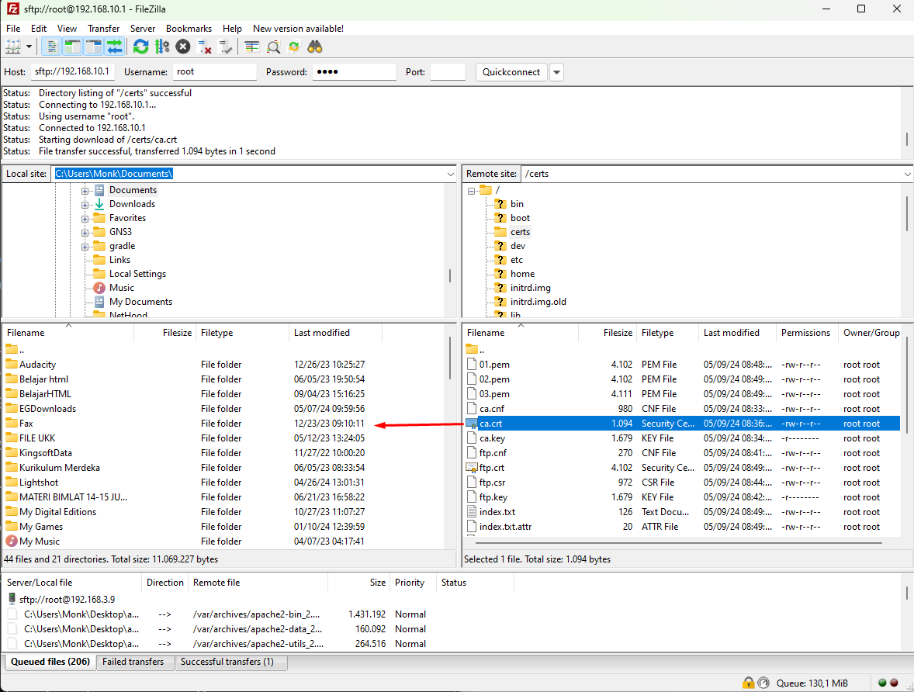  

2. Buka Chrome -> Setting -> Privacy and Security Manage certificates
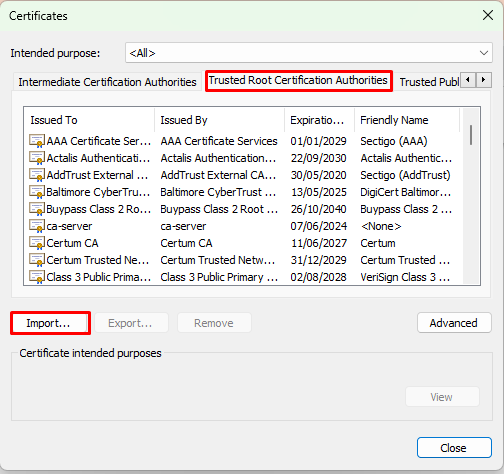  
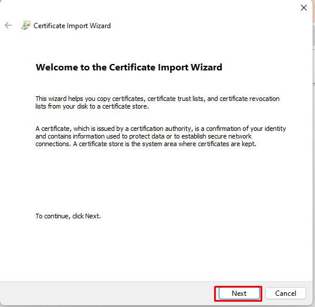  
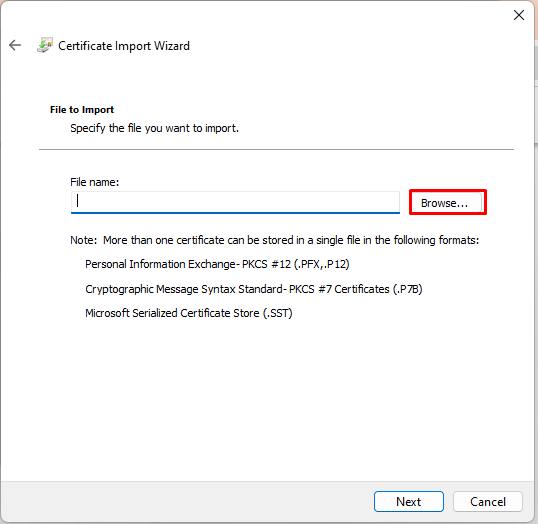  
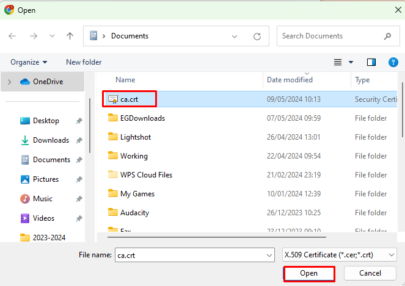  
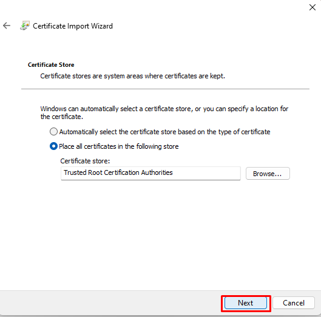
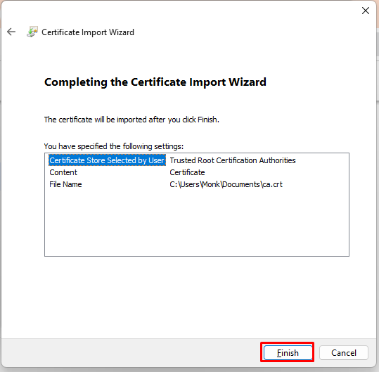  
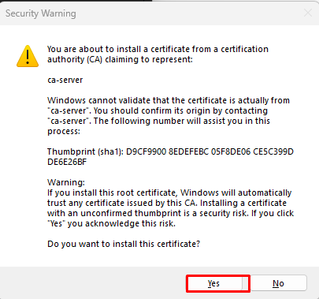  
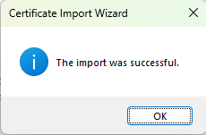

## Pengujian
Akses https://www.web.lan di browser
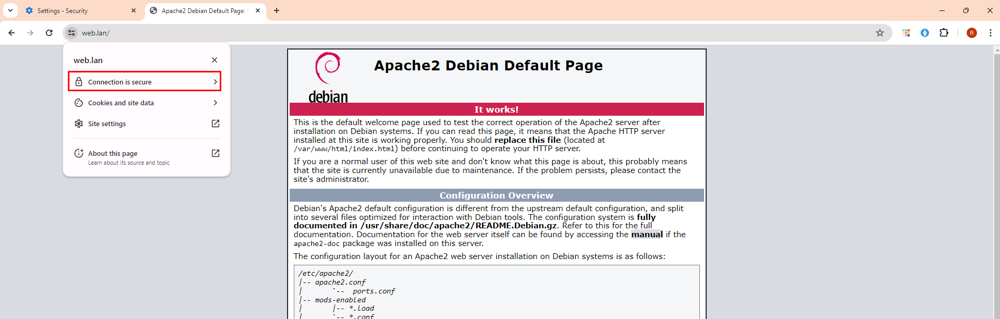


