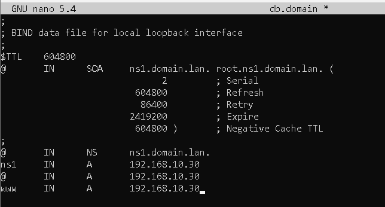
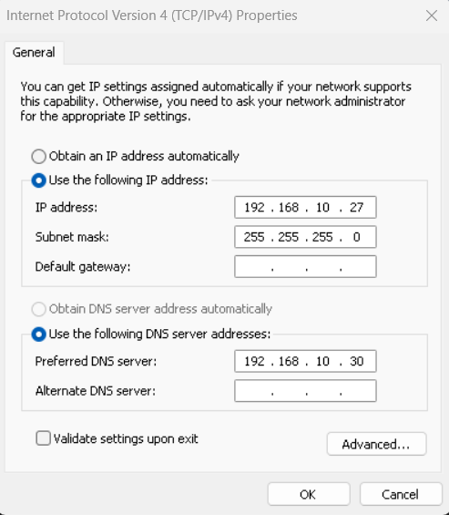
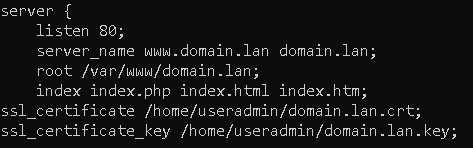
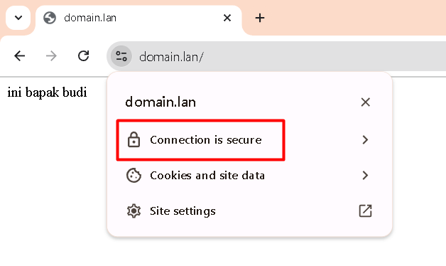
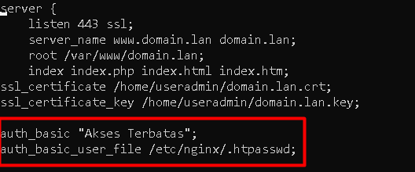
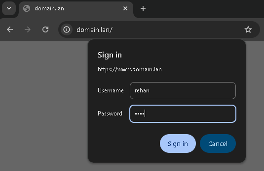

# Nginx HTTPS & Nginx Authentication

!!! Note
    Pada praktikum kali ini kita akan menggunakan VM `ftp-server` sebelumnya sebagai `CA-Server` dan VM `nginx` di praktikum sebelumnya sebagai `nginx web server` dan `DNS Server`. Jangan Lupa untuk melakukan konfigurasi IP vm `nginx` menjadi 192.168.10.30.

## Pembuatan certificate untuk Nginx
Agar nginx dapat diakses secara secure, maka dibutuhkan pasangan `key dan certificate`. certificate ini akan dibuat di vm `ftp server` yang bertindak sebagai `ca server` yang nanti akan dikirimkan ke vm `nginx`.  

### Membuat file konfigurasi untuk client nginx

!!! Warning
    **GUNAKAN USER BIASA !!!** yang digunakan untuk melakukan konfigurasi CA pada praktikum sebelumnya

```py
useradmin@ftp-server:~$ cd ca
useradmin@ftp-server:~/ca$ nano domain.lan.ext
```

``` py
authorityKeyIdentifier=keyid,issuer
basicConstraints=CA:FALSE
keyUsage = digitalSignature, nonRepudiation, keyEncipherment, dataEncipherment
subjectAltName = @alt_names

[alt_names]
DNS.1 = domain.lan
DNS.2 = www.domain.lan
```
### Membuat privete key untuk client
``` py
useradmin@ftp-server:~/ca$ openssl genrsa -out domain.lan.key 2048
```

### Membuat CSR file untuk client

```py
useradmin@ftp-server:~/ca$ openssl req -new -key domain.lan.key -out domain.lan.csr
```
```
You are about to be asked to enter information that will be incorporated
into your certificate request.
What you are about to enter is what is called a Distinguished Name or a DN.
There are quite a few fields but you can leave some blank
For some fields there will be a default value,
If you enter '.', the field will be left blank.
-----
Country Name (2 letter code) [AU]:ID
State or Province Name (full name) [Some-State]:Jabar
Locality Name (eg, city) []:Jonggol
Organization Name (eg, company) [Internet Widgits Pty Ltd]:Nginx
Organizational Unit Name (eg, section) []:Web Nginx
Common Name (e.g. server FQDN or YOUR name) []:www.domain.lan
Email Address []:domain@gg.lan

Please enter the following 'extra' attributes
to be sent with your certificate request
A challenge password []: enter aja
An optional company name []: sama ini juga enter aja
```

### Menandatangani (Sign) file csr

``` py
useradmin@ftp-server:~/ca$ openssl x509 -req -in domain.lan.csr -CA rootCA.crt -CAkey rootCA.key -CAcreateserial -out domain.lan.crt -days 365 -sha256 -extfile domain.lan.ext
```

### Mengirimkan file crt dan key client ke server client

```py
useradmin@ftp-server:~/ca$ scp domain.lan.key useradmin@192.168.10.30:~
useradmin@ftp-server:~/ca$ scp domain.lan.crt useradmin@192.168.10.30:~
```

## Setting DNS Server
Karena kita membuat perubahan `IP Address` pada web server `nginx` maka kita perlu menyesuaikan `ip address` tersebut didalam konfigurasi `dns server` agar domain mengarah ke ip-address yang benar.  
  

### Setting ip dns server di client
Sesuaikan ip address DNS Server dari client.  
  

## Konfigurasi Server Block Nginx
Server Block pada nginx harus dikonfigurasi agar website bisa diakses dengan mode `https`

### Edit file konfigurasi Server Block domain.lan
```py
root@nginx:/etc/bind# cd /etc/nginx/conf.d/
```
ubah baris ke menjadi seperti dibawah ini agar `nginx` membaca konfigurasi `ssl/tls`
```
listen 443 ssl;
```
tambahkan perintah berikut dibawah baris perintah `index`, sesuaikan dengan path anda menyimpan file crt dan key dari nginx.
```
ssl_certificate /home/useradmin/domain.lan.crt;
ssl_certificate_key /home/useradmin/domain.lan.key;
```
  

``` py
root@nginx:/etc/nginx/conf.d# service nginx restart
```

## Pengujian di browser
akses `www.domain.lan` dengan mode `https` di browser `https://www.domain.lan`



## Nginx Authentication
Sama seperti halnya `apache2` `nginx` pun memiliki fitur `authentication`

### installasi htpasswd
`htpasswd` merupakan `utilitas` yang memungkinkan kita untuk menerapkan `authentication` pada web server, namun sebenarnya `htpasswd` merupakan `utilitas` dari `apache2` sehingga jika menggunakan `nginx` kita harus menginstallnya terlebih dahulu.

```py
root@nginx:/etc/nginx/conf.d# apt install apache2-utils
```

### membuat file kata sandi
```py
root@nginx:/etc/nginx/conf.d# htpasswd -c /etc/nginx/.htpasswd rehan
New password:
Re-type new password:
Adding password for user rehan
```

### edit konfigurasi server block domain.lan
```py
root@nginx:/etc/nginx/conf.d# nano domain.lan.conf
```
tambahkan 2 baris berikut dibawah konfigurasi `ssl`
```py
auth_basic "Akses Terbatas";
auth_basic_user_file /etc/nginx/.htpasswd;
```
  

### mengubah kepemilikan file .htpasswd
``` py
root@nginx:/etc/nginx/conf.d# chown www-data:www-data /etc/nginx/.htpasswd
```

```py
root@nginx:/etc/nginx/conf.d# service nginx restart
```
### Pengujian di browser
akses `https://www.domain.lan`  

