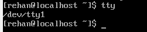
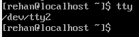

# Accessing the Command Line

## Objectives
After completing this section, you should be able to log in to a Linux system and run simple
commands using the shell.

## Introduction to the Bash Shell
A command line is a text-based interface which can be used to input instructions to a computer
system. The Linux command line is provided by a program called the shell. Various options for the
shell program have been developed over the years, and different users can be configured to use
different shells. Most users, however, stick with the current default.  

The default shell for users in Red Hat Enterprise Linux is the GNU Bourne-Again Shell (bash).
Bash is an improved version of one of the most successful shells used on UNIX-like systems, the
Bourne Shell (sh).

When a shell is used interactively, it displays a string when it is waiting for a command from the
user. This is called the shell prompt. When a regular user starts a shell, the default prompt ends
with a $ character, as shown below.

```
[user@host ~]$
```
actual example 
```
[rehan@localhost ~]$
```  

The $ character is replaced by a # character if the shell is running as the superuser, root. This
makes it more obvious that it is a superuser shell, which helps to avoid accidents and mistakes
which can affect the whole system. The superuser shell prompt is shown below.

```
[root@localhost ~]#
```
  

Using bash to execute commands can be powerful. The bash shell provides a scripting language
that can support automation of tasks. The shell has additional capabilities that can simplify or
make possible operations that are hard to accomplish efficiently with graphical tools.

## Shell Basics


Commands entered at the shell prompt have three basic parts:  
• Command to run  
• Options to adjust the behavior of the command  
• Arguments, which are typically targets of the command  

The command is the name of the program to run. It may be followed by one or more options, which
adjust the behavior of the command or what it will do. Options normally start with one or two
dashes (-a or --all, for example) to distinguish them from arguments. Commands may also
be followed by one or more arguments, which often indicate a target that the command should
operate upon.  

For example, the command usermod -L user01 has a command (usermod), an option (-L),
and an argument (user01). The effect of this command is to lock the password of the user01
user account.  

```
[rehan@localhost ~]$ usermod -L user01
```  

## Logging in to a Local Computer  

To run the shell, you need to log in to the computer on a terminal. A terminal is a text-based
interface used to enter commands into and print output from a computer system. There are
several ways to do this.  

The computer might have a hardware keyboard and display for input and output directly
connected to it. This is the Linux machine's physical console. The physical console supports
multiple virtual consoles, which can run separate terminals. Each virtual console supports an
independent login session. You can switch between them by pressing Ctrl+Alt and a function
key (F1 through F6) at the same time. Most of these virtual consoles run a terminal providing a
text login prompt, and if you enter your username and password correctly, you will log in and get a
shell prompt.  

The computer might provide a graphical login prompt on one of the virtual consoles. You can use
this to log in to a graphical environment. The graphical environment also runs on a virtual console.
To get a shell prompt you must start a terminal program in the graphical environment. The shell
prompt is provided in an application window of your graphical terminal program.

  

```
Ctrl+Alt+F2
```  

  

## Logging in over the Network  

Linux users and administrators often need to get shell access to a remote system by connecting
to it over the network. In a modern computing environment, many headless servers are actually
virtual machines or are running as public or private cloud instances. These systems are not physical
and do not have real hardware consoles. They might not even provide access to their (simulated)
physical console or serial console.  

In Linux, the most common way to get a shell prompt on a remote system is to use Secure
Shell (SSH). Most Linux systems (including Red Hat Enterprise Linux) and macOS provide the
OpenSSH command-line program ssh for this purpose.  

In this example, a user with a shell prompt on the machine host uses ssh to log in to the remote
Linux system remotehost as the user remoteuser:  

```
[user@host ~]$ ssh remoteuser@remotehost
remoteuser@remotehost's password: password
[remoteuser@remotehost ~]$
```  
Actual Example:  

The ssh command encrypts the connection to secure the communication against eavesdropping
or hijacking of the passwords and content.  

Some systems (such as new cloud instances) do not allow users to use a password to log in with
ssh for tighter security. An alternative way to authenticate to a remote machine without entering a
password is through public key authentication.  

With this authentication method, users have a special identity file containing a private key, which
is equivalent to a password, and which they keep secret. Their account on the server is configured
with a matching public key, which does not have to be secret. When logging in, users can configure
ssh to provide the private key and if their matching public key is installed in that account on that
remote server, it will log them in without asking for a password.  

```
[rehan@localhost ~]$ ssh rehan@172.16.70.23
```  
```
The authenticity of host '172.16.70.23 (172.16.70.23)' can't be established.
ED25519 key fingerprint is SHA256:Xbp9Sh3L8OwG1pj62suEtSTM2CuJvcAty0GAaVdouHE.
This key is not known by any other names
Are you sure you want to continue connecting (yes/no/[fingerprint])? yes
Warning: Permanently added '172.16.70.23' (ED25519) to the list of known hosts.  
```  
```
rehan@172.16.70.23's password:
Activate the web console with: systemctl enable --now cockpit.socket

Last login: Mon Jul 22 13:17:21 2024
[rehan@webserver ~]$
```  

In the next example, a user with a shell prompt on the machine host logs in to remotehost
as remoteuser using ssh, using public key authentication. The -i option is used to specify
the user's private key file, which is mylab.pem. The matching public key is already set up as an
authorized key in the remoteuser account.  

```
[user@host ~]$ ssh -i mylab.pem remoteuser@remotehost
[remoteuser@remotehost ~]$
```  

For this to work, the private key file must be readable only by the user that owns the file. In the
preceding example, where the private key is in the mylab.pem file, the command chmod 600
mylab.pem could be used to ensure this. How to set file permissions is discussed in more detail in
a later chapter.  

Users might also have private keys configured that are tried automatically, but that discussion is
beyond the scope of this section. The References at the end of this section contain links to more
information on this topic.  

## Logging Out  

When you are finished using the shell and want to quit, you can choose one of several ways to end
the session. You can enter the exit command to terminate the current shell session. Alternatively,
finish a session by pressing Ctrl+D.
The following is an example of a user logging out of an SSH session:  

```
[rehan@webserver ~]$ exit
logout
Connection to 172.16.70.23 closed.
[rehan@localhost ~]$
```  


