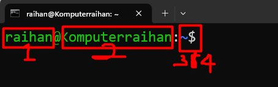
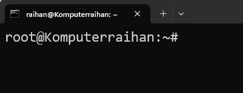

# Accessing The Command Line 

## Introduction to The Bash Shell

`Command Line` merupakan sebuah `interface` berbasis text yang digunakan untuk memasukkan perintah kedalam sebuah sistem komputer. Pada sistem Operasi Linux `Command Line` yang digunakan disebut dengan `Shell`. Adapun yang sekarang digunakan oleh sistem operasi Linux merupakan pengembangan dari `Shell` itu sendiri yaitu `Bourne-Again Shell` atau biasa disebut dengan `bash` atau biasa juga disebut dengan `Bourne Shell (sh)`.

Ketika sebuah `Shell` tengah digunakan, dia akan menampilkan sebuah `String`(tulisan) ketika menunggu command dari user, hal ini biasa disebut dengan `Shell Prompt`. Nah, `Shell Prompt` ini terdiri dari 4 bagian, silahkan lihat gambar dibawah ini

!!! Note
    1. Nama User yang sedang Login.  
    2. Hostname dari sistem komputer.  
    3. Current Directory. Lokasi direktori dimana user sedang berada.
    4. type user. $ untuk regular user, # untuk superuser(Root)

Berikut contoh `Shell Prompt` apabila user `Root` yang sedang login.

terlihat `Shell Prompt` diakhiri dengan tanda `#`

`Bash Shell` sangatlah powerful. `Bash Shell` memiliki `Scripting Languange` yang mana dengannya kita dapat melakukan automasi terhadap perintah perintah bash.

## Shell Basic

Perintah yang dimasukkan ke `Shell Prompt` memiliki tiga bagian :

1. `Command` program yang akan dijalankan
2. `Options` variasi dari bagaimana sebuah `command` bekerja
3. `Argument` target dari sebuah `command`

`Command` merupakan nama dari sebuah program/perintah yang ingin dijalankan. Dalam mengeksekusi perintah didalam `Bash Shell`, `command` merupakan unsur yang wajib ada namun untuk `options` dan juga `argument` hanya bersifat opsional, artinya tanpa `options` dan juga `argument` sebuah `command` tetap bisa dijalankan. Adapun `options` biasanya dimulai dengan tanda dash (-) atau pun tanda double dash (--) contoh : (**-a**  or **--a** ). Sebuah `command` bisa diikuti oleh satu atau lebih `options` dan `arguments`.  
Sebagi contoh `command` **usermod -L user01** memiliki `command`(**usermod**), sebuah `options`(**-L**) dan sebuah `argument`(**user01**). Efek dari `command` ini adalah mengunci `password` dari `user01`.