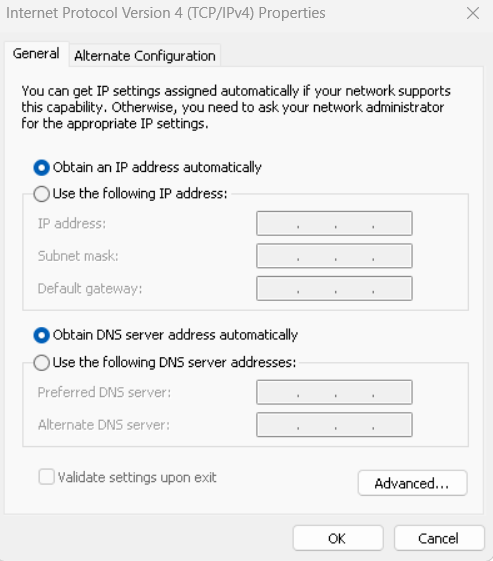

# DHCP Server

---

## Konsep Dasar DHCP Server

### 1.1. Apa Itu DHCP?

**DHCP (Dynamic Host Configuration Protocol)** adalah protokol jaringan yang memungkinkan **DHCP Server** untuk secara otomatis memberikan konfigurasi jaringan (seperti alamat IP, subnet mask, gateway default, dan DNS server) kepada perangkat **DHCP Client** dalam sebuah jaringan. Pemberian konfigurasi ini bersifat "Dinamis" karena dilakukan secara otomatis dan fleksibel, tidak manual.

### 1.2. Mengapa DHCP Begitu Penting?

Implementasi DHCP server adalah fondasi bagi jaringan modern yang efisien dan skalabel. Berikut adalah alasannya:

1.  **Efisiensi dan Penghematan Waktu**:
    * **Automasi**: Menghilangkan kebutuhan konfigurasi manual pada setiap perangkat, sangat efisien untuk jaringan besar.
    * **Penyebaran Cepat**: Perangkat baru dapat langsung terhubung dan mendapatkan konfigurasi dalam hitungan detik.
2.  **Mengurangi Kesalahan Konfigurasi**:
    * **Meminimalkan Konflik IP**: Secara otomatis memastikan setiap klien mendapatkan alamat IP unik, menghindari konflik IP.
    * **Konsistensi Konfigurasi**: Semua klien mendapatkan konfigurasi yang seragam dari satu sumber terpusat.
3.  **Manajemen Alamat IP yang Fleksibel**:
    * **Re-use IP**: Alamat IP yang tidak terpakai dapat dikembalikan ke *pool* dan didistribusikan kembali, memaksimalkan penggunaan alamat IP terbatas.
    * **Perubahan Konfigurasi Mudah**: Perubahan konfigurasi (misalnya gateway atau DNS) cukup dilakukan di DHCP server dan akan disebarkan ke semua klien saat mereka memperbarui *lease*.
4.  **Mendukung Skalabilitas**: Sangat penting untuk jaringan besar yang sering mengalami penambahan atau pengurangan perangkat.
5.  **Mobilitas Perangkat**: Perangkat bergerak dapat mulus berpindah antar jaringan tanpa konfigurasi manual.

---

### 1.3. Komponen Utama DHCP

Untuk memahami cara kerja DHCP, penting untuk mengetahui komponen-komponen dasarnya:

* **DHCP Server**: Komputer atau perangkat jaringan yang menjalankan layanan DHCP. Ia memiliki *database* alamat IP yang tersedia dan bertanggung jawab untuk mendistribusikannya.
* **DHCP Client**: Perangkat yang meminta dan menerima konfigurasi jaringan dari DHCP server (contoh: komputer, laptop, smartphone, printer jaringan, IP Camera).
* **IP Pool / Scope**: Rentang alamat IP yang telah ditentukan oleh administrator untuk didistribusikan secara otomatis kepada klien (misalnya, 192.168.1.100 hingga 192.168.1.200).
* **Lease Time**: Durasi waktu sebuah alamat IP "dipinjamkan" kepada klien. Setelah *lease time* berakhir, klien harus memperbarui *lease* atau meminta alamat IP baru.
* **Reserved IP (Static Lease / Reservation)**: Kemampuan DHCP server untuk selalu memberikan alamat IP spesifik kepada perangkat tertentu berdasarkan **MAC Address**-nya. Berguna untuk server atau perangkat yang memerlukan IP tetap.

---

### 1.4. Proses Kerja DHCP (DORA)

Komunikasi antara DHCP Client dan DHCP Server mengikuti empat langkah dasar yang dikenal dengan akronim **DORA**:

1.  **D - Discover (Penemuan)**:
    * DHCP Client mengirimkan pesan **DHCP Discover** (broadcast) ke seluruh jaringan lokal untuk mencari DHCP server yang tersedia. Klien belum memiliki alamat IP, sehingga berkomunikasi secara broadcast.
2.  **O - Offer (Penawaran)**:
    * DHCP Server yang menerima pesan Discover akan merespons dengan pesan **DHCP Offer**. Pesan ini berisi penawaran alamat IP yang tersedia beserta informasi konfigurasi lainnya (subnet mask, gateway, DNS).
3.  **R - Request (Permintaan)**:
    * DHCP Client memilih salah satu tawaran (jika ada beberapa) dan mengirimkan pesan **DHCP Request** (broadcast). Pesan ini mengkonfirmasi alamat IP yang diinginkan kepada server yang dipilih, dan secara implisit memberitahu server lain bahwa tawarannya tidak diterima.
4.  **A - Acknowledge (Pengakuan/Konfirmasi)**:
    * DHCP Server yang tawarannya diterima akan mengirimkan pesan **DHCP Acknowledge (DHCP ACK)**. Ini adalah konfirmasi akhir bahwa alamat IP telah resmi diberikan kepada klien, lengkap dengan semua konfigurasi jaringan yang diminta.

---

## Bagian 2: DHCP Relay Agent: Ketika Jaringan Kalian Tumbuh

### 2.1. Batasan Pesan Broadcast dan Peran Router

Pesan **DHCP Discover** yang dikirim oleh klien bersifat **broadcast**, dan ini menimbulkan masalah di jaringan yang lebih kompleks:

* **Broadcast tidak dapat melintasi router**. Router didesain untuk memisahkan domain broadcast.
* **Implikasinya**: Jika DHCP server berada di subnet yang berbeda dari klien, permintaan DHCP Discover dari klien tidak akan pernah sampai ke DHCP server, sehingga klien tidak akan mendapatkan alamat IP.

---

### 2.2. Solusi: DHCP Relay Agent

Untuk mengatasi batasan ini, kita menggunakan **DHCP Relay Agent**.

* **Apa itu DHCP Relay Agent?** Ini adalah perangkat (bisa berupa router, switch Layer 3, atau server) yang dipasang di subnet tempat DHCP Client berada, tetapi tidak ada DHCP server di sana.
* **Fungsi Utama**: DHCP Relay Agent bertindak sebagai "jembatan" atau "perantara" untuk lalu lintas DHCP antara dua subnet yang berbeda.
    1.  Ia menerima pesan **DHCP Discover** (broadcast) dari klien di subnet lokalnya.
    2.  Ia mengubah pesan broadcast tersebut menjadi pesan **unicast** (yang dapat di-*routing* oleh router) dan meneruskannya ke alamat IP DHCP server yang sebenarnya (yang berada di subnet lain).
    3.  Ketika DHCP server merespons (dengan DHCP Offer/ACK), Relay Agent akan menerima balasan tersebut dan meneruskannya kembali ke klien yang meminta di subnet lokalnya.

---

### 2.3. Mengapa Menggunakan DHCP Relay Agent?

* **Sentralisasi Manajemen IP**: Memungkinkan satu DHCP server terpusat untuk melayani beberapa subnet, menyederhanakan manajemen dan *troubleshooting*.
* **Efisiensi Sumber Daya**: Tidak perlu menginstal DHCP server di setiap subnet, menghemat sumber daya *hardware* dan *software*.
* **Fleksibilitas Desain Jaringan**: Memungkinkan desain jaringan yang lebih kompleks dan terdistribusi tanpa mengorbankan fungsionalitas DHCP.

## Bagian 3: Tutorial Konfigurasi DHCP Server di Debian (Lanjutan)

Kita akan menggunakan paket `isc-dhcp-server`, implementasi DHCP server paling umum di Linux.

---

### 3.1. Persiapan Awal Server DHCP

* **Sistem Operasi**: Debian 11 (Bullseye) atau versi lebih baru.
* **Akses Root**: Gunakan ` ` untuk perintah instalasi dan konfigurasi.
* **Kartu Jaringan (NIC)**: DHCP server **HARUS** memiliki alamat IP statis agar klien dapat menemukannya secara konsisten.

**Konfigurasi IP Statis**:

1.  Edit file `/etc/network/interfaces`:
    ```bash
      nano /etc/network/interfaces
    ```
2.  Tambahkan atau modifikasi baris berikut (sesuaikan dengan nama *interface* kalian, misal `enp0s3` atau `eth0`). Gunakan IP untuk DHCP Server: **192.168.10.1**.

    ```
    # The primary network interface for DHCP services
    auto enp0s3
    iface enp0s3 inet dhcp
    auto enp0s8
    iface enp0s8 inet static
        address 192.168.10.1
        netmask 255.255.255.0
        # Gateway dan DNS opsional jika server ini hanya untuk layanan DHCP dan tidak perlu akses internet atau jaringan luar.
        # Jika perlu internet untuk apt update, tambahkan juga:
        # gateway 192.168.10.254  # Gateway jaringan Anda
        # dns-nameservers 8.8.8.8 8.8.4.4 # DNS Server eksternal
    ```
3.  Simpan (`Ctrl+O`, Enter) dan keluar (`Ctrl+X`).
4.  Restart layanan networking:
    ```
      systemctl restart networking
    ```
5.  Verifikasi IP: `ip a` atau `ip addr show enp0s8`.

---

### 3.2. Instalasi Paket `isc-dhcp-server`

Buka terminal dan jalankan perintah berikut:

```bash
  apt update          # Perbarui daftar paket
  apt install isc-dhcp-server # Instal paket DHCP server
```  

### 3.3. Konfigurasi Interface isc-dhcp-server
Kita perlu memberitahu DHCP server di interface mana ia akan mendengarkan permintaan DHCP.

Edit file /etc/default/isc-dhcp-server:

```
nano /etc/default/isc-dhcp-server
```
Cari baris INTERFACESv4="" dan ubah menjadi nama interface yang terhubung ke jaringan tempat klien akan berada. Dalam kasus ini, enp0s8.

```
# On what interfaces should the DHCP server (dhcpd) serve DHCP requests?
# Separate multiple interfaces with spaces, e.g. "eth0 eth1".
INTERFACESv4="enp0s8" # Ganti dengan nama interface server Anda
#INTERFACESv6="" # Abaikan atau sesuaikan jika menggunakan IPv6
Simpan dan keluar.
```

### 3.4. Konfigurasi File Utama DHCP Server (dhcpd.conf)
Ini adalah jantung konfigurasi DHCP server. File ini terletak di /etc/dhcp/dhcpd.conf.

Sangat Penting: Selalu buat salinan cadangan file konfigurasi asli sebelum mengedit:
```
  cp /etc/dhcp/dhcpd.conf /etc/dhcp/dhcpd.conf.bak
```
Sekarang, edit file /etc/dhcp/dhcpd.conf:

```
  nano /etc/dhcp/dhcpd.conf
```
Anda dapat menghapus komentar-komentar bawaan untuk memudahkan pembacaan dan menambahkan konfigurasi berikut:

```
# Opsi global untuk semua scope (berlaku untuk semua subnet yang didefinisikan)
default-lease-time 600;  # Waktu sewa default: 600 detik (10 menit)
max-lease-time 7200;   # Waktu sewa maksimum: 7200 detik (2 jam)

# Jika Anda memiliki server DNS, tentukan di sini
option domain-name-servers 8.8.8.8, 8.8.4.4; # Contoh: Google Public DNS
option domain-name "smk.net"; # Nama domain internal Anda (opsional)

# Nonaktifkan DNS dynamic update (biasanya tidak diperlukan untuk kasus sederhana)
ddns-update-style none;

# Deklarasi subnet untuk Lab A
subnet 192.168.10.0 netmask 255.255.255.0 {
    range 192.168.10.100 192.168.10.200; # Rentang IP yang akan didistribusikan
    option routers 192.168.10.254; # Alamat IP gateway default 
    option broadcast-address 192.168.10.255; # Alamat broadcast jaringan
}

# Contoh konfigurasi untuk host tertentu (reserved IP/Static Lease)
# host nama-komputer-siswa {
#   hardware ethernet AA:BB:CC:DD:EE:FF; # MAC Address komputer siswa (HARUS SAMA)
#   fixed-address 192.168.10.10; # Alamat IP yang akan selalu diberikan ke komputer ini
# }

```

Penjelasan Mendalam:

* default-lease-time & max-lease-time: Atur ini sesuai kebutuhan. Untuk lingkungan yang sering berubah (misal, kafe Wi-Fi), gunakan lease time pendek. Untuk jaringan stabil, lease time lebih panjang mengurangi overhead permintaan IP.

* option domain-name-servers: Ini memberitahu klien DNS server mana yang harus digunakan. Kalian bisa menggunakan DNS lokal atau publik.

* option domain-name: Memberikan nama domain ke klien, berguna untuk resolusi nama di jaringan internal.

* ddns-update-style none: Menonaktifkan fitur Dynamic DNS Update. Fitur ini memungkinkan DHCP server memperbarui catatan DNS secara otomatis saat IP dialokasikan, namun lebih kompleks dan jarang diperlukan untuk kasus dasar.

* subnet 192.168.10.0 netmask 255.255.255.0 { ... }: Ini adalah blok yang mendefinisikan sebuah subnet. Semua konfigurasi di dalamnya hanya berlaku untuk klien di subnet tersebut.

* range: Penting! Pastikan rentang ini TIDAK TUMPANG TINDIH dengan alamat IP statis DHCP server itu sendiri, router, atau perangkat lain yang sudah memiliki IP statis.

* option routers: Ini adalah konfigurasi vital yang memberitahu klien alamat IP gateway mereka untuk akses ke jaringan lain (termasuk internet).

* host nama-komputer-siswa { ... }: Digunakan untuk Static Lease. hardware ethernet harus persis sama dengan MAC address perangkat klien. fixed-address adalah IP yang akan selalu diberikan ke perangkat tersebut. Pastikan IP ini berada di luar rentang range agar tidak terjadi konflik dinamis.

Simpan dan keluar dari editor.

### 3.5. Menguji Konfigurasi dan Memulai Layanan
Selalu uji sintaks konfigurasi kalian untuk menghindari error fatal:

```
  dhcpd -t -cf /etc/dhcp/dhcpd.conf
``` 
Jika tidak ada output, berarti sintaksnya benar. Jika ada kesalahan, pesan error akan ditampilkan dengan nomor baris yang relevan.

Setelah yakin konfigurasi benar, mulai dan aktifkan layanan DHCP server:

```

  systemctl enable isc-dhcp-server  # Mengaktifkan layanan saat boot
  systemctl start isc-dhcp-server   # Memulai layanan sekarang
```
### 3.6. Memeriksa Status Layanan dan Log
Untuk memastikan layanan berjalan dengan baik dan tidak ada error:

```

  systemctl status isc-dhcp-server
```
Pastikan statusnya active (running). Jika ada masalah, periksa log untuk detail lebih lanjut:

```

  journalctl -u isc-dhcp-server --no-pager
```


## Bagian 4: Studi Kasus Praktikum

Untuk semua praktikum, kita akan menggunakan **VirtualBox** untuk mensimulasikan lingkungan jaringan. Pastikan kalian sudah menginstal VirtualBox dan mengerti dasar pengoperasiannya.

### Panduan Pengaturan Network Adapter di VirtualBox

Memahami mode jaringan di VirtualBox sangat krusial untuk simulasi jaringan:

* **NAT (Network Address Translation)**: VM dapat mengakses internet melalui IP *host* (komputer fisik kalian), tetapi VM tidak dapat diakses dari luar (dari *host* atau VM lain di jaringan internal). Cocok untuk VM yang hanya perlu akses internet.
* **Bridge Adapter**: VM berperilaku seperti komputer fisik terpisah di jaringan kalian. Ia mendapatkan IP dari *router* fisik kalian (jika ada DHCP server di jaringan fisik kalian) dan dapat berkomunikasi dengan perangkat lain di jaringan fisik kalian.
* **Internal Network**: VM dapat berkomunikasi satu sama lain dalam jaringan virtual yang terisolasi, tetapi tidak dapat mengakses internet atau jaringan fisik *host*. Sangat cocok untuk simulasi jaringan lokal yang terisolasi. Kalian perlu memberi nama Internal Network (misalnya `LabA_Network`). VM yang menggunakan nama yang sama akan terhubung dalam satu segmen jaringan virtual.
* **Host-only Adapter**: VM dapat berkomunikasi dengan *host* (komputer fisik kalian) dan VM lain yang terhubung ke adapter Host-only yang sama, tetapi tidak dapat mengakses internet atau jaringan fisik eksternal.

**Langkah-langkah Mengatur Network Adapter pada VM di VirtualBox**:

1.  **Pilih VM**: Buka VirtualBox Manager, klik pada VM yang ingin diatur.
2.  **Buka Pengaturan**: Klik "Settings" atau klik kanan VM dan pilih "Settings...".
3.  **Pilih Jaringan**: Di jendela Settings, klik "Network".
4.  **Pilih Adapter**: Pilih tab "Adapter X" (misal: Adapter 1, Adapter 2).
5.  Centang "Enable Network Adapter".
6.  Pilih "**Attached to:**". Di sini kalian pilih mode jaringan.
7.  Jika memilih **Internal Network**, berikan nama yang sama untuk semua VM yang ingin berada di jaringan virtual yang sama (misal: `LabA_Network`, `LabB_Network`).

---

### Praktikum 1: Konfigurasi DHCP Dasar untuk Jaringan Kelas

**Tujuan**: Siswa mampu menginstal dan mengkonfigurasi DHCP server untuk mendistribusikan alamat IP dinamis ke klien dalam satu *subnet*.

**Skenario**:
Kalian adalah administrator jaringan di SMK. Kalian diminta menyiapkan DHCP server untuk lab komputer yang memiliki 20 komputer klien. Jaringan lab menggunakan *subnet* `192.168.10.0/24`. *Gateway* jaringan adalah `192.168.10.254`. DNS server yang akan digunakan adalah `8.8.8.8` (Google DNS) dan `8.8.4.4`. Rentang IP yang akan didistribusikan adalah dari `192.168.10.100` hingga `192.168.10.150`.

**Topologi (Sederhana)**:

* **VM 1: DHCP Server (Debian)**
    * Network Adapter2: **Host Onlyy Adapter** 
    * IP Statis: `192.168.10.1/24`
* **VM 2: Klien (Windows Host)**
    * IP Dinamis (DHCP)

**Langkah-langkah Praktikum**:

1.  **Persiapan VM DHCP Server (VM 1)**:
    * Buat VM Debian baru.
    * Di VirtualBox, atur **Network Adapter 2** menjadi **Host Only Adapter** . (Jika perlu akses internet untuk `apt update`, tambahkan Adapter 1 dengan mode NAT).
    * Di dalam VM Debian, konfigurasi IP statis `192.168.10.1` dengan *netmask* `255.255.255.0` pada *interface* (misal `enp0s8`). Restart layanan *networking*.
    * Instal paket `isc-dhcp-server`.
    * Edit `/etc/default/isc-dhcp-server` dan tentukan *interface* yang digunakan (`INTERFACESv4="enp0s8"`).
    * disable `dhcp server` pada host only adapter

2.  **Konfigurasi `dhcpd.conf` pada DHCP Server**:
    * Edit `/etc/dhcp/dhcpd.conf` dan terapkan konfigurasi berikut:

    ```ini
    default-lease-time 600;
    max-lease-time 7200;
    option domain-name-servers 8.8.8.8, 8.8.4.4;
    option domain-name "labsmk.local";
    ddns-update-style none;

    subnet 192.168.10.0 netmask 255.255.255.0 {
        range 192.168.10.100 192.168.10.150;
        option routers 192.168.10.254;
        option broadcast-address 192.168.10.255;
    }
    ```

3.  **Uji Konfigurasi dan Start Layanan**:

    ```bash
      dhcpd -t -cf /etc/dhcp/dhcpd.conf # uji sintaks
      systemctl restart isc-dhcp-server
      systemctl status isc-dhcp-server # pastikan running
    ```

4.  **Pengujian Klien (Windows Host)**:
    * Di dalam VM Klien, atur pengaturan jaringan ke "**Obtain an IP address automatically**" (DHCP).
    
    * Verifikasi bahwa klien mendapatkan IP `192.168.10.x` dalam rentang yang ditentukan, serta *gateway* (`192.168.10.254`) dan DNS (`8.8.8.8`, `8.8.4.4`). (Gunakan `ip a` di Linux atau `ipconfig` di Windows).
    * Coba `ping 192.168.10.1` (ke DHCP server).

---

### Praktikum 2: DHCP dengan IP Reserved (Static Lease)

**Tujuan**: Siswa mampu mengkonfigurasi DHCP server untuk memberikan alamat IP statis kepada klien tertentu berdasarkan MAC address-nya.

**Skenario**:
Di lab yang sama, ada sebuah *print server* dan satu PC guru yang selalu memerlukan alamat IP yang sama agar mudah diakses. *Print server* memiliki MAC address `xx:xx:xx:xx:xx:xx` dan harus mendapatkan IP `192.168.10.50`. PC guru memiliki MAC address `xx:xx:xx:xx:xx:xx` dan harus mendapatkan IP `192.168.10.51`.

**Langkah-langkah Praktikum**:

1.  **Lanjutkan dari Praktikum 1**: Gunakan konfigurasi DHCP server yang sudah ada.

2.  **Identifikasi MAC Address Klien**:
    * Pada VM klien yang akan dijadikan "Print Server" dan "PC Guru", catat **MAC address** *interface* jaringannya yang terhubung ke `Host Only Adapter`. (Di Linux: `ip link show` atau `ifconfig`. Di Windows: `ipconfig /all` - cari "Physical Address"). Catat MAC address dengan format `xx:xx:xx:xx:xx:xx`.

3.  **Modifikasi `dhcpd.conf` pada DHCP Server**:
    * Edit `/etc/dhcp/dhcpd.conf`.
    * Di dalam blok `subnet 192.168.10.0`, tambahkan entri `host` untuk Print Server dan PC Guru. **Ganti MAC address dengan yang sesungguhnya dari VM kalian!**

    ```ini
    # ... (bagian konfigurasi subnet dari Praktikum 1) ...

        # Konfigurasi untuk Print Server
        host print-server {
            hardware ethernet xx:xx:xx:xx:xx:xx; # Ganti dengan MAC Address Print Server Anda
            fixed-address 192.168.10.50;
        }

        # Konfigurasi untuk PC Guru
        host pc-guru {
            hardware ethernet xx:xx:xx:xx:xx:xx; # Ganti dengan MAC Address PC Guru Anda
            fixed-address 192.168.10.51;
        }
    }
    ```
    **Penting**: Pastikan `192.168.10.50` dan `192.168.10.51` berada di **luar** rentang `range 192.168.10.100 192.168.10.150` untuk menghindari konflik alokasi dinamis.

4.  **Uji Konfigurasi dan Restart Layanan**:

    ```bash
      dhcpd -t -cf /etc/dhcp/dhcpd.conf
      systemctl restart isc-dhcp-server
    ```

5.  **Pengujian Klien**:
    * Pada VM "Print Server" dan "PC Guru", pastikan pengaturan jaringan diatur ke DHCP.
    * Restart *interface* jaringan klien (atau *reboot* VM).
    * Periksa alamat IP yang diterima. Mereka harus mendapatkan `192.168.10.50` dan `192.168.10.51` masing-masing.
    * Coba *ping* dari satu klien ke klien lainnya atau ke DHCP server.

---

### Praktikum 3: DHCP dengan Multiple Subnet menggunakan DHCP Relay Agent

**Tujuan**: Siswa mampu memahami dan mengkonfigurasi DHCP Relay Agent untuk memungkinkan klien di *subnet* yang berbeda mendapatkan alamat IP dari DHCP server terpusat.

**Skenario**:
SMK kalian memiliki dua lab komputer yang berbeda, Lab A dan Lab B. Lab A menggunakan *subnet* `192.168.10.0/24` (tempat DHCP server berada), dan Lab B menggunakan *subnet* `192.168.20.0/24`. Kedua lab terhubung melalui sebuah *router*. Kalian ingin klien di Lab B juga mendapatkan IP dari DHCP server yang ada di Lab A.

**Topologi Jaringan (Simulasi VM di VirtualBox)**:

* **VM 1: DHCP Server (Debian)**
    * Network Adapter 1: **NAT** 
    * Network Adapter 2: **Internal Network** (Nama: `LabA_Network`)
    * IP Statis: `192.168.10.1/24`
* **VM 2: Router/DHCP Relay Agent (Debian)**
    * Network Adapter 1: **NAT**
    * Network Adapter 2: **Internal Network** (Nama: `LabA_Network`) - IP Statis: `192.168.10.254/24`
    * Network Adapter 3: **Internal Network** (Nama: `LabB_Network`) - IP Statis: `192.168.20.254/24`
    * **Penting**: IP Forwarding harus diaktifkan pada VM ini.
* **VM 3: Klien Lab B (Debian)**
    * Network Adapter 1: **Internal Network** (Nama: `LabB_Network`)
    * IP Dinamis (DHCP)

**Langkah-langkah Praktikum**:

#### A. Persiapan DHCP Server (VM 1)

1.  **Lanjutkan dari Praktikum 1 & 2**: Pastikan DHCP server kalian sudah berjalan di *subnet* `192.168.10.0/24`.
2.  **Tambahkan Konfigurasi Subnet untuk Lab B**:
    * Edit file `/etc/dhcp/dhcpd.conf` pada DHCP Server (VM 1).
    * Tambahkan blok *subnet* baru untuk Lab B:

    ```
    # ... (konfigurasi subnet 192.168.10.0/24 dari Praktikum 1 & 2) ...

    # Deklarasi subnet untuk Lab B
    subnet 192.168.20.0 netmask 255.255.255.0 {
        range 192.168.20.100 192.168.20.200; # Rentang IP untuk klien Lab B
        option routers 192.168.20.254; # Gateway untuk Lab B (IP interface router di Lab B)
        option broadcast-address 192.168.20.255;
        option domain-name-servers 8.8.8.8, 8.8.4.4; # DNS untuk klien Lab B
    }
    ```
    Simpan dan keluar.
3.  **Uji Konfigurasi dan Restart Layanan DHCP Server**:

    ```bash
      dhcpd -t -cf /etc/dhcp/dhcpd.conf
      systemctl restart isc-dhcp-server
    ```
    Pastikan tidak ada *error*.

#### B. Persiapan Router/DHCP Relay Agent (VM 2)

1.  **Instalasi Debian VM**: Clone VM Debian baru yang akan berfungsi sebagai *router*/relay.
2.  **Konfigurasi Network Adapter di VirtualBox**:
    * Pastikan VM ini memiliki 3 Network Adapter:
        * Adapter 1: **NAT**
        * Adapter 2: Diatur ke **Internal Network** dengan nama `LabA_Network`.
        * Adapter 3: Diatur ke **Internal Network** dengan nama `LabB_Network`.
3.  **Konfigurasi Dua Interface Jaringan di Debian**:
    * Di dalam VM ini, konfigurasi IP statis pada kedua *interface*. Identifikasi nama *interface* dengan `ip a`.
    * *Interface* yang terhubung ke `LabA_Network` (misal `enp0s8`) menjadi `192.168.10.254/24`.
    * *Interface* yang terhubung ke `LabB_Network` (misal `enp0s9`) menjadi `192.168.20.254/24`.
    * Contoh `/etc/network/interfaces`:

    ```ini
    auto enp0s8
    iface enp0s3 inet static
        address 192.168.10.254
        netmask 255.255.255.0

    auto enp0s9
    iface enp0s8 inet static
        address 192.168.20.254
        netmask 255.255.255.0
    ```
    * Restart layanan *networking*: `  systemctl restart networking`.
4.  **Aktifkan IP Forwarding**: Ini krusial agar VM ini dapat meneruskan paket antar *subnet*.
    * Edit `/etc/sysctl.conf`: `  nano /etc/sysctl.conf`
    * Cari baris `#net.ipv4.ip_forward=1` dan hilangkan tanda `#` di depannya:

    ```ini
    net.ipv4.ip_forward=1
    ```
    * Simpan dan keluar. Terapkan perubahan tanpa *reboot*: `  sysctl -p`.
5.  **Instalasi DHCP Relay Agent**:
    * Instal paket `isc-dhcp-relay`: `  apt update &&   apt install isc-dhcp-relay`
6.  **Konfigurasi DHCP Relay Agent**:
    * Edit file `/etc/default/isc-dhcp-relay`: `  nano /etc/default/isc-dhcp-relay`
    * Sesuaikan baris berikut:

    ```ini
    # What interfaces should the DHCP relay listen on?
    INTERFACESv4="enp0s9" # Interface yang menghadap ke klien (Lab B)

    # A list of DHCP servers to send requests to.
    # These should be IP addresses, not hostnames.
    SERVERS="192.168.10.1" # IP Address DHCP Server di Lab A
    ```
    Simpan dan keluar.
7.  **Mulai dan Aktifkan Layanan DHCP Relay Agent**:

    ```bash
      systemctl enable isc-dhcp-relay
      systemctl start isc-dhcp-relay
    ```
    Periksa status: `  systemctl status isc-dhcp-relay`. Pastikan `active (running)`.

#### C. Pengujian Klien Lab B (VM 3)

1.  **Konfigurasi Network Adapter di VirtualBox**:
    * Pastikan VM Klien Lab B Anda memiliki satu Network Adapter yang diatur ke **Internal Network** dengan nama `LabB_Network`.
2.  **Konfigurasi Jaringan Klien**:
    * Di dalam VM Klien Lab B, pastikan pengaturan jaringan diatur ke  (DHCP).
3.  **Verifikasi IP**:
    * Restart *interface* jaringan atau *reboot* klien.
    * Periksa alamat IP yang diterima klien. Seharusnya klien mendapatkan IP dari rentang `192.168.20.100` hingga `192.168.20.200`, dengan *gateway* `192.168.20.254` dan DNS yang Anda tentukan.
    * Gunakan `ip a` (Linux) atau `ipconfig` (Windows) untuk memverifikasi.
4.  **Pengujian Konektivitas**:
    * Coba `ping` dari klien Lab B ke *gateway*-nya (`192.168.20.254`).
    * Coba `ping` dari klien Lab B ke DHCP Server di Lab A (`192.168.10.1`).
    * (Opsional) Jika seluruh topologi Anda memiliki akses internet (misal, *router* memiliki NAT ke *host* fisik), coba *ping* ke `8.8.8.8` atau situs web lain.

---

### D. Pemecahan Masalah (Troubleshooting):

Jika klien tidak mendapatkan IP atau ada masalah:

* **Periksa Konfigurasi VirtualBox**: Pastikan semua nama **Internal Network** sudah benar dan konsisten. Pastikan setiap VM terhubung ke *network* yang tepat.
* **Periksa Konfigurasi IP Statis**: Pastikan IP statis pada DHCP Server dan Router/Relay Agent sudah benar dan berada di *subnet* yang sesuai.
* **Periksa Firewall**: Debian secara *default* tidak memiliki *firewall* yang ketat (seperti `ufw` atau `iptables`). Namun, jika kalian mengaktifkannya, pastikan port UDP **67** (DHCP Server) dan **68** (DHCP Client) terbuka.
* **Periksa Log Layanan**:
    * `  journalctl -u isc-dhcp-server --no-pager` pada DHCP Server.
    * `  journalctl -u isc-dhcp-relay --no-pager` pada DHCP Relay Agent.
    * Log akan memberikan petunjuk detail tentang masalah yang terjadi.
* **Pastikan IP Forwarding Aktif**: Pada VM Router/Relay Agent, pastikan `net.ipv4.ip_forward=1` sudah benar-benar aktif (`  sysctl net.ipv4.ip_forward`).
* **Nama Interface**: Pastikan nama *interface* di file konfigurasi (misal `enp0s3`, `enp0s8`) sesuai dengan nama *interface* aktual di dalam VM (`ip a`).