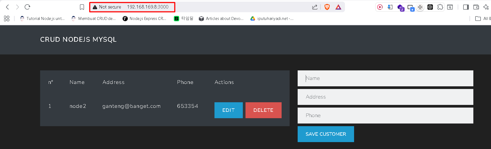

# Ansible dasar Part2 

!!! Note
    Nah sekarang kita akan mengulangi apa yang sudah kita lakukan di `node1` pada `node2` namun semua langkah kita lakukan dari `control node`

## Mengurutkan langkah yang harus di lakukan pada Node2
!!! Note
    Sebelum melakukan konfigurasi dari `control node` terlebih dahulu kita urutkan langkah-langkah yang telah kita lakukan pada `node1` agar nantinya langkah-langkah tersebut kita `convert` kedalam `playbook`  

    1. update repository  
    2. Install Curl
    3. Download NodeJS Setup
    4. Install NodeJS
    5. Install git
    6. Clone Repo
    7. Install MySql
    8. Import Database
    9. Membuat user mysql Baru
    10. memberikan kewenangan (Grant Privilege)
    11. Mengedit Konfigurasi database di NodeJS app
    12. npm install
    13. npm install -g pm2
    14. Menjalankan app dengan pm2
    15. simpan konfigurasi pm2
    dari sini kita akan membuat 3 playbook :
    1. installasi kebutuhan dan git repo
    2. perdatabase-an
    3. menjalankan App

## Membuat folder baru dan konfigurasi inventory
```
root@pve:~# mkdir nodejs
root@pve:~# cd nodejs
root@pve:~/nodejs# nano inventory
```
```
[nodejs]
node2 ansible_host=192.168.169.8 ansible_user=root
```
!!! Note
    Inventory merupakan file yang berisi detail dari `managed node` disini kita membuat group `[nodejs]` didalam group tersebut ada `node2` berikut dengan ip addressnya. nantinya didalam playbook `managed host` dapat kita panggil bisa dengan `group`nya atau hostnamenya yakni `node2`.

```
root@pve:~/nodejs# ansible -i inventory nodejs -m ping
```
## Membuat Playbook 1 - Installasi+repo
```
root@pve:~/nodejs# nano playbook-01-install.yml
```
```
- name: Install NodeJS, Git, MariaDB, dan clone repo
  hosts: nodejs
  become: true

  tasks:
    - name: Update repository
      apt:
        update_cache: yes

    - name: Install dependencies dasar
      apt:
        name:
          - curl
          - git
        state: present

    - name: Download NodeJS setup script
      shell: curl -fsSL https://deb.nodesource.com/setup_lts.x | bash -
      args:
        creates: /etc/apt/sources.list.d/nodesource.list

    - name: Install NodeJS
      apt:
        name: nodejs
        state: present

    - name: Install MariaDB Server
      apt:
        name: mariadb-server
        state: present

    - name: Pastikan MariaDB running
      service:
        name: mariadb
        state: started
        enabled: true

    - name: Clone repository CRUD NodeJS
      git:
        repo: https://github.com/fazt/crud-nodejs-mysql.git
        dest: /root/crud-nodejs-mysql
        force: yes
```
## Jalankan Playbook1
```
root@pve:~/nodejs# ansible-playbook -i inventory playbook-01-install.yml
```

## Membuat playbook 02 - Database
```
root@pve:~/nodejs# nano playbook-02-database.yml
```
```
- name: Setup database customersdb
  hosts: nodejs
  become: true

  vars:
    db_name: customersdb
    db_user: crud
    db_pass: "1234"
    sql_file: /root/crud-nodejs-mysql/database/db.sql
    mysql_socket: /run/mysqld/mysqld.sock

  tasks:
    - name: Install python mysql dependency
      apt:
        name: python3-pymysql
        state: present

    - name: Import database & table (force)
      shell: mysql --force < /root/crud-nodejs-mysql/database/db.sql

    - name: Create MySQL user
      mysql_user:
        name: "{{ db_user }}"
        password: "{{ db_pass }}"
        priv: "{{ db_name }}.*:ALL"
        host: localhost
        state: present
        login_unix_socket: "{{ mysql_socket }}"
```

## Jalankan Playbook 02
```
root@pve:~/nodejs# ansible-playbook -i inventory playbook-02-database.yml
```

## Membuat playbook 03 - Menjalankan app
```
root@pve:~/nodejs# nano playbook-03-run-app.yml
```
```
- name: Configure app and run with PM2
  hosts: nodejs
  become: true

  vars:
    app_dir: /root/crud-nodejs-mysql
    db_host: localhost
    db_user: crud
    db_pass: "1234"
    db_name: customersdb

  tasks:
    - name: Render db.js from template
      template:
        src: db.js.j2
        dest: "{{ app_dir }}/src/db.js"
        mode: "0644"

    - name: Install npm dependencies
      npm:
        path: "{{ app_dir }}"

    - name: Install PM2 globally
      npm:
        name: pm2
        global: yes

    - name: Start app with PM2
      shell: pm2 start npm --name "crudgaming" -- start
      args:
        chdir: "{{ app_dir }}"
      ignore_errors: true

    - name: Save PM2 process list
      shell: pm2 save

    - name: Enable PM2 startup
      shell: pm2 startup systemd
```

!!! Note
    Karena dalam menjalankan app kita butuh mengedit file `db.js` agar lebih mudah kita buat filenya menggunakan `jinja template` sehingga filenya dibuat dari sisi `control node` dan kode di playbook menjadi lebih rapi karena kontennya berada di jinja template.

### Membuat Jinja Template
```
root@pve:~/nodejs# nano db.js.j2
```
```
import { createPool } from "mysql2/promise";

export const pool = createPool({
  host: "{{ db_host }}",
  user: "{{ db_user }}",
  password: "{{ db_pass }}",
  database: "{{ db_name }}"
});
```
!!! Note
    Intinya adalah isi dari jinja template ialah file db.js setelah diedit, namun karena di `playbook` kita menggunakan `vars` atau biasa disebut dengan `variable` sehingga didalam `jinja tamplate` kita menggunakan `variable` yang nanti nilainya akan diisi oleh `playbook` dengan menggunakan `variable` ketika misalnya `db_user` ada perubahan kita tidak perlu mengedit seluruh baris kode yang menggunakan `db_user` kita cukup mengganti nilai dari `variable` `db_user` tersebut.

## Jalankan Playbook 03
```
root@pve:~/nodejs# ansible-playbook -i inventory playbook-03-run-app.yml
```

## tes di broswer akses http://192.168.8:3000
  
