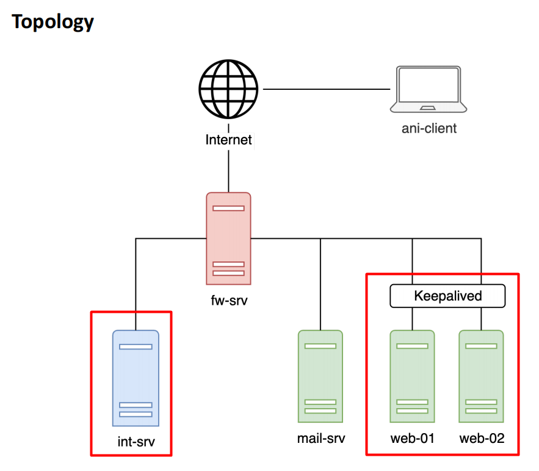
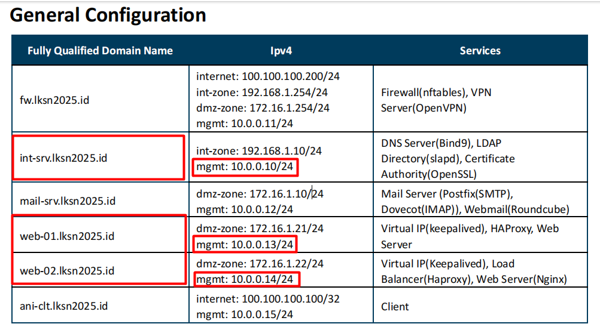
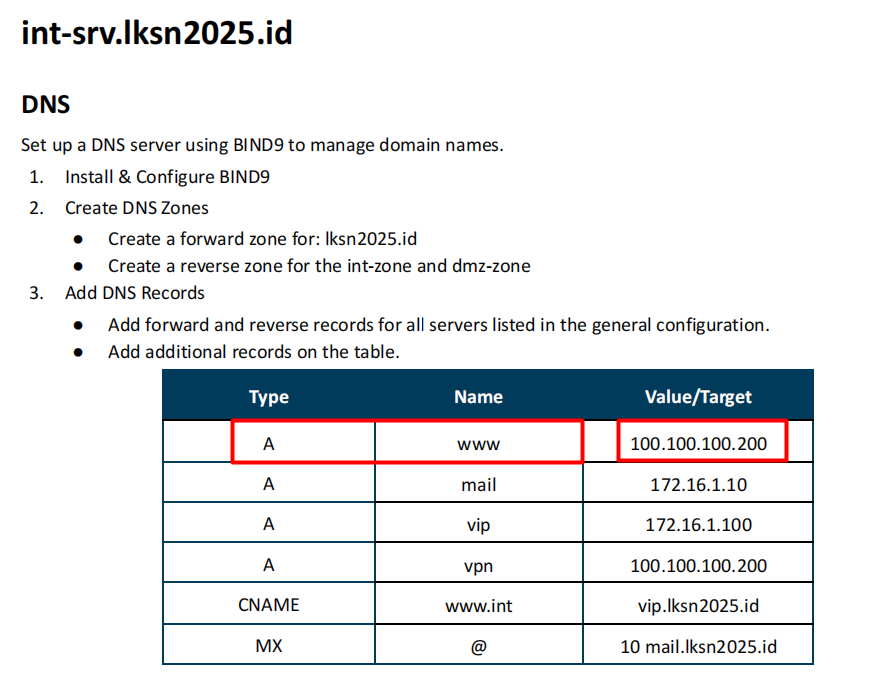

# HA (High Availability) Web Server

## Topology  

  
Kita akan melakukan replika konfigurasi `int` server yang nanti didalamnya terdapat service `DNS Server`, `CA server`, `Ansible` dan `LDAP` khusus `LDAP` akan kita skip karena kaitannya dengan `Mail Server` , berikutnya kita akan melakukan konfigurasi pada `web-01` dan `web-02` menggunakan ansible , `web-01` dan `web-02` akan menggunakan `keepalived` untuk sharing ip-address yang sama , didalamnya pun akan di konfigurasi `ha proxy` untuk `load balancing` , jadi `keepalived` untuk `Failover` sedangkan `HAproxy` untuk membagi beban.  

## Network  

  

Sementara kita hanya akan menggunakan ip dari network `mgmt`, karena network yang ada berkaitan dengan `firewall` , jadi kalian diminta untuk membuat 3 buah server di `virtual box`  
Server `Int` ip `10.0.0.10/24`  
Server `web-01` ip `10.0.0.13/24`  
Server `web-02` ip `10.0.0.14/24`  
Jangan Lupa mengubah hostname agar tidak bingung server mana yang sedang di konfigurasi.

## DNS Server  
  
Berikut adalah task asli dari `dns server` namun karena kita belum melakukan konfigurasi `firewall` ip dari `www` akan sementara kita rubah menjadi ip dari `virtual ip keepalived` yaitu `10.0.0.26`    

```
apt update
apt install bind9 bind9utils -y
```  

```
nano named.conf.local
```
## Membuat forward dan reverse zone
```
zone "lksn2025.id" {
    type master;
    file "/etc/bind/db.lksn2025.id";
};

zone "1.168.192.in-addr.arpa" {
    type master;
    file "/etc/bind/db.int";
};

zone "1.16.172.in-addr.arpa" {
    type master;
    file "/etc/bind/db.dmz";
};
```


