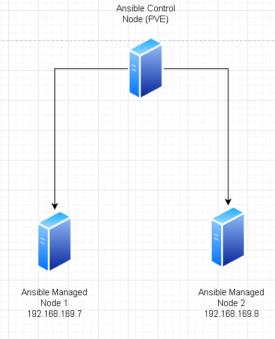
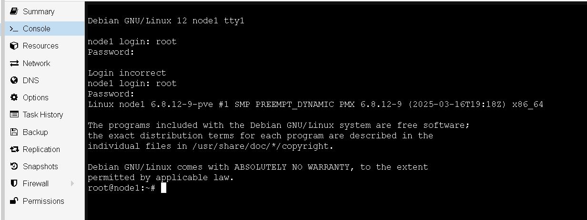
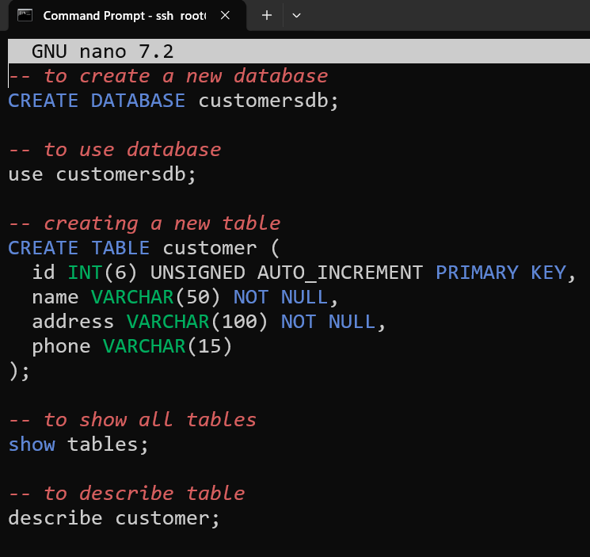
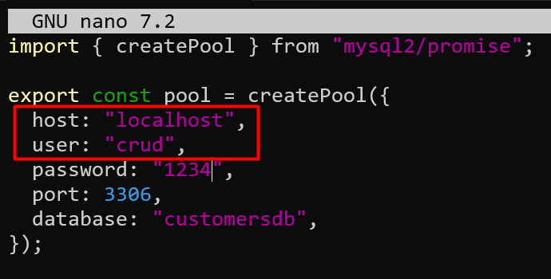

# Ansible Dasar (lagi) PART I

## Topologi
Pada pembelajaran ini kita akan menggunakan topologi berikut :
  
Pada `Ansible Managed Node1` kita akan melakukan Installasi `Node JS` dan melakukan deploy aplikasi dengan link github berikut https://github.com/fazt/crud-nodejs-mysql.git secara manual , sedangkan pada `Ansible Managed Node2` kita akan melakukan deploy aplikasi yang sama melalui `Ansible`

!!! Warning
    Buat 2 Container baru, sesuaikan IP Address sesuai dengan topologi, container container sebelumnya dihapus terlebih dahulu sebelum memulai praktikum ini.  

## Passwordless SSH Managed Node

### Aktifkan PermitRootLogin Managed Node

  
  
  
  
  
  
  

### copy public key dari control node ke managed node

```
root@pve:~# ssh-copy-id 192.168.169.7
/usr/bin/ssh-copy-id: INFO: Source of key(s) to be installed: "/root/.ssh/id_rsa.pub"
/usr/bin/ssh-copy-id: INFO: attempting to log in with the new key(s), to filter out any that are already installed
/usr/bin/ssh-copy-id: INFO: 1 key(s) remain to be installed -- if you are prompted now it is to install the new keys
root@192.168.169.7's password:

Number of key(s) added: 1

Now try logging into the machine, with:   "ssh '192.168.169.7'"
and check to make sure that only the key(s) you wanted were added.
```  

```
root@pve:~# ssh-copy-id 192.168.169.8
/usr/bin/ssh-copy-id: INFO: Source of key(s) to be installed: "/root/.ssh/id_rsa.pub"
The authenticity of host '192.168.169.8 (192.168.169.8)' can't be established.
ED25519 key fingerprint is SHA256:eIZIA2z88iH9jhYkjyE5gKsfhGMJ659WJxFhHAiVU70.
This host key is known by the following other names/addresses:
    ~/.ssh/known_hosts:7: [hashed name]
Are you sure you want to continue connecting (yes/no/[fingerprint])? yes
/usr/bin/ssh-copy-id: INFO: attempting to log in with the new key(s), to filter out any that are already installed
/usr/bin/ssh-copy-id: INFO: 1 key(s) remain to be installed -- if you are prompted now it is to install the new keys
root@192.168.169.8's password:

Number of key(s) added: 1

Now try logging into the machine, with:   "ssh '192.168.169.8'"
and check to make sure that only the key(s) you wanted were added.
```  

## SSH ke managed Node1 dari control node  
```
root@pve:~# ssh root@192.168.169.7
Linux node1 6.8.12-9-pve #1 SMP PREEMPT_DYNAMIC PMX 6.8.12-9 (2025-03-16T19:18Z) x86_64

The programs included with the Debian GNU/Linux system are free software;
the exact distribution terms for each program are described in the
individual files in /usr/share/doc/*/copyright.

Debian GNU/Linux comes with ABSOLUTELY NO WARRANTY, to the extent
permitted by applicable law.
Last login: Thu Feb  5 01:08:35 2026
root@node1:~#
```  

## Installasi NodeJS
### Update Package
```
root@node1:~# apt-get update
```
### Download dan Install NodeJS
```
root@node1:~# apt install curl
```
```
root@node1:~# curl -fsSL https://deb.nodesource.com/setup_lts.x | bash -
```
```
root@node1:~# apt install nodejs -y
```
## Install git dan clone Repo
```
root@node1:~# apt install git -y
```
```
root@node1:~# git clone https://github.com/fazt/crud-nodejs-mysql.git
```

## Install MysQL
```
root@node1:~# apt install mariadb-server -y
```
## Import Database 
### Cek apakah ada file sql di app folder
```
root@node1:~# ls
crud-nodejs-mysql
root@node1:~# cd crud-nodejs-mysql/
root@node1:~/crud-nodejs-mysql# ls
README.md  database  package.json  pnpm-lock.yaml  src
root@node1:~/crud-nodejs-mysql# cd database
root@node1:~/crud-nodejs-mysql/database# ls
db.sql
```
```
root@node1:~/crud-nodejs-mysql/database# nano db.sql
```
  
!!! Note
    File db.sql secara otomatis akan membuat database dengan nama customersdb dan table customer didalamnya  

### Import Database
```
root@node1:~/crud-nodejs-mysql/database# mysql -u root < ~/crud-nodejs-mysql/database/db.sql
Tables_in_customersdb
customer
Field   Type    Null    Key     Default Extra
id      int(6) unsigned NO      PRI     NULL    auto_increment
name    varchar(50)     NO              NULL
address varchar(100)    NO              NULL
phone   varchar(15)     YES             NULL
```
## Koneksikan Database dengan App
### Membuat user mysql baru
```
root@node1:~/crud-nodejs-mysql/src# mysql -u root
```
```
MariaDB [(none)]> CREATE USER 'crud'@'localhost' IDENTIFIED BY '1234';
```
!!! Note
    Perintah diatas akan membuat user bernama crud yang hanya dapat login dari localhost dan memiliki password 1234  

### Memberikan kewenangan database customersdb ke user crud
```
MariaDB [(none)]> GRANT ALL PRIVILEGES ON customersdb.* TO 'crud'@'localhost';
Query OK, 0 rows affected (0.005 sec)
```

### Mengedit konfigurasi database di nodeJS app
```
MariaDB [(none)]> exit
```
```
root@node1:~/crud-nodejs-mysql/src# cd
root@node1:~# cd crud-nodejs-mysql/
root@node1:~/crud-nodejs-mysql# ls
README.md  database  package.json  pnpm-lock.yaml  src
root@node1:~/crud-nodejs-mysql# cd src/
root@node1:~/crud-nodejs-mysql/src# ls
app.js  config.js  controllers  db.js  index.js  public  routes  views
root@node1:~/crud-nodejs-mysql/src# nano db.js
```
  

## Menjalankan App
### Install dependency NodeJS App
```
root@node1:~/crud-nodejs-mysql/src# cd
root@node1:~# cd crud-nodejs-mysql/
```
```
root@node1:~/crud-nodejs-mysql# npm install

added 93 packages, and audited 94 packages in 35s

16 packages are looking for funding
  run `npm fund` for details

1 critical severity vulnerability

To address all issues (including breaking changes), run:
  npm audit fix --force

Run `npm audit` for details.
npm notice
npm notice New minor version of npm available! 11.6.2 -> 11.9.0
npm notice Changelog: https://github.com/npm/cli/releases/tag/v11.9.0
npm notice To update run: npm install -g npm@11.9.0
npm notice
```
```
root@node1:~/crud-nodejs-mysql# npm install -g pm2
```
!!! Note
    Dengan PM2 kita menjalankan nodeJS app di background 

### Menjalankan App dengan PM2
```
root@node1:~/crud-nodejs-mysql# pm2 start npm --name "crudgaming" -- start
```
```
root@node1:~/crud-nodejs-mysql# pm2 status
┌────┬────────────────────┬──────────┬──────┬───────────┬──────────┬──────────┐
│ id │ name               │ mode     │ ↺    │ status    │ cpu      │ memory   │
├────┼────────────────────┼──────────┼──────┼───────────┼──────────┼──────────┤
│ 0  │ crudgaming         │ fork     │ 0    │ online    │ 0%       │ 67.6mb   │
└────┴────────────────────┴──────────┴──────┴───────────┴──────────┴──────────┘
```
### Simpan konfigurasi PM2 agar otomatis start setelah reboot
```
root@node1:~/crud-nodejs-mysql# pm2 startup systemd
root@node1:~/crud-nodejs-mysql# pm2 save
```

## Tes akses http://192.168.169.7:3000  
  

## The end of Part 1

