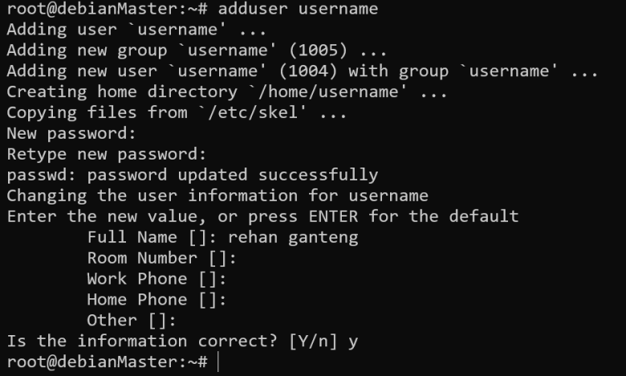
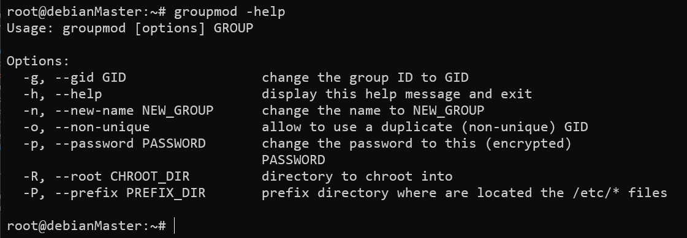

# Manage Local Users and Group

## Membuat User

Ada beberapa perintah yang bisa digunakan untuk membuat user

1. Useradd 
Perintah ini akan membuat `user`, namun perintah ini hanya membuat user saja tidak dengan passwordnya, sehingga `user` yang dibuat dengan perintah ini tidak dapat digunakan untuk login, perintah ini juga tidak membuat home `directory user`. Untuk menambahkan/mengganti password kita dapat menggunakan perintah **passwd**.  
  

2. Adduser  
- Dengan perintah ini akan membuat user, home directory, password dan juga biodata dari user tersebut.  
  
- User yang telah dibuat akan tersimpan di `/etc/passwd`  
```
root@debianMaster:~# cat /etc/passwd | grep username
username:x:1004:1005:rehan ganteng,,,:/home/username:/bin/bash
```  

## Menghapus User

Untuk menghapus user kita bisa menggunakan perintah **userdel <namauser>**, perintah ini hanya akan menghapus user saja, namun tidak dengan data si user. Untuk menghapus user beserta datanya gunakan perintah **userdel -r <namauser>**  
  

## Mengganti Password user  
Mengganti password dapat menggunakan perintah **passwd<namauser>**  
  

## UUID Ranges
Berikut adalah Range UID yang diberikan system.
- Root: 0
- System User: 1-200
- Non Ownership System User: 201-999
- Reguler User: 1000+++

## Membuat Group
- Membuat group dapat dilakukan dengan perintah **groupadd<namagroup>**   
  
- Kita dapat memberikan `GID` custom ketika membuat sebuah group, dengan menambahkan opsi `-g` pada perintah **groupadd** 
  
- Opsi **-r** akan membuat system group(group system user) menggunakan GID range yang tersimpan di **/etc/login.defs** yaitu pada parameter **SYS_GID_MIN dan SYS_GID_MAX**.

## Memodifikasi groupp yang sudah dibuat

- Kita bisa menggunakan perintah **groupmod** untuk mengedit/modifikasi group yang sudah dibuat. `Groupmod` memiliki berbagai macam opsi, kita bisa cek dengan perintah `groupmod –help`  
  
- Opsi yang umum digunakan yaitu `-g` dan `-n`, keduanya berfungsi untuk mengubah `GID` dan mengubah nama `group`  
  
  

## Menghapus Group

- Menghapus group dapat dilakukan dengan perintah **groupdel <namagroup>**  
  
Terlihat group tkj sudah terhapus dan tidak muncul di **/etc/group**  

## Memasukkan user kedalam Group  
Dengan perintah **usermod -aG <namagroup> <namauser>** kita dapat memasukkan sebuah user kedalam group.  
  
Perintah tersebut memasukkan user `al` dan `b` kedalam group `tkj`

# Praktikum Mandiri

1. Berpindah menjadi user root
2. Membuat user `operator1` dan verifikasi apakah telah terbuat di system  
```
root@debianMaster:~# adduser operator1
Adding user `operator1' ...
Adding new group `operator1' (1009) ...
Adding new user `operator1' (1008) with group `operator1' ...
Creating home directory `/home/operator1' ...
Copying files from `/etc/skel' ...
New password: 1234
Retype new password: 1234
passwd: password updated successfully
Changing the user information for operator1
Enter the new value, or press ENTER for the default
        Full Name []:
        Room Number []:
        Work Phone []:
        Home Phone []:
        Other []:
Is the information correct? [Y/n] y
root@debianMaster:~# cat /etc/passwd | grep operator1
operator1:x:1008:1009:,,,:/home/operator1:/bin/bash
```
3. Membuat user `operator2` dan `operator3`
```
root@debianMaster:~# adduser operator2
Adding user `operator2' ...
Adding new group `operator2' (1010) ...
Adding new user `operator2' (1009) with group `operator2' ...
Creating home directory `/home/operator2' ...
Copying files from `/etc/skel' ...
New password:1234
Retype new password:1234
passwd: password updated successfully
Changing the user information for operator2
Enter the new value, or press ENTER for the default
        Full Name []:
        Room Number []:
        Work Phone []:
        Home Phone []:
        Other []:
Is the information correct? [Y/n] y
root@debianMaster:~# adduser operator3
Adding user `operator3' ...
Adding new group `operator3' (1011) ...
Adding new user `operator3' (1010) with group `operator3' ...
Creating home directory `/home/operator3' ...
Copying files from `/etc/skel' ...
New password:1234
Retype new password:1234
passwd: password updated successfully
Changing the user information for operator3
Enter the new value, or press ENTER for the default
        Full Name []:
        Room Number []:
        Work Phone []:
        Home Phone []:
        Other []:
Is the information correct? [Y/n] y  
```  
4. Menghapus user `operator3` dan juga personal data dari user tersebut.
```
root@debianMaster:~# userdel -r operator3
```
5. Membuat `group` dengan nama `operators` dengan GID `30000`
```
root@debianMaster:~# groupadd -g 30000 operators
```
6. Membuat `group` dengan nama `admin`
```
root@debianMaster:~# groupadd admin
```
7. Verifikasi apakah group `operators dan admin` telah terbuat
```
root@debianMaster:~# tail /etc/group
operators:x:30000:
admin:x:30001:
```
8. Memasukkan user `operator1` dan `operator2` kedalam group `operators`
```
root@debianMaster:~# usermod -aG operators operator1
root@debianMaster:~# usermod -aG operators operator2
```
9. Verifikasi apakah `operator1` dan `operator2` telah masuk kedalam group `operators`
``` 
root@debianMaster:~# id operator1
uid=1008(operator1) gid=1009(operator1) groups=1009(operator1),30000(operators)
root@debianMaster:~# id operator2
uid=1009(operator2) gid=1010(operator2) groups=1010(operator2),30000(operators)
```
10. Buatlah user `sysadmin1`,`sysadmin2`,`sysadmin3` dengan password `1234`
```
root@debianMaster:~# adduser sysadmin1
root@debianMaster:~# adduser sysadmin2
root@debianMaster:~# adduser sysadmin3
```
11. Memasukkan user `sysadmin1`,`sysadmin2`,`sysadmin3` kedalam group `admin`
```
root@debianMaster:~# usermod -aG admin sysadmin1
root@debianMaster:~# usermod -aG admin sysadmin2
root@debianMaster:~# usermod -aG admin sysadmin3
```
12. verifikasi `sysadmin1`,`sysadmin2`dan `sysadmin3` telah tergabuung dalam group `admin`
```
root@debianMaster:~# id sysadmin1
uid=1010(sysadmin1) gid=1011(sysadmin1) groups=1011(sysadmin1),30001(admin)
root@debianMaster:~# id sysadmin2
uid=1011(sysadmin2) gid=1012(sysadmin2) groups=1012(sysadmin2),30001(admin)
root@debianMaster:~# id sysadmin3
uid=1012(sysadmin3) gid=1013(sysadmin3) groups=1013(sysadmin3),30001(admin)
```
13. Membuat member group `admin` setara dengan root / dapat menggunakan `sudo`
```
root@debianMaster:~# echo "%admin ALL=(ALL) ALL" >> /etc/sudoers.d/admin
```
14. Masuk sebagai `sysadmin1` dan verifikasi apakah user tersebut dapat menggunakan `sudo`
```
sysadmin1@debianMaster:~$ sudo apt-get update

We trust you have received the usual lecture from the local System
Administrator. It usually boils down to these three things:

    #1) Respect the privacy of others.
    #2) Think before you type.
    #3) With great power comes great responsibility.

[sudo] password for sysadmin1:
Err:1 http://deb.debian.org/debian bullseye InRelease
```
!!! Warning  
    Buat Dokumentasi pengerjaan dan upload pada Exam MySMK


