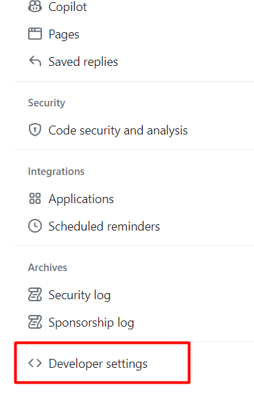
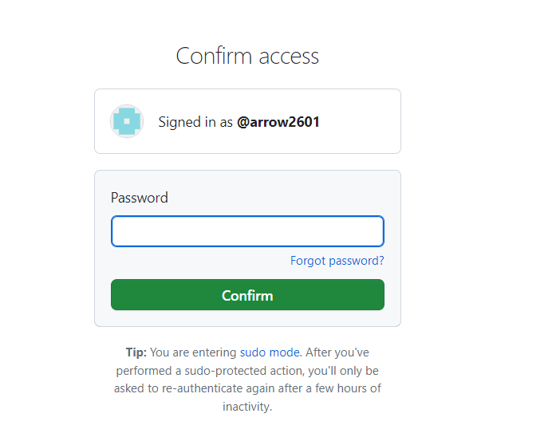
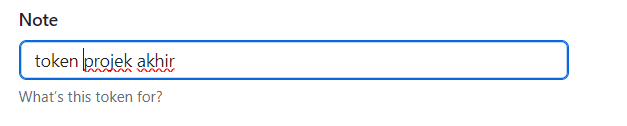

# Token Github

Agar kita dapat melakukan `push` dan juga `pull` kita memerlukan `token` dari akun github. Dahulu bisa menggunakan password namun kebijakan dirubah untuk keamanan , sehingga sekarang kita membutuhkan `token` untuk melakukan pull request.

Login ke akun github kalian lalu klik icon profile kalian
  

Klik Setting

  

Scroll kebawah kemudian klik `Developer Setting`  

Kemudian Pilih `Personal Access Tokens` -> `Tokens (classic)`  

  

`Generate New Token` untuk membuat token baru
    

    

  Masukkan password akun github anda

  

  untuk `Note` isikan deskripsi `token` yang dibuat  

  

  pada bagian `Expiration` pilih `No Expiration`

    

  ceklis pada baigan `repo`

  

  scroll saja kebawah kemudian klik `Generate Token`

   

  Silahkan copy `token` yang telah dibuat kedalam notepad dan JANGAN SAMPAI HILANG !!!. Karena tidak akan ditampilkan lagi pada halaman github.