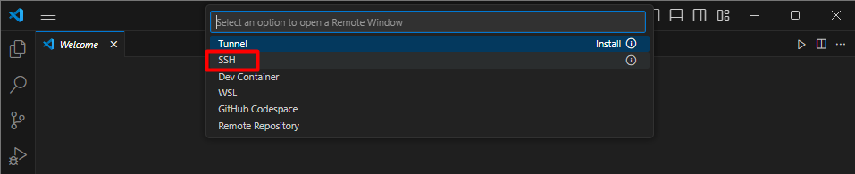
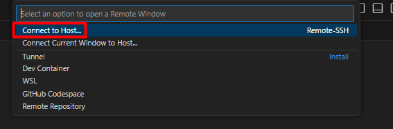
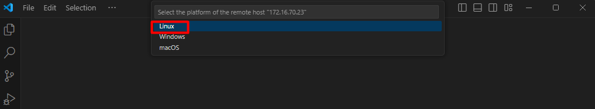
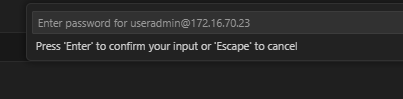
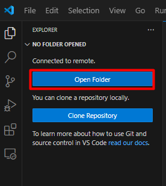

# SSH Using VS Code

Untuk mempermudah pekerjaan kita akan SSH menggunakan VSCode, dengan ini kegiatan membuat file dll menjadi lebih mudah.

1. Install Vs code 
2. Buka VS Code kemudian di klik di ujung kiri bawah `Open a Remote window`

3. Pilih `SSH` Otomatis `VS Code` akan melakukan installasi `ekstensi` yang dibutuhkan

4. Setelah itu kita akan menambahkan `host` atau target server yang ingin kita `remote`. Klik `Add New SSH Host`

5. Masukkan perintah `SSH` yang biasa kita gunakan ketika `remote` via `CMD`. Sesuaikan `username` dan `ipaddress` sesuai dengan yang berada di server kalian.

6. Pilih `SSH Configuration file` untuk diupdate. pilih pilihan pertama.

7. Untuk connect SSH ke server , klik `Open a Remote Window` -> `Connect to Host` -> Pilih IP server yang tadi sudah kita tambahkan.  

8. Setelah itu akan muncul `Window VSCode baru`, system akan bertanya `platform` apa yang digunakan oleh server kita. Plih `Linux`.

9. Pilih `Continue` untuk lanjut
10. Masukkan password server   

11. kita akan membuka folder `home` nantinya kita akan membuat project docker kita di folder tersebut. Untuk membuka folder klik menu `explorer` yang berada di ujung kiri atas.

12. klik `open folder`  

13. Otomatis `Path` nya akan mengarah ke `home folder` dari user yang kita gunakan untuk `ssh`
 
14. Masukkan kembali password user yang digunakan untuk ssh

15. Klik `Yes, I trust the authors` dan jangan lupa dicentang
  
16. Jika berhasil akan muncul seperti dibawah ini  

17. Untuk bisa memasukkan perintah kita butuh sebuah terminal, caranya cukup mudah kita hanya perlu mencari menu `Terminal` kemudian pilih `new terminal`, nanti akan muncul terminal dibagian bawah.

