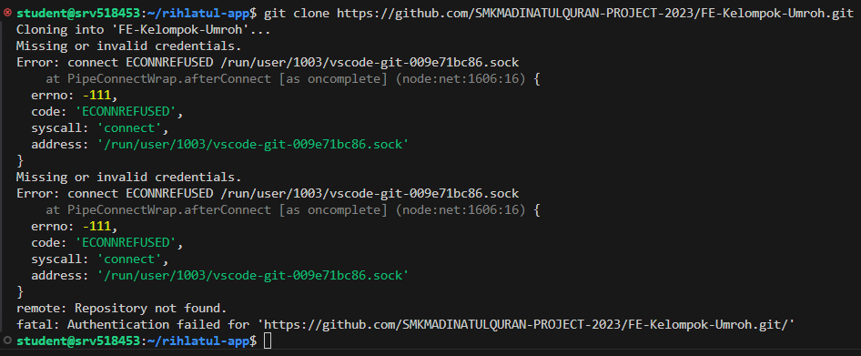
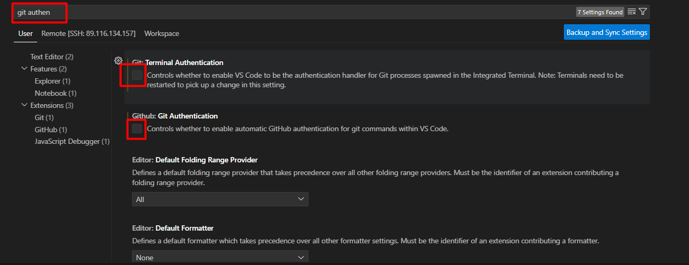
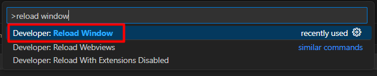

# Study Case Rihlatul App (Docker Compose)


!!! Preparation
    Seperti biasa kita akan melakukan praktik ini dengan `ssh` menggunakan `vscode` namun sebelum itu ada beberapa hal yang harus dilakukan untuk memudahkan praktik kali ini.  
    1. Menambahkan user `student` dengan password `1234` (biar ez) pada server docker.
    ```
    adduser student
    ```
    2. Memasukkan user `student` kedalam group `sudo`. Agar nantinya tidak perlu masuk sebagai root.
    ```
    usermod -aG sudo student
    ```
    Jika belum ada group `sudo` install terlebih dahulu.
    ```
    apt-get update
    apt-get install sudo
    ```
    3. Memasukkan user `student` kedalam group `docker`. Agar bisa menggunakan docker dengan user `student`.
    ```
    usermod -aG docker student
    ```
    4. SSH ke server docker via vscode menggunakan user `student`


Rihlatul App merupakan App yang dibangun dengan `Next.js` untuk `Front End`, `Nest.JS` sebagai `BackEnd`nya dan `MySQL` sebagai `Database`nya. Dengan `Docker compose` kita akan mencoba untuk menjalankan app tersebut.  

1. Membuat folder baru dengan nama `rihlatul-app` pada homefolder user `student`
  
2. Cloning `repo fe` dan `repo be` didalam folder `rihlatul-app`. Masukkan perintah didalam terminal `vscode`  
```
student@srv518453:~$ cd rihlatul-app/
student@srv518453:~/rihlatul-app$ git clone https://github.com/SMKMADINATULQURAN-PROJECT-2023/FE-Kelompok-Umroh.git
Cloning into 'FE-Kelompok-Umroh'...
Username for 'https://github.com': arrow2601
Password for 'https://arrow2601@github.com': 
```  
```
student@srv518453:~/rihlatul-app$ git clone https://github.com/SMKMADINATULQURAN-PROJECT-2023/BE-Kelompok-Umroh.git
Cloning into 'BE-Kelompok-Umroh'...
Username for 'https://github.com': arrow2601
Password for 'https://arrow2601@github.com': 
```
3. Jika muncul error seperti ini  
    
    1. Pergi ke `File > Preferences > Settings >`  
      
    2. Cari `git authentication` kemudian `uncheck` `git : terminal Authentication` dan `git : Git Authentication`  
      
    3. Kemudian `reload window` tekan `ctrl+shift+p`  
    4. cari `reload window` kemudian enter  
    
    5. Masukkan kembali password user `student`  
      
    6. Buka terminal baru `Terminal > New Terminal`  
      
      
    7. Ulangi `step` nomor `2`
    
4. Pastikan kedua repo telah berhasil di clone.  


5. Membuat `Dockerfile` dan `dockerignore` didalam folder `BE-Kelompok-Umroh`

    

