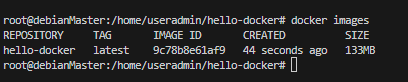

# Hello Docker App

Kita akan mencoba membuat App yang akan menuliskan `Hello Docker` berbasis javascript menggunakan `Dockerfile`

1. Membuat folder `Hello-docker`. Pada menu `EXPLORER` klik `New Folder` kemudian isikan dengan nama `hello-docker`  

  
2. Membuat file `hello.js` didalam folder `hello-docker`. Klik kanan pada `hello-docker` -> `New File`  


3. Mengedit isi file `hello.js`. Ckup klik 2 kali pada file `hello.js`. Tambahkan seperti dibawah.
```
console.log('Hello Docker!')
```
Untuk menyimpan perubahan seperti pada editor file lainnya cukup dengan menekan `ctrl + s`
4. Membuat file `Dockerfile` pada folder `hello-docker`    
  
5. Mengedit file `Dockerfile`
```
# base image yang digunakan
FROM node:20-alpine 

# Menentukan direktori yang akan digunakan didalam container
WORKDIR /app 

# mengcopy semua file dari tempat dockerfile berada ke dalam WORKDIR
COPY . .  

# menjalankan command untuk menjalankan file js
CMD node hello.js
```

6. Build `dockerimage` menggunakan `dockerfile` yang telah kita buat. Gunakan terminal.
```
useradmin@debianMaster:~$ su 
Password: 
root@debianMaster:/home/useradmin# pwd
/home/useradmin
root@debianMaster:/home/useradmin# cd hello-docker/
root@debianMaster:/home/useradmin/hello-docker# docker build -t hello-docker . # build image dengan nama hello-docker
```

7. Verifikasi apakah build sudah berhasil
``` 
docker images
```

Pastikan `hello-docker` tampil dilayar

8. Menjalankan container dengan image yang baru saja kita buat.
```
root@debianMaster:/home/useradmin/hello-docker# docker run hello-docker
Hello Docker!
```
Pastikan tulisan `Hello Docker!` Muncul dilayar

9. Sekarang kita akan coba masuk kedalam container
```
docker run -it hello-docker sh
```
  
Ketika kita mengakses container tersebut, otomatis kita diarahkan kedalam folder `/app` ini terjadi karena konfigurasi `WORKDIR` pada `Dockerfile`
```
exit # untuk keluar dari container
```

