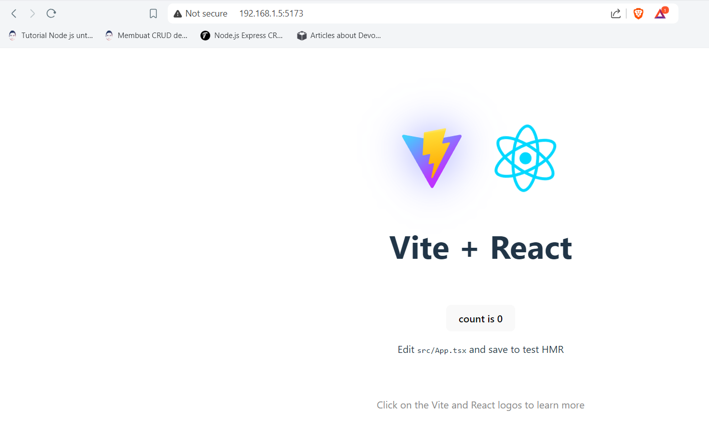

# Docker Compose

## Pengenalan Docker Compose
- Docker Compose adalah tool yang digunakan untuk mendefinisikan dan menjalankan multiple Docker Container secara sekaligus
- Dengan menggunakan Docker Compose, kita bisa menggunakan fiile YAML untuk melakukan konfigurasi Docker Container nya
- Lalu dengan sebuah perintah, kita bisa membuat semua Docker Container dan menjalankannya sekaligus dari file konfigurasi tersebut
- Dengan begitu, kita tidak perlu lagi mengetikan perintah docker create secara manual ketika ingin membuat Docker Container
- Contoh misalnya `app` kita perlu 3 container, maka kita tidak perlu melakukannya lagi secara manual, cukup configurasi `docker compose` saja.

## Demo Docker Compose
kali ini kita akan kembali mencoba `docker compose` menggunakan `vite-react app`

1. Membuat project `vite-react` baru, namun karena diserver kita belum diinstall `nodeJS` , maka seperti sebelumnya kita akan menggunakan `container` dari `image` `hello-docker`.
```
root@debianMaster:/home/useradmin# docker run -it -v .:/app hello-docker npm create vite@latest vite-project
```


2. cek apakah folder `vite-project` sudah berisi project yang tadi kita sudah buat.

3. Kemudian kita harus membuat `dockerfile` , `dockerignore` dan juga `compose.yaml`.  
4. `Dockerfile` nya copy kan dari `Dockerfile` `docker-react` pada praktikum sebelumnya.  
    !!! Warning
            Apabila file `Dockerfile` tidak dapat disimpan dan muncul error seperti ini  
              
            kita perlu mengubah kepemilikan folder tersebut menjadi kepemilikan user yang kita gunakan untuk `SSH`
            ```
            chown -R useradmin:useradmin /home/useradmin/vite-project
            ```  
5. Kemudian untuk `compose.yaml` diatur sesuai dengan kebutuhan kita. Disini tidak banyak yang kita butuhakan, hanya setting port dan volume  
```py title="compose.yaml"
services: # service yang ada didalam compose
  web:      # disini kita hanya membuat 1 service yaitu `web`. web ini hanya penamaan saja , jadi bebas
    build: # build adalah proses pembuatan image
      context: . # context ialah lokasi dari dockerfile. bisa path ataupun url.
    ports:
      - 5173:5173
    volumes:
      - .:/app # volume dari vite-project ke /app didalam container
      - /app/node_modules # volume anonymous ke /app/node_modules, sehingga node_modules tersimpan disisi host meskipun telah kita masukkan ke docker ignore.
```
6. copykan juga `dockerignore` dari `docker-react` ke `vite-project`
7. janganlupa edit `package.json` menambah `--host`

8. Masuk kedalam `vite-project` kemudian masukkan perintah `docker compose up` 
```
docker compose up
```
9. Jika sukses akan muncul seperti ini


10. akses ip_address:5173 di browser



