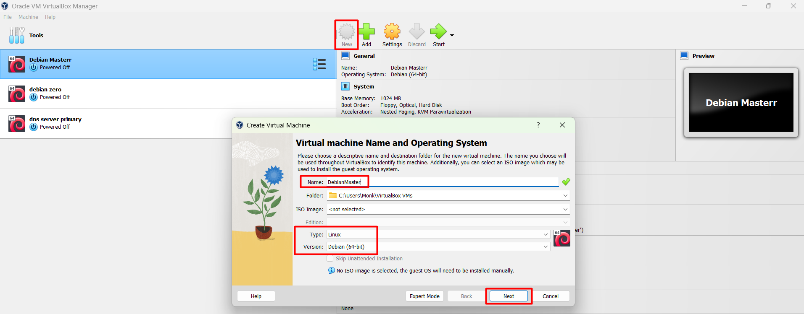
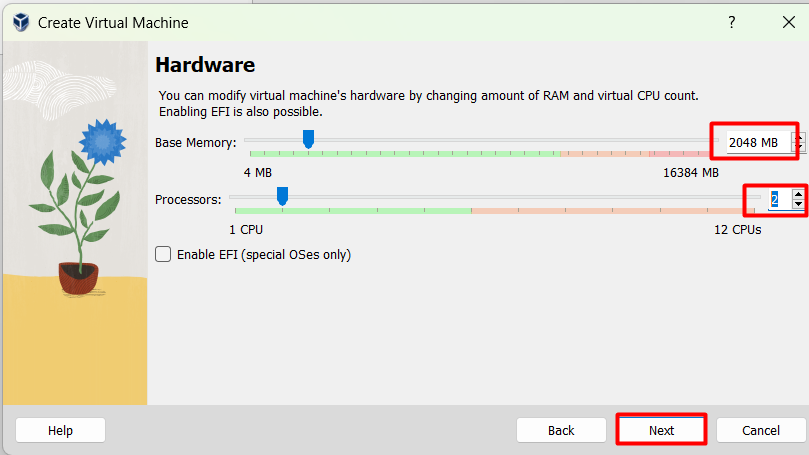
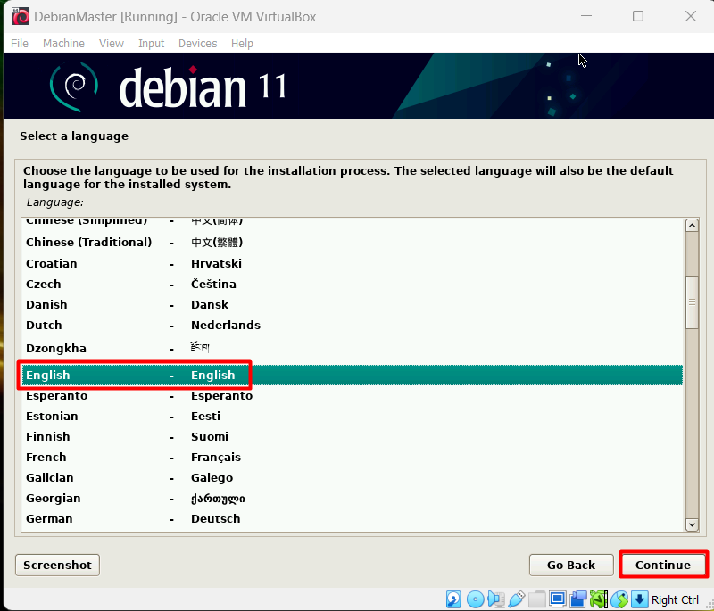
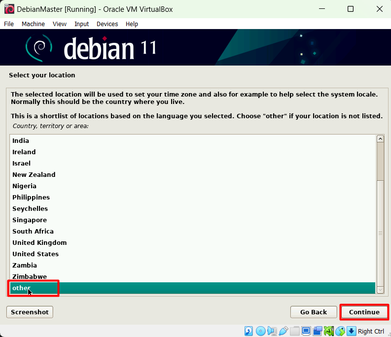
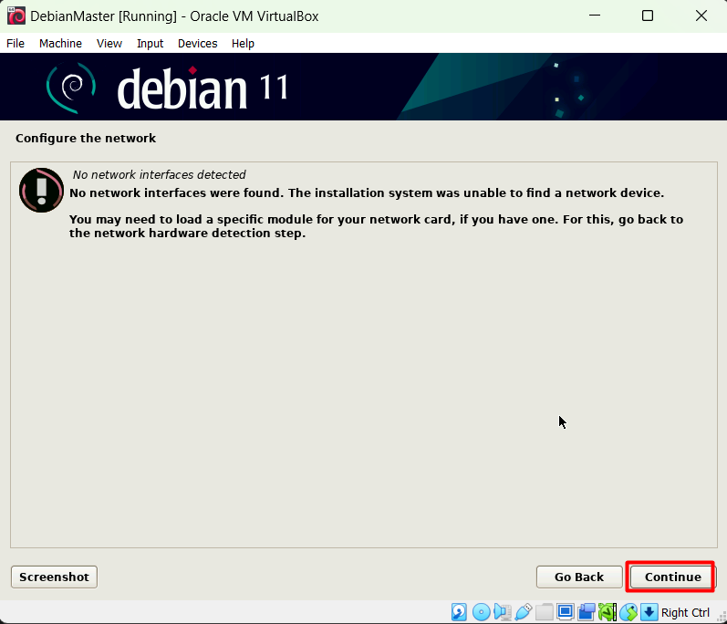
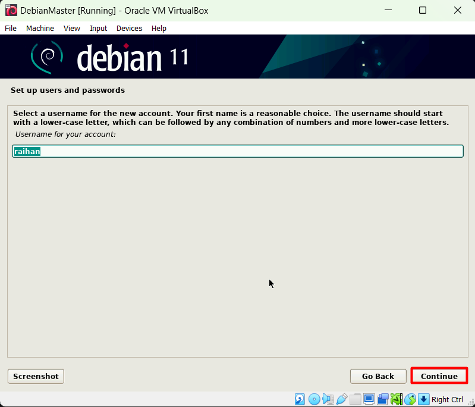
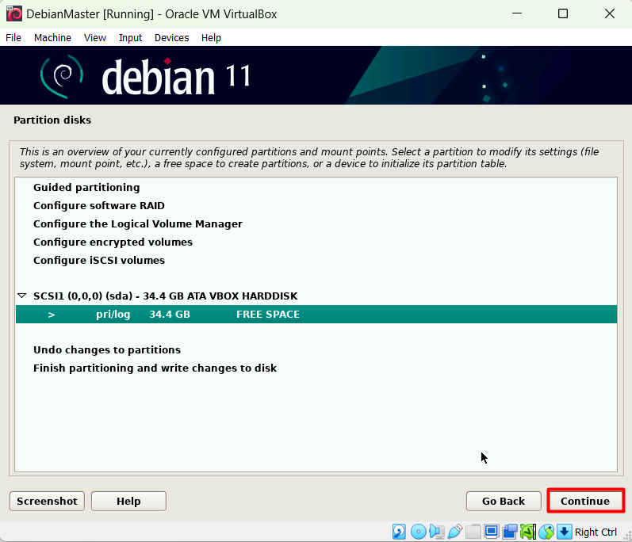
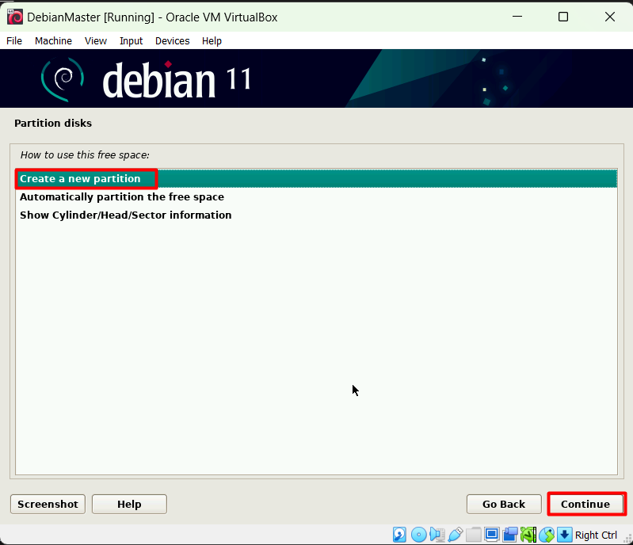
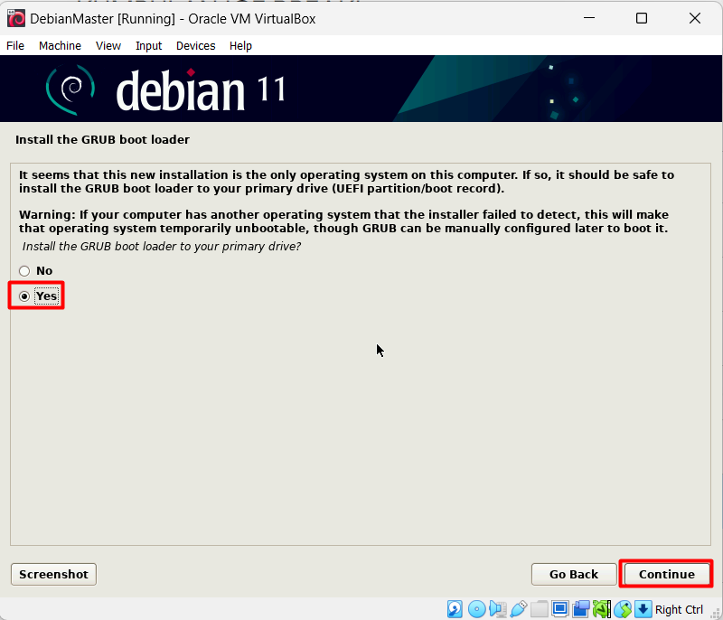

# Installasi Debian Server

## Membuat VM (Virtual Machine) Baru

isikan Nama, type dan version

Isi RAM dan Processor 

Membuat Virtual Hard Disk dan Size nya

Summary VM yang akan dibuat

## Setting Network Adapter

Untuk memudahkan installasi, agar VM tidak menggunakan Internet, kita disable dahulu Network Adapter dari VM tersebut.

## Memilih Installation Media

Sebelum menjalankan VM, kita masukkan dahulu Media Installasi yang berupa ISO file dari debian 11

## Memulai Installasi

Jalankan VM dengan menekan Tombol `Start`

Untuk installasi kali ini kita menggunakan mode `Graphical install`

Pemilihan bahasa

Pemilihan lokasi dimana kita berada

Pemilihan configurasi Locale

Pemilihan Keyboard

Karena tadi kita men disable Network Adapter, maka kita pilih `no ethernet card`

Konfirmasi Network

Pengisian Hostname (Nama Komputer kita)

Pengisian Password User Root(Administrator)

Pengisian Full Name Pengguna

Pengisian Username untuk Login

Pengisian Password dari user diatas

Pemilihan Zona Waktu

Pemilihan Mode Pembuatan Partisi

Pemilihan Device yang akan di partisi

Konfirmasi

Pemilihan Free Space yang akan di partisi

Membuat Partisi baru

Size Partisi

Pemilihan type Partition : Primary/Logical  

Primary : Partisi yang bisa digunakan untuk boot(Bootable), hanya bisa 4 partisi primary didalam 1 hard disk  
Logical : Partisi yang tidak bisa digunakan untuk boot(Non-Bootable), tidak memiliki batasan berapa banyak dalam 1 hard disk  

Sehingga kita pilih `primary` karena kita akan menyimpan os kita didalamnya dan agar kita bisa boot ke OS kita

Posisi Cluster

Pengisian type File System, Mount Point  

Dalam sistem Operasi Linux Minimal ada 2 buah partisi yaitu `/` atau yang biasa disebut dengan `root` dan juga partisi `swap` yaitu partisi yang berfungsi sebagai RAM.  

Disini secara otomatis dibuatkan partisi `/` oleh sistem sehingga kita tidak melakukan konfigurasi apapun. Adapun yang kita konfigurasi adalah bagian `Bootable flag` kita akan merubahnya menjadi `on`

Selesai setting partisi

Pemilihan Free Space yang akan di Partisi

Membuat Partisi Baru

Size Partisi

Kali ini kita pilih logical

Kita rubah file systemnya 

Pilih Swap Area

Selesai setting partisi

Finish

Konfirmasi

Scanning media pilih no

Network Mirror, pilih no karena kita menginstall secara offline.

Survey, Pilih No

Software Selection, Disini kita dapat memilih apa saja yang diinstall. Kita bisa memilih type GUI (Graphic Userinterface), dan beberapa service. Disini kita akan menginstall debian CLI(Command line) sehingga kita tidak butuh GUI/Desktop Environment. Jadi kita hanya menginstall debian minimalis dan ssh server

Install Grub Boot Loader

Pilih device yang mau diinstall Grub Loader

Installasi Selesai

