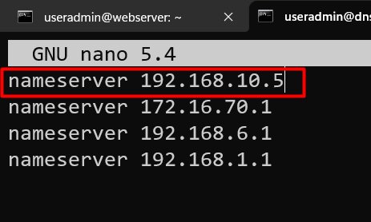

# DNS Server

## Preparation

!!! Note
    Sebelum memulai `Clone` terlebih dahulu `VM` `DebianZero` menjadi `DNS Server Primary`, Ubah `IP Address` nya menjadi `192.168.10.5` dan ubah `Hostname` menjadi `dns-server-primary`

## What is DNS
<div style="text-align: justify"> 
DNS (Domain Name System) adalah sebuah sistem yang berfungsi sebagai layanan 
direktori untuk semua sistem, dengan menspesifikannya sebagai nama host atau domain. 
Dengan kata lain, DNS menjadi satu fasilitas dimana sebuah server yang memiliki nama 
host dan alamat IP sebagai identitas yang unik di dalam jaringan. 
<br>
<br>
Sebagai layanan, DNS menjadi salah satu bagian terpenting di dalam jaringan internet. 
Misalnya terdapat seseorang yang mengunjungi sebuah situs dengan mengetikan 
sebuah alamat situs contohnya coba.lan pada aplikasi browser (Firefox, Chrome, 
dsb).
<br>
<br>  
Tanpa adanya DNS, seseorang atau pengunjung situs tersebut masih tetap akan dapat 
mengakses alamat coba.lan tersebut dengan menggunakan IP, namun disinilah 
yang menjadi persoalan penting, apakah kita sanggup menghafal berbagai alamat IP 
sebuah server?  
<br>
<br>
Secara pribadi penulis sangat kesulitan sekali untuk untuk menghafal sebuah alamat IP 
pada sebuah server jika dibandingkan dengan nama host atau domain. 
Dengan demikian untuk melakukan pemetaan atau pengalamatan sebuah host atau 
domain menjadi sebuah IP Address maupun sebaliknya maka dibutuhkan sebuah server 
yang berfungsi sebagai penanggung jawab yang disebut dengan DNS Server.
</div>

## How DNS Works

  

Berikut ini tahapan - tahapan cara kerja dari DNS server mengacu pada skema atau 
gambar diatas:  

1. Jika seseorang (user) ingin mengakses domain coba.id, maka user harus mengetahui alamat IP Server dari domain hamim.id. 
Pertama kali user mengakses DNS Recursive untuk mencari record dari domain hamim.id  


2. DNS Recursive akan menerjemahkan domain ke alamat IP jika DNS Recursive 
memiliki record dari domain hamim.id. Jika DNS Recursive tidak menyimpan record 
domain coba.id maka permintaan akan diteruskan ke “Root Server”
3. Root Server akan memberikan jawaban delegasi, Contohnya “Saya tidak tahu alamat 
IP dari coba.id, tapi saya “tahu” bahwa server DNS di 103.19.178.178 memiliki 
informasi tentang domain .id”
4. Recursor DNS lokal kemudian bertanya kepada server DNS (Contohnya: 
203.119.112.47) pertanyaan pun sama seperti yang diberikan kepada root server tadi. 
"apakah alamat IP dari www.coba.id?". (secara umum) akan mendapatkan jawaban 
yang serupa, "saya tidak tahu alamat dari www.coba.id, tapi saya "tahu" bahwa 
server 103.19.178.178 memiliki informasi dari domain coba.id"
5. Akhirnya, pertanyaan beralih kepada server DNS ketiga (207.142.131.234), yang 
menjawab dengan alamat IP yang dibutuhkan. 
6. Barulah DNS Recursive memberi jawaban bahwa IP 117.53.45.53 digunakan oleh 
domain coba.id.  

Nah pada praktikum ini yang akan kita konfigurasi adalah `Authoritative NameServer` atau `Top Level Domain Name Server`.
## Installasi BIND9

``` py
root@dns-server-primary:~# apt install bind9 -y
```

## Membuat Zone DNS

``` py
root@dns-server-primary:/# cd /etc/bind
root@dns-server-primary:/etc/bind# nano named.conf.local
```
tambahkah seperti dibawah ini
``` py title="nano named.conf.local"
zone "coba.lan" {
        type master;
        file "/etc/bind/db.coba";
};
```
!!! Note
    `zone`: Silahkan isikan nama domain yang ingin digunakan  

    `type`: type dari DNS Master/Slave  

    `file`: Lokasi penyimpanan Konfigurasi Zone Forward

## Konfigurasi File Forward (DB Files)

Copy dari konfigurasi Default 
``` py
root@dns-server-primary:/etc/bind# cp db.local db.coba
```
Tampilan awal file `db.coba`
``` py title="root@dns-server-primary:/etc/bind# nano db.coba"
;
; BIND data file for local loopback interface
;
$TTL    604800
@       IN      SOA     localhost. root.localhost. (
                              2         ; Serial
                         604800         ; Refresh
                          86400         ; Retry
                        2419200         ; Expire
                         604800 )       ; Negative Cache TTL
;
@       IN      NS      localhost.
@       IN      A       127.0.0.1
@       IN      AAAA    ::1
```
Ubah menjadi seperti dibawah ini  

```py
;
; BIND data file for local loopback interface
;
$TTL    604800
@       IN      SOA     coba.lan. root.coba.lan. (
                        09082309                ; Serial
                         604800         ; Refresh
                          86400         ; Retry
                        2419200         ; Expire
                         604800 )       ; Negative Cache TTL
;
@       IN      NS      ns1.coba.lan.
ns1     IN      A       192.168.10.5
ns2     IN      A       192.168.10.5
@       IN      A       192.168.10.5
mail    IN      A       192.168.10.5
www     IN      A       192.168.10.5
@       IN      MX      10      mail.coba.lan.
```
!!! Note
    1. SOA (Start Of Authority) untuk mengidentifikasikan otoritas name-server pada zone data atau informasi nama host domain.  
    2. TTL (Time To Live) merupakan waktu yang diperlukan server DNS untuk menyimpan hasil resolving ke cache-nya.  
    3. Serial merupakan nomor seri database-cache domain (coba.lan). Jika ada perubahan data pada berkas zone pada domain (coba.lan), misalnya menambahkan subdomain, (test.coba.lan) maka, Anda harus merubah/menambah nomor serinya. Sebaiknya digunakan format dalam bentuk tahun-bulan-tanggal-jam untuk nomor serialnya. Pada berkas database untuk zone domain (coba.lan) tersebut terakhir di-update tanggal 09 Agustus 2023 jam 09 (09082309). Fungsi dari serial ini adalah untuk memberitahukan kepada secondary-master name-server untuk meng-update database-cache-nya jika ada perubahan pada primary-master name-server yaitu dengan melakukan pengecekan nomor serial. Jika nomor serial berubah/bertambah maka secondary-master name-server akan segera melakukan zone-transfer dari primary-master name-server.
    4. IN adalah singkatan dari Internet. Semua informasi Internet digunakan IN dan untuk informasi non-Internet digunakan kode lain.  
    5. A menyatakan Address Internet atau alamat IP dari mesin yang ditangani oleh DNS ini proses penerjemahan namanya.  
    6. NS Record merupakan daftar name-server yang otoritatif untuk zone bersangkutan. 
    Pada database domain (updateartikel.net) name-servernya adalah ns1.updateartikel.net dan ns2.updateartikel.net. NS Record ini yang nantinya akan diserahkan kepada pengelola domain TLD (Top Level Domain) agar terdaftar dalam registrar domain.
    7. MX (Mail Exchanger) merupakan record routing email, untuk domain updateartikel.net dalam hal ini akan diarahkan ke mail.updateartikel.net, sebagai host yang ditunjuk sebagai mail exchanger akan memproses atau meneruskan mail untuk domain updateartikel.net.

``` py
root@dns-server-primary:/etc/bind# service bind9 restart
```
## Setting Resolver

```py
root@dns-server-primary:/etc/bind# nano /etc/resolv.conf
```


## Ubah IP Addres Komputer Host



Tes Ping dari CMD
``` py title="CMD"
C:\Users\Monk>ping coba.lan
```
```
Pinging coba.lan [192.168.10.5] with 32 bytes of data:
Reply from 192.168.10.5: bytes=32 time<1ms TTL=64
Reply from 192.168.10.5: bytes=32 time<1ms TTL=64
Reply from 192.168.10.5: bytes=32 time<1ms TTL=64
Reply from 192.168.10.5: bytes=32 time<1ms TTL=64

Ping statistics for 192.168.10.5:
    Packets: Sent = 4, Received = 4, Lost = 0 (0% loss),
Approximate round trip times in milli-seconds:
    Minimum = 0ms, Maximum = 0ms, Average = 0ms
```

!!! Warning
    Jangan lupa untuk memasukkan pula IP Address server DNS didalam client, agar client melakukan resolve domain ke server kita.

## Tugas Praktikum

1. Ubah IP Address dari dns-server-primary menjadi `192.168.10.7` dan ip address komputer host menjadi `192.168.10.102`
2. buatlah zone baru dengan domain [namakamu].lan
3. Konfigurasi kan `File Forward` dengan ketentuan sebagai berikut  
    - buat subdomain `host` dan arahkan sesuai dengan ip address dari komputer host kalian.
    - buat subdomain dengan nama teman kalian dan arahkan sesuai dengan ip address teman kalian.
4. tes ping ke subdomain `host` dan teman kalian.
5. Dokumentasikan lalu dikumpulkan via discord dengan format NAMA-Lengkap_dns-server-primary.doc/pdf
    