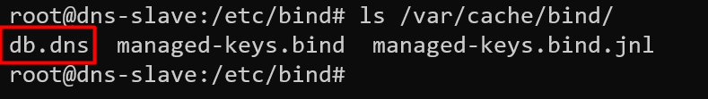

# DNS Master/Slave

Didalam praktikum ini kita akan membuat `DNS Master` dan `DNS Slave` , nanti jika `DNS Master` mengalami Kerusakan `DNS SLave` Masih dapat menghandle `request`  dari `client`

!!! note
    Clone vm `DNS Server Primary` menjadi `DNS Server Secondary`. Ubah `IP addres` `DNS Server Secondary` menjadi `192.168.10.20` dan hostnamenya menjadi `dns-slave`. Pada Praktikum kali ini kita akan melakukan setting dengan domain `dnsserver.lan`

## Konfigurasi DNS Master

### Membuat Zone Baru

```py
root@dns-server-primary:~# su -
root@dns-server-primary:~# cd /etc/bind
root@dns-server-primary:/etc/bind# nano named.conf.local
```


### Konfigurasi db files

```py
root@dns-server-primary:/etc/bind# cp db.local db.dns
root@dns-server-primary:/etc/bind# nano db.dns
```


## Konfigurasi DNS Slave

```py
useradmin@dns-slave:~$ su -
root@dns-slave:~# cd /etc/bind
root@dns-slave:/etc/bind# nano named.conf.local
```


## Finalisasi
### Restart Service
restart service bind9 pada kedua server.  
```py
root@dns-server-primary:/etc/bind# service bind9 restart
```
```py
root@dns-slave:/etc/bind# service bind9 restart
```
### Konfigurasi Resolver
Ubah Resolver pada kedua server
```py
root@dns-server-primary:/etc/bind# nano /etc/resolv.conf
```


### Cek Konfigurasi DNS Server SLave

```py
root@dns-slave:/etc/bind# ls /var/cache/bind/
```
pastikan file db dari `dns master` telah ada di `dns slave`
```py
root@dns-slave:/etc/bind# ls /var/cache/bind/
```

### Testing

#### Ubah IP address Client


#### Testing 1
Memastikan `client.dnsserver.lan` dapat di ping dari cmd


#### Testing 2
Matikan `Dns Server Primary` kemudian ping `client.dnsserver.lan` dari cmd


