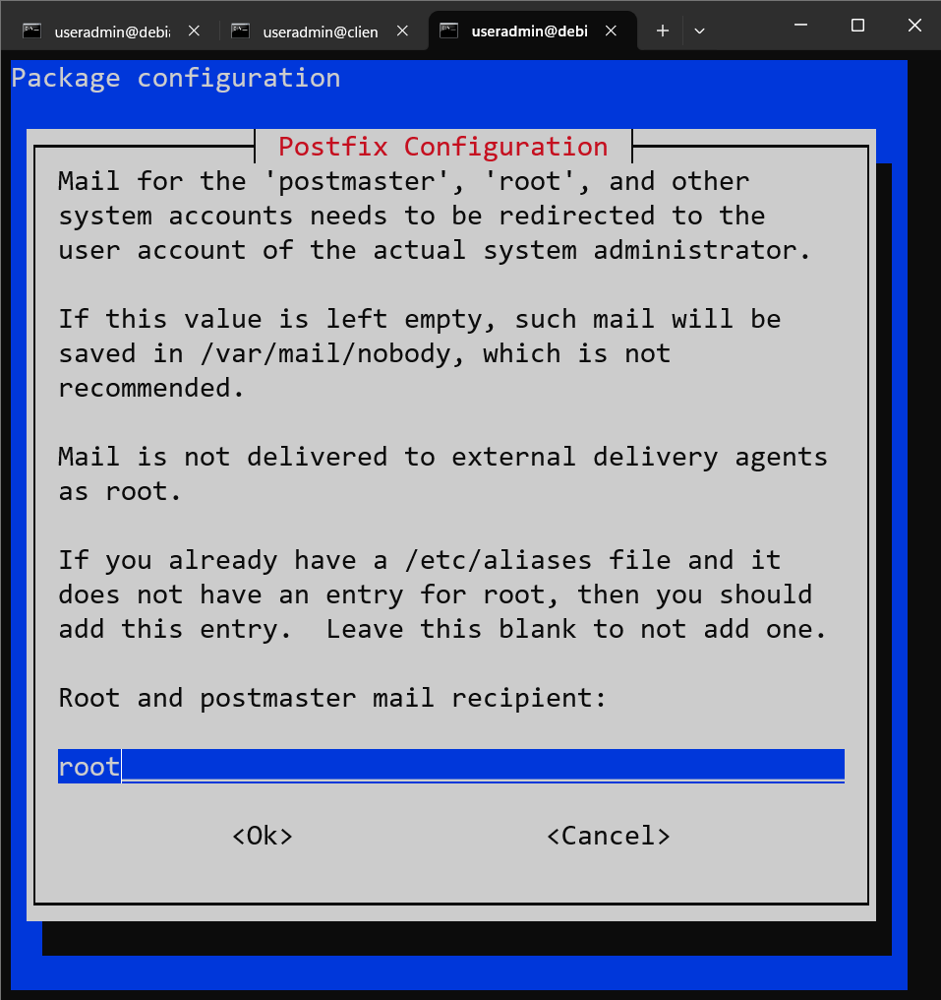
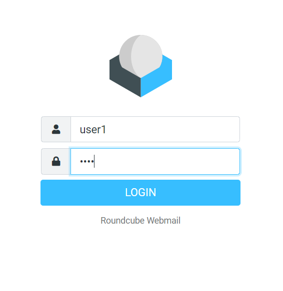

# Mail Server

## Installasi Requirement Mail server

```py
root@mailServer:~# apt install apache2 libapache2-mod-php php php-common php-json php-mysql php-curl postfix dovecot-core dovecot-pop3d dovecot-imapd default-mysql-server
```
!!! Note
    1. `Postfix` digunakan agar server dapat mengirim dan menerima email.  
    2. `Dovecot` digunakan agar server dapat membaca email dengan protocol `imap` dan `pop3`  
    3. `Mysql` digunakan untuk menyimpan email dan konfigurasi email.


## Mengaktifkan MailBox

```py
root@mailServer:~# nano /etc/postfix/main.cf
```

tambahkan perintah berikut dibaris paling bawah.


## Konfigurasi Dovecot

```py
root@mailServer:/etc/dovecot# cd /etc/dovecot
root@mailServer:/etc/dovecot# nano dovecot.conf
```
ubah `#listen.....` seperti dibawah ini


```py
root@mailServer:/etc/dovecot# cd conf.d/
root@mailServer:/etc/dovecot/conf.d# nano 10-auth.conf
```
hilangkan tanda `#` pada `disable_plaintext....` dan ubah yes menjadi no
lakukan ini agar kita bisa menggunakan password sebagai authentication.


```py
root@mailServer:/etc/dovecot/conf.d# nano 10-mail.conf
```

hilangkan tanda `#` `mail_location.........` seperti dibawah ini
dan tambahkan pula tanda `#` pada `mail location......` yang ada dibawahnya


## Membuat Mailbox untuk setiap user

```py
root@mailServer:/etc/dovecot/conf.d# maildirmake.dovecot  /etc/skel/Maildir
```

## reconfigure postfix




sisanya enter enter aja.

## Installasi Roundcube

RoundCube digunakan sebagai UI untuk email.

```py
root@mailServer:/# apt-get install roundcube
```


isikan password untuk Mysql `1234`


Masukkan kembali Password

## Konfigurasi Roundcube

```py
root@mailServer:/etc/dovecot/conf.d# cd /etc/roundcube/
root@mailServer:/etc/roundcube# nano config.inc.php
```


## Setting Apache2

```py
root@mailServer:/etc/roundcube# nano /etc/apache2/sites-available/000-default.conf
```


## Merubah etc hosts

```py
root@mailServer:/etc# nano /etc/hosts
```
Tambahkan `host` dari mail kita


## Finalisasi
root@mailServer:/etc/roundcube# service apache2 restart
root@mailServer:/etc/roundcube# service postfix restart
root@mailServer:/etc/roundcube# service dovecot restart


## Testing

Buatlah 2 buah user untuk tes melakukan email

```py
root@mailServer:/# adduser user1
root@mailServer:/# adduser user2
```

Akses Roundcube via web browser


Login menggunakan `user 1`



kirim email ke user2


Login dengan user2 cek apakah ada email masuk diinbox