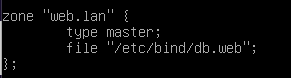
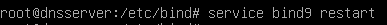
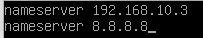

# Certificate Authority Server

Certificate Authority atau dikenal dengan CA adalah organisasi yang dipercaya untuk membuat dan melakukan verifikasi terhadap sertifikat digital pada suatu website. Dengan sertifikat tersebut kita dapat mengakses dengan menggunakan SSL/TLS sehingga lebih aman karena ter-enkripsi.

!!! Note
    Clone `DebianMaster` menjadi `ca server` Konfigurasikan ip address `192.168.10.1`

## Installasi Openssl 

```py
root@ca-server:~# apt install openssl ssl-cert
```

## Membuat CA key dan Certificate pair
1. Membuat direktori untuk menyimpan file yang dibutuhkan

```py
root@ca-server:~# mkdir /certs
```
2. Membuat file konfigurasi CA

```py
root@ca-server:~# cd /certs
```

```py
root@ca-server:/certs# nano ca.cnf
```
```py
# OpenSSL CA configuration file
[ ca ]
default_ca = CA_default

[ CA_default ]
default_days = 365
database = index.txt
serial = serial.txt
default_md = sha256
copy_extensions = copy
unique_subject = no

# Used to create the CA certificate.
[ req ]
prompt=no
distinguished_name = distinguished_name
x509_extensions = extensions

[ distinguished_name ]
organizationName = MySMK
commonName = ca-server

[ extensions ]
keyUsage = critical,digitalSignature,nonRepudiation,keyEncipherment,keyCertSign
basicConstraints = critical,CA:true,pathlen:1

# Common policy for nodes and users.
[ signing_policy ]
organizationName = supplied
commonName = optional

# Used to sign node certificates.
[ signing_node_req ]
keyUsage = critical,digitalSignature,keyEncipherment
extendedKeyUsage = serverAuth,clientAuth

# Used to sign client certificates.
[ signing_client_req ]
keyUsage = critical,digitalSignature,keyEncipherment
extendedKeyUsage = clientAuth

```
3. Membuat private key CA
```py
root@ca-server:/certs# openssl genrsa -out ca.key 2048
```

```py
root@ca-server:/certs# chmod 400 ca.key
```
4. Membuat Certificate CA
```py
root@ca-server:/certs# openssl req -new -x509 -config ca.cnf -key ca.key -out ca.crt -days 365 -batch
```
5. Membuat index.txt dan serial.txt untuk penyimpanan
```py
root@ca-server:/certs# touch index.txt
root@ca-server:/certs# echo '01' > serial.txt
```

## Membuat certificate dan private key untuk clients

!!! Note

    Disini kita akan membuat sertifikat untuk webserver `www.web.lan` , ftp `ftp.web.lan` dan mail `mail.web.lan`. jangan lupa untuk melakukan setting dns server. 

1. Membuat file konfigurasi untuk masing masing client certificate.
```py
root@ca-server:/certs# nano web.cnf
```
```py
# OpenSSL node configuration file
[ req ]
prompt=no
distinguished_name = distinguished_name
req_extensions = extensions

[ distinguished_name ]
organizationName = Web SMK MQ

[ extensions ]
subjectAltName = critical,DNS:ftp-web,DNS:www.web.lan,IP:192.168.10.2
```

```py
root@ca-server:/certs# nano ftp.cnf
```
```py
# OpenSSL node configuration file
[ req ]
prompt=no
distinguished_name = distinguished_name
req_extensions = extensions

[ distinguished_name ]
organizationName = FTP SMK MQ

[ extensions ]
subjectAltName = critical,DNS:ftp-web,DNS:ftp.web.lan,IP:192.168.10.2
```

```py
root@ca-server:/certs# nano mail.cnf
```
```py
# OpenSSL node configuration file
[ req ]
prompt=no
distinguished_name = distinguished_name
req_extensions = extensions

[ distinguished_name ]
organizationName = FTP SMK MQ

[ extensions ]
subjectAltName = critical,DNS:mail-server,DNS:mail.web.lan,IP:192.168.10.4
```
2. Membuat private key untuk masing masing client
```py
root@ca-server:/certs# openssl genrsa -out web.key 2048
root@ca-server:/certs# chmod 400 web.key
root@ca-server:/certs# openssl genrsa -out ftp.key 2048
root@ca-server:/certs# chmod 400 ftp.key
root@ca-server:/certs# openssl genrsa -out mail.key 2048
root@ca-server:/certs# chmod 400 mail.key
```
3. Membuat file CSR(request ca) untuk masing masing client
```py
root@ca-server:/certs# openssl req -new -config web.cnf -key web.key -out web.csr -batch
root@ca-server:/certs# openssl req -new -config ftp.cnf -key ftp.key -out ftp.csr -batch
root@ca-server:/certs# openssl req -new -config mail.cnf -key mail.key -out mail.csr -batch
```
4. Menandatangani(`Signing) file CSR
```py
root@ca-server:/certs# openssl ca -config ca.cnf -keyfile ca.key -cert ca.crt -policy signing_policy -extensions signing_node_req -out web.crt -outdir /certs/ -in web.csr -batch
```
```py
 root@ca-server:/certs# openssl ca -config ca.cnf -keyfile ca.key -cert ca.crt -policy signing_policy -extensions signing_node_req -out ftp.crt -outdir /certs/ -in ftp.csr -batch
 ```
 ```py
 root@ca-server:/certs# openssl ca -config ca.cnf -keyfile ca.key -cert ca.crt -policy signing_policy -extensions signing_node_req -out mail.crt -outdir /certs/ -in mail.csr -batch
 ```

## Setting DNS Server
!!! Note
    Bisa clone dari `debianMaster` atau yang sudah ada. Disarankan untuk clone saja.
1. Installasi Bind9

2. Membuat zone baru


3. Konfigurasi db files


4. service layanan

5. Setting file resolver




 
