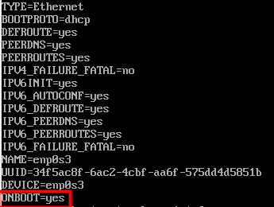
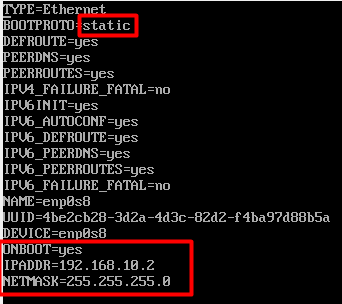
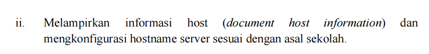
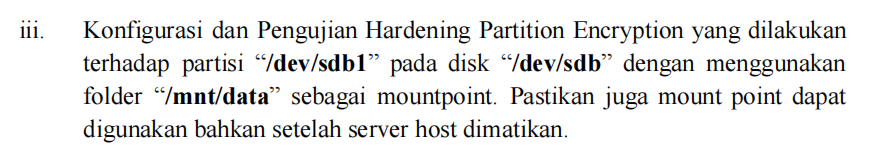
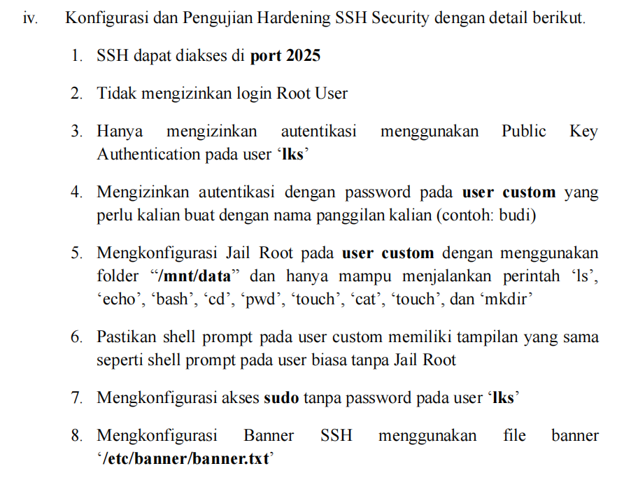
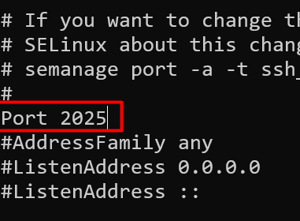
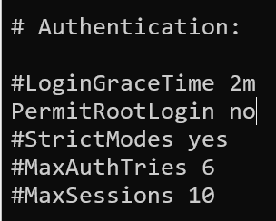
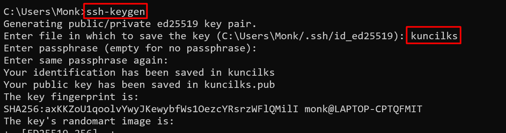

# LKS Cyber
## Konfigurasi IP address
```
cd /etc/sysconfig/network-scripts
ls
vi ifcfg-enp0s3
```  
  
Tekan i untuk masuk ke mode insert , untuk keluar dari mode insert tekan ESC, ketik :wq untuk simpan dan keluar  

```
vi ifcfg-enp0s8
```
  
```
systemctl restart network
ip a
```
## Konfigurasi repo
```
rm -f /etc/yum.repos.d/CentOS-Base.repo
vi /etc/yum.repos.d/CentOS-Vault.repo
```
copykan ini ke paling bawah
```
[base]
name=CentOS-7.9 - Base
baseurl=http://vault.centos.org/7.9.2009/os/x86_64/
gpgcheck=0
enabled=1

[updates]
name=CentOS-7.9 - Updates
baseurl=http://vault.centos.org/7.9.2009/updates/x86_64/
gpgcheck=0
enabled=1

[extras]
name=CentOS-7.9 - Extras
baseurl=http://vault.centos.org/7.9.2009/extras/x86_64/
gpgcheck=0
enabled=1
```

tes install nano
```
yum install nano
```
## KOnfigurasi Hostname  
   

```
hostnamectl set-hostname SMKMADINATULQURAN
hostnamectl
uname -a
```
## Enkripsi Partisi 
  

tambahkan hard disk 1 lagi, hardisk yang kita tambahkan sebelum install ternyata dipakai oleh system digabung dalam LVM, sehingga kita harus menambahkan hard disk 1 lagi.
buat partisi sdc1
```
fdisk /dev/sdc
Welcome to fdisk (util-linux 2.23.2).

Changes will remain in memory only, until you decide to write them.
Be careful before using the write command.

Device does not contain a recognized partition table
Building a new DOS disklabel with disk identifier 0x82f5e22f.

Command (m for help): n
Partition type:
   p   primary (0 primary, 0 extended, 4 free)
   e   extended
Select (default p): p
Partition number (1-4, default 1): enter
First sector (2048-20971519, default 2048): enter
Using default value 2048
Last sector, +sectors or +size{K,M,G} (2048-20971519, default 20971519):enter
Using default value 20971519
Partition 1 of type Linux and of size 10 GiB is set

Command (m for help): w
The partition table has been altered!

Calling ioctl() to re-read partition table.
Syncing disks.
```
```
lsblk
yum install cryptsetup -y
```
```
cryptsetup luksFormat /dev/sdc1
```
```
cryptsetup luksFormat /dev/sdc1

WARNING!
========
This will overwrite data on /dev/sdc1 irrevocably.

Are you sure? (Type uppercase yes): YES
Enter passphrase for /dev/sdc1:Skills54!
Verify passphrase:Skills54!
```
```
cryptsetup luksOpen /dev/sdc1 data_encrypt
Enter passphrase for /dev/sdc1:Skills54!
```
```
mkfs.ext4 /dev/mapper/data_encrypt
```
Mount data  
```
mkdir -p /mnt/data
mount /dev/mapper/data_encrypt /mnt/data
```
Auto Mount setiap server menyala  
```
nano /etc/crypttab
```
```
data_encrypt /dev/sdc1 none luks
```
```
nano /etc/fstab
```
```
/dev/mapper/data_encrypt /mnt/data ext4 defaults 0 0
```
## Hardening SSH
  

### SSH dapat diakses di port 2025
```
nano /etc/ssh/sshd_config
```
  
### Tidak mengizinkan login Root User  
```
nano /etc/ssh/sshd_config
```  
   

### Hanya mengizinkan autentikasi menggunakan Public Key Authentication pada user ‘lks’  

Buat pasangan private key dan public key di windows
  
Copy kan kuncilks.pub ke user lks di server
```
C:\Users\Monk>scp kuncilks.pub lks@192.168.10.2:/home/lks
lks@192.168.10.2's password:Skills54!
kuncilks.pub                                                  100%  103    50.3KB/s   00:00
```
copy isi dari kuncilks.pub di server ke authorized keys
```
[root@smkmadinatulquran ~]# cd /home/lks
[root@smkmadinatulquran lks]# ls
kuncilks.pub
[root@smkmadinatulquran lks]# mkdir .ssh
[root@smkmadinatulquran lks]# cat kuncilks.pub >> .ssh/authorized_keys
```
Tes SSH dari windows menggunakan ssh key
```
C:\Users\Monk>ssh -i kuncilks lks@192.168.10.2
Last failed login: Wed Apr 15 23:16:50 EDT 2026 from 192.168.10.12 on ssh:notty
There was 1 failed login attempt since the last successful login.
Last login: Wed Apr 15 22:44:06 2026 from 192.168.10.12
[lks@smkmadinatulquran ~]$
```
Konfigurasi sshd_config agar user lks hanya bisa menggunakan ssh_key untuk ssh dan tidak bisa menggunakan password  
```
nano /etc/ssh/sshd_config
```
tambahkan baris berikut di paling bawah  
```
Match User lks
        PasswordAuthentication no
        PubkeyAuthentication yes
```
```
systemctl restart sshd
```
tes ssh biasa dari windows
```
C:\Users\Monk>ssh lks@192.168.10.2
ssh: connect to host 192.168.10.2 port 22: Connection refused
```  
Tes SSH menggunakan key dari windows


